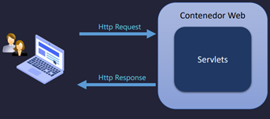
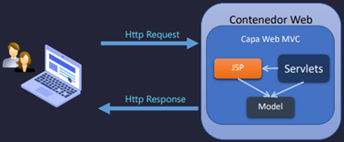
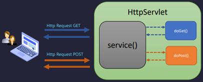
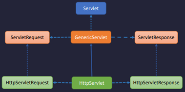
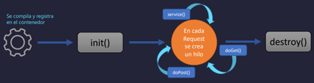
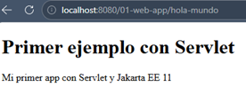
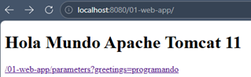
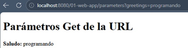
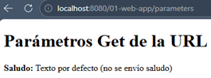
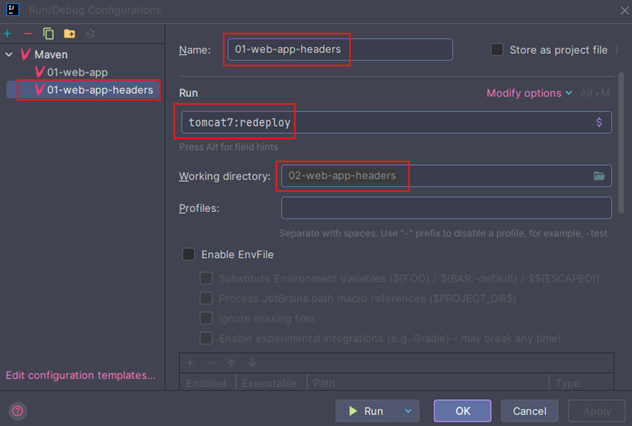

# 🌐 Jakarta EE 11: API Servlet - Introducción

> 📌 `Nota de contexto`: Esta sección cubre los fundamentos del `API Servlet`, que
> *es la base sobre la cual se construye todo el stack web de Jakarta EE*. Comprender estos conceptos es esencial
> antes de avanzar hacia `JAX-RS` y, posteriormente, hacia `Quarkus`.

---

# ⚙️ Introducción a los Servlets

---

## 📋 Tabla de Contenidos

1. [¿Qué es un Servlet?](#1--qué-es-un-servlet)
2. [Patrón MVC en la Capa Web](#2--patrón-mvc-en-la-capa-web)
3. [Request y Response](#3--request-y-response)
4. [Métodos HTTP soportados](#4--métodos-http-soportados-por-el-api-servlet)
5. [Clases e Interfaces del Servlet](#5--clases-e-interfaces-del-servlet)
6. [Ciclo de Vida de un Servlet](#6--ciclo-de-vida-de-un-servlet)

---

## 1. 🧩 ¿Qué es un Servlet?

Los `Servlets` son la base de la especificación web en `Jakarta EE`.

> Un **Servlet** es una clase Java que se ejecuta dentro de un **contenedor web** (como Tomcat, Jetty o WildFly)
> y tiene la capacidad de recibir peticiones HTTP, procesarlas y devolver una respuesta al cliente.

Forma parte de la especificación `Jakarta Servlet` (anteriormente **Java Servlet**) y es la tecnología más fundamental
del desarrollo web en el ecosistema `Java/Jakarta EE`.



### 🔑 Características principales

- Es una `clase Java` que extiende `HttpServlet`.
- Vive y es gestionado por el `contenedor web` (no por nosotros directamente).
- Es capaz de manejar múltiples peticiones `de forma concurrente`.
- Procesa peticiones `HTTP` y genera respuestas dinámicas.
- Actúa como `intermediario` entre el `cliente (navegador/app)` y la `lógica de negocio`.

### 🏗️ ¿Por qué es importante para Quarkus?

> Aunque `Quarkus` abstrae los `Servlets` mediante `JAX-RS` `(RESTEasy Reactive)`, internamente el modelo
> `request/response` y el concepto de contenedor son los mismos. Entender `Servlets` te da claridad conceptual
> sobre qué ocurre "debajo del capó".

### 📝 Ejemplo básico de un Servlet

```java
import jakarta.servlet.annotation.WebServlet;
import jakarta.servlet.http.HttpServlet;
import jakarta.servlet.http.HttpServletRequest;
import jakarta.servlet.http.HttpServletResponse;

import java.io.IOException;
import java.io.PrintWriter;

@WebServlet("/hola")  // Mapeo de la URL
public class HolaServlet extends HttpServlet {

    @Override
    protected void doGet(HttpServletRequest request, HttpServletResponse response)
            throws IOException {

        response.setContentType("text/html");
        PrintWriter out = response.getWriter();
        out.println("<h1>¡Hola desde un Servlet!</h1>");
    }
}
```

> 📌 Con la anotación `@WebServlet("/hola")`, este servlet responderá a todas las peticiones `GET` hacia
> `http://localhost:8080/hola`

## 2. 🏛️ Patrón MVC en la Capa Web

### ¿Qué es MVC?

`MVC (Model - View - Controller)` es un patrón arquitectónico que separa las responsabilidades de una aplicación
en tres capas bien definidas, facilitando el mantenimiento, la escalabilidad y las pruebas.

- Model (Lógica/Datos)
- View (JSP)
- Controller (Servlet)



### 🧱 Las tres capas

#### 🎮 Controller — El Servlet

El `Controlador` es el punto de entrada. Recibe la petición HTTP, decide qué lógica ejecutar y qué vista mostrar.
En `Jakarta EE`, este rol lo cumple el `Servlet`.

```java

@WebServlet("/usuarios")
public class UsuarioController extends HttpServlet {

    private UsuarioService usuarioService = new UsuarioService();

    @Override
    protected void doGet(HttpServletRequest request, HttpServletResponse response)
            throws ServletException, IOException {

        // 1. Obtiene datos del Model
        List<Usuario> usuarios = usuarioService.obtenerTodos();

        // 2. Pasa los datos a la View
        request.setAttribute("usuarios", usuarios);

        // 3. Delega el renderizado a la View (JSP)
        request.getRequestDispatcher("/vistas/usuarios.jsp")
                .forward(request, response);
    }
}
```

#### 📦 Model — La lógica y los datos

El `Modelo` representa los `datos de la aplicación` y la `lógica de negocio`. Es completamente independiente de la
interfaz de usuario.

```java
public class Usuario {
    private Long id;
    private String nombre;
    private String email;
    // Getters y Setters...
}

public class UsuarioService {
    public List<Usuario> obtenerTodos() {
        // Aquí iría la lógica de acceso a base de datos
        return List.of(new Usuario(1L, "Ana", "ana@email.com"));
    }
}
```

#### 🖼️ View — JSP (JavaServer Pages)

La `Vista` se encarga de la presentación. En el contexto de `Servlet MVC`, se usan `JSP` para renderizar HTML
dinámico con los datos que el Controlador le pasó.

```jsp
<%-- usuarios.jsp --%>
<html>
<body>
    <h1>Lista de Usuarios</h1>
    <ul>
        <c:forEach var="usuario" items="${usuarios}">
            <li>${usuario.nombre} - ${usuario.email}</li>
        </c:forEach>
    </ul>
</body>
</html>
```

### 🔄 Flujo completo MVC

```
1. Cliente hace GET /usuarios
        ↓
2. Servlet (Controller) recibe la petición
        ↓
3. Llama al Service/Repository (Model) para obtener datos
        ↓
4. Coloca los datos en el request: request.setAttribute(...)
        ↓
5. Hace forward hacia el JSP (View)
        ↓
6. El JSP renderiza el HTML con los datos
        ↓
7. La respuesta HTML llega al cliente
```

> 🔗 `Conexión con Quarkus`: En `Quarkus` con `RESTEasy` y `Qute` (motor de plantillas), el patrón es conceptualmente
> idéntico: un recurso REST actúa como controlador, los servicios son el modelo, y `Qute` reemplaza a JSP como vista.

## 3. 📨 Request y Response

La comunicación entre el cliente y el servidor siempre sigue el modelo `petición-respuesta (Request-Response)`.
Es el corazón del protocolo HTTP.

### 📥 HttpServletRequest — La Petición

`HttpServletRequest` es el objeto que representa `todo lo que el cliente envía al servidor`. El contenedor web lo
crea automáticamente y lo pasa al método del servlet.

#### ¿Qué contiene un Request?

| Elemento        | Descripción                      | Método de acceso                     |
|-----------------|----------------------------------|--------------------------------------|
| **Método HTTP** | GET, POST, PUT, DELETE...        | `request.getMethod()`                |
| **URL**         | La ruta solicitada               | `request.getRequestURL()`            |
| **Parámetros**  | Datos de la URL o del formulario | `request.getParameter("nombre")`     |
| **Headers**     | Metadatos de la petición         | `request.getHeader("Authorization")` |
| **Body**        | Cuerpo de la petición (POST/PUT) | `request.getInputStream()`           |
| **Session**     | Sesión del usuario               | `request.getSession()`               |
| **Atributos**   | Datos internos del request       | `request.getAttribute("clave")`      |

```java

@Override
protected void doPost(HttpServletRequest request, HttpServletResponse response)
        throws IOException {

    // Leyendo parámetros del formulario
    String nombre = request.getParameter("nombre");
    String email = request.getParameter("email");

    // Leyendo un header
    String contentType = request.getHeader("Content-Type");

    // Leyendo la IP del cliente
    String ipCliente = request.getRemoteAddr();

    System.out.println("Petición de: " + ipCliente);
    System.out.println("Nombre recibido: " + nombre);
}
```

### 📤 HttpServletResponse — La Respuesta

`HttpServletResponse` es el objeto que representa `todo lo que el servidor devuelve al cliente`. A través de él
construimos la respuesta HTTP.

#### ¿Qué podemos configurar en un Response?

| Elemento         | Descripción                    | Método de acceso                                      |
|------------------|--------------------------------|-------------------------------------------------------|
| **Status Code**  | Código HTTP (200, 404, 500...) | `response.setStatus(200)`                             |
| **Content-Type** | Tipo de contenido              | `response.setContentType("application/json")`         |
| **Headers**      | Cabeceras de respuesta         | `response.setHeader("X-Custom", "valor")`             |
| **Body**         | Cuerpo de la respuesta         | `response.getWriter()` / `response.getOutputStream()` |
| **Redirect**     | Redirigir a otra URL           | `response.sendRedirect("/otra-url")`                  |

```java

@Override
protected void doGet(HttpServletRequest request, HttpServletResponse response)
        throws IOException {

    // Configurar tipo de contenido
    response.setContentType("application/json");
    response.setCharacterEncoding("UTF-8");

    // Configurar código de estado
    response.setStatus(HttpServletResponse.SC_OK); // 200

    // Escribir el cuerpo de la respuesta
    PrintWriter out = response.getWriter();
    out.println("{\"mensaje\": \"Todo OK\"}");
}
```

### 🔄 El ciclo Request → Response

```
CLIENTE                          SERVIDOR (Contenedor Web)
  │                                         │
  │──── HTTP Request ──────────────────────►│
  │     GET /api/usuarios                   │
  │     Headers: Accept: application/json   │
  │                                         │
  │                              [Servlet procesa]
  │                              [Consulta datos]
  │                              [Construye respuesta]
  │                                         │
  │◄─── HTTP Response ──────────────────────│
  │     Status: 200 OK                      │
  │     Content-Type: application/json      │
  │     Body: [{"id":1,"nombre":"Ana"}]     │
  │                                         │
```

## 4. 🔧 Métodos HTTP soportados por el API Servlet

La clase `HttpServlet` define métodos `do*` para cada verbo HTTP estándar. El contenedor web invoca el método
correspondiente según el tipo de petición recibida.



En una aplicación web común y corriente, típicamente se trabaja con dos métodos: `doGet()` y `doPost()`. Estos métodos
se llaman de forma automática mediante el método `service()` y de acuerdo al tipo de request:

- Si se envía un tipo `GET`, se ejecutará el método `service()` y este invocará de forma automática el método `doGet()`.
- Si la petición viene de un formulario, y viene del tipo `POST`, se ejecutará el método `service()` y este ejecutará
  el método `doPost()`.

> `Importante`: El método `service()` nunca debemos sobreescribirlo de la clase `HttpServlet`, porque él se encarga de
> llamar a los métodos de la petición `doGet()`, `doPost()`, etc. de manera automática. Si lo sobreescribimos los
> métodos ya no se llamarán de manera automática.
>
> Lo que sí debemos implementar son los métodos `doGet()`, `doPost()` o cualquier otro método que no sea el `service()`.

### 📊 Tabla de métodos HTTP

En una aplicación del tipo API Rest, tenemos los siguientes métodos:

| Método HTTP | Método Servlet | Propósito                           | ¿Tiene Body? |
|-------------|----------------|-------------------------------------|--------------|
| `GET`       | `doGet()`      | Obtener/consultar recursos          | ❌ No         |
| `POST`      | `doPost()`     | Crear un nuevo recurso              | ✅ Sí         |
| `PUT`       | `doPut()`      | Actualizar un recurso completo      | ✅ Sí         |
| `DELETE`    | `doDelete()`   | Eliminar un recurso                 | ❌ No         |
| `PATCH`     | `doPatch()`    | Actualización parcial               | ✅ Sí         |
| `HEAD`      | `doHead()`     | Como GET pero sin body en respuesta | ❌ No         |
| `OPTIONS`   | `doOptions()`  | Consultar métodos permitidos        | ❌ No         |
| `TRACE`     | `doTrace()`    | Diagnóstico (raramente usado)       | ❌ No         |

> 📌 **Nota:** `doPatch()` fue introducido en **Jakarta Servlet 6.1 (Jakarta EE 11)**.
> En versiones anteriores no existía y requería un workaround manual.

### 💡 Ejemplo con múltiples métodos

```java

@WebServlet("/productos")
public class ProductoServlet extends HttpServlet {

    // GET /productos → Listar todos
    @Override
    protected void doGet(HttpServletRequest request, HttpServletResponse response)
            throws IOException {
        response.setContentType("application/json");
        response.getWriter().println("[{\"id\":1,\"nombre\":\"Laptop\"}]");
    }

    // POST /productos → Crear nuevo producto
    @Override
    protected void doPost(HttpServletRequest request, HttpServletResponse response)
            throws IOException {
        String body = new String(request.getInputStream().readAllBytes());
        // Procesar body y guardar producto...
        response.setStatus(HttpServletResponse.SC_CREATED); // 201
        response.getWriter().println("{\"mensaje\": \"Producto creado\"}");
    }

    // DELETE /productos → Eliminar
    @Override
    protected void doDelete(HttpServletRequest request, HttpServletResponse response)
            throws IOException {
        String id = request.getParameter("id");
        // Eliminar producto con ese id...
        response.setStatus(HttpServletResponse.SC_NO_CONTENT); // 204
    }
}
```

> 🔗 **Conexión con Quarkus:** En `JAX-RS` (y por tanto en `Quarkus`), estos métodos HTTP se mapean con anotaciones
> como `@GET`, `@POST`, `@PUT`, `@DELETE`, `@PATCH`. El concepto es exactamente el mismo, pero mucho más declarativo
> y limpio.

## 5. 🗂️ Clases e Interfaces del API Servlet

El API Servlet está organizado en una jerarquía clara de interfaces y clases abstractas. Conocerla te ayuda a entender
qué hereda tu servlet y qué capacidades tiene.

### 🌳 Jerarquía de clases

```
«interface»
Servlet
    │
    ▼
«interface»
ServletConfig
    │
    ▼
«abstract class»
GenericServlet
    │
    ▼
«abstract class»
HttpServlet          ← Aquí es donde tú extiendes
    │
    ▼
Tu clase (ej: UsuarioServlet)
```



### 📌 Las piezas clave

#### 🔷 Interface `Servlet`

Es la `interfaz raíz`. Define el contrato básico que todo servlet debe cumplir.

```java
public interface Servlet {
    void init(ServletConfig config) throws ServletException;

    void service(ServletRequest req, ServletResponse res) throws ServletException, IOException;

    void destroy();

    ServletConfig getServletConfig();

    String getServletInfo();
}
```

#### 🔷 Interface `ServletConfig`

Proporciona información de configuración al servlet durante su inicialización. El contenedor crea e inyecta esta
instancia.

```java
// Acceso a parámetros de inicialización configurados en web.xml o anotaciones
String valor = getServletConfig().getInitParameter("miParametro");
String nombreServlet = getServletConfig().getServletName();
ServletContext ctx = getServletConfig().getServletContext();
```

#### 🔷 Interface `ServletContext`

Representa el `contexto de toda la aplicación web`. Es compartido por todos los servlets de la aplicación. Permite
compartir atributos globales.

```bash
// Obtener el contexto de la aplicación
ServletContext context = getServletContext();

// Compartir datos entre todos los servlets
context.setAttribute("configGlobal",miConfiguracion);

// Leer parámetros de contexto definidos en web.xml
String dbUrl = context.getInitParameter("database.url");
```

#### 🔷 Clase abstracta `GenericServlet`

Implementación parcial de `Servlet`. Es independiente del protocolo. Rara vez se usa directamente.

#### 🔷 Clase abstracta `HttpServlet` ⭐

La clase más importante para el desarrollo web. Extiende `GenericServlet` y especializa todo para el protocolo HTTP.
Es la que tú extiendes en tus servlets.

```java
public abstract class HttpServlet extends GenericServlet {
    protected void doGet(HttpServletRequest req, HttpServletResponse resp) {/*...*/}

    protected void doPost(HttpServletRequest req, HttpServletResponse resp) {/*...*/}

    protected void doPut(HttpServletRequest req, HttpServletResponse resp) {/*...*/}

    protected void doDelete(HttpServletRequest req, HttpServletResponse resp) {/*...*/}

    protected void doHead(HttpServletRequest req, HttpServletResponse resp) {/*...*/}

    protected void doOptions(HttpServletRequest req, HttpServletResponse resp) {/*...*/}

    protected void service(HttpServletRequest req, HttpServletResponse resp) {/*...*/} // dispatcher interno
}
```

#### 🔷 Interface `HttpServletRequest`

Extiende `ServletRequest` y agrega todos los métodos específicos de HTTP para leer la petición.

#### 🔷 Interface `HttpServletResponse`

Extiende `ServletResponse` y agrega métodos específicos de HTTP para construir la respuesta.

### 🗺️ Diagrama de interfaces relacionadas

```
ServletRequest ──────────────── HttpServletRequest
                                        │
                               Implementado por el
                               contenedor web (Tomcat, etc.)

ServletResponse ─────────────── HttpServletResponse
                                        │
                               Implementado por el
                               contenedor web
```

## 6. 🔄 Ciclo de Vida de un Servlet

Uno de los conceptos más importantes del `API Servlet` es comprender `quién controla la vida` del servlet.
La respuesta es: `el contenedor web`, no tú.

### 🗺️ Las tres fases del ciclo de vida

```
┌─────────────────────────────────────────────────────────────────┐
│                    CICLO DE VIDA DEL SERVLET                    │
│                                                                 │
│  ┌───────────┐    ┌───────────┐    ┌──────────────────────┐     │
│  │  1. INIT  │───►│ 2. SERVICE│───►│    3. DESTROY        │     │
│  │           │    │           │    │                      │     │
│  │  init()   │    │ service() │    │    destroy()         │     │
│  │ (1 sola   │    │(N veces,  │    │  (1 sola vez al      │     │
│  │  vez)     │    │concurrent)│    │   apagar el server)  │     │
│  └───────────┘    └───────────┘    └──────────────────────┘     │
│                                                                 │
└─────────────────────────────────────────────────────────────────┘
```



### 📌 Fase 1: Inicialización — `init()`

El contenedor crea `una única instancia` del servlet y llama a `init()` exactamente `una vez`. Aquí debes realizar
configuraciones costosas (conexiones a BD, carga de configuración, etc.).

```java

@WebServlet("/mi-servlet")
public class MiServlet extends HttpServlet {

    private DataSource dataSource;
    private ConfiguracionApp config;

    @Override
    public void init(ServletConfig servletConfig) throws ServletException {
        super.init(servletConfig);

        // ✅ Lógica de inicialización — solo se ejecuta UNA vez
        this.config = new ConfiguracionApp();
        this.dataSource = inicializarConexionBD();

        System.out.println("Servlet inicializado y listo.");
    }
}
```

> ⚠️ **Importante:** Como solo hay **una instancia** del servlet, pero puede atender **múltiples peticiones
> concurrentes**, los atributos de instancia deben ser **thread-safe** o de solo lectura.

### 📌 Fase 2: Servicio — `service()`

Cada vez que llega una petición HTTP, el contenedor llama al método `service()`. Este método interno analiza el verbo
HTTP y delega a `doGet()`, `doPost()`, `doPut()`, etc.

```
Petición entrante
       │
       ▼
  service(req, res)      ← Dispatcher interno de HttpServlet
       │
       ├── si GET     ──►  doGet(req, res)
       ├── si POST    ──►  doPost(req, res)
       ├── si PUT     ──►  doPut(req, res)
       ├── si DELETE  ──►  doDelete(req, res)
       └── si otro    ──►  405 Method Not Allowed
```

> 🔑 Normalmente **no sobrescribes `service()`**, sino directamente `doGet()`, `doPost()`, etc.
> La recomendación general es **nunca sobrescribir `service()`**, porque es el dispatcher interno que enruta
> automáticamente hacia `doGet()`, `doPost()`, etc. Si lo sobrescribes sin llamar a `super.service()`, rompes ese
> mecanismo.

```java

@Override
protected void doGet(HttpServletRequest request, HttpServletResponse response)
        throws ServletException, IOException {
    // Esta lógica se ejecuta en cada petición GET
    // Puede ejecutarse concurrentemente para múltiples usuarios
    response.getWriter().println("Respuesta del servidor");
}
```

#### ⚠️ Nota importante sobre concurrencia en Servlets

Es fundamental entender cómo se gestionan los Servlets dentro del contenedor:

- 🧩 **Instancia única** → El contenedor crea **una sola instancia** del Servlet y la mantiene en memoria.
- 🔄 **Múltiples peticiones concurrentes** → `Cada petición HTTP` se atiende en un `hilo independiente`.
- ⚡ **Paralelismo** → Esto significa que el mismo Servlet puede estar atendiendo a varios usuarios al mismo tiempo.
- 🛡️ **Implicación práctica** → Nunca uses variables de instancia compartidas sin sincronización, porque podrían
  ser accedidas por varios hilos simultáneamente.

Ejemplo conceptual:

```text
Servlet único en memoria
        │
        ├── Petición 1 → Hilo A
        ├── Petición 2 → Hilo B
        ├── Petición 3 → Hilo C
        └── ...
```

> ✅ `Conclusión`: El modelo de `Servlets` es `multi-hilo`. **Cada petición se maneja en un hilo distinto**, pero
> todas comparten la misma instancia del Servlet. Esto obliga a diseñar el código pensando en la
> `seguridad de hilos (thread-safety)`.

### 📌 Fase 3: Destrucción — `destroy()`

Cuando el contenedor va a descargar el servlet (apagado del servidor, redespliegue), llama a `destroy()` una única vez.
Aquí liberas recursos.

```java

@Override
public void destroy() {
    // ✅ Liberar recursos — solo se ejecuta UNA vez
    if (dataSource != null) {
        dataSource.cerrarConexiones();
    }
    System.out.println("Servlet destruido. Recursos liberados.");
}
```

### ⏱️ Línea de tiempo completa

```
Servidor arranca
       │
       ▼
Contenedor carga la clase MiServlet
       │
       ▼
Contenedor crea UNA instancia: new MiServlet()
       │
       ▼
init() ─────────────────────────────── (1 sola vez)
       │
       ▼
service() → doGet() / doPost() ──────── (N veces, concurrente)
service() → doGet() / doPost()
service() → doGet() / doPost()
       │
       ▼
destroy() ──────────────────────────── (1 sola vez)
       │
       ▼
Servlet eliminado de memoria
```

### 🧵 Concurrencia: el punto crítico

Dado que hay `una sola instancia` del servlet atendiendo `múltiples peticiones en paralelo`, hay que tener cuidado
con los atributos de instancia:

```java

@WebServlet("/contador")
public class ContadorServlet extends HttpServlet {

    // ❌ MAL: variable de instancia compartida entre threads
    private int contador = 0;

    @Override
    protected void doGet(HttpServletRequest request, HttpServletResponse response)
            throws IOException {
        contador++; // ⚠️ Race condition! Múltiples threads leen/escriben esto
        response.getWriter().println("Visitas: " + contador);
    }
}
```

```java

@WebServlet("/contador-seguro")
public class ContadorSeguroServlet extends HttpServlet {

    // ✅ BIEN: variable thread-safe
    private AtomicInteger contador = new AtomicInteger(0);

    @Override
    protected void doGet(HttpServletRequest request, HttpServletResponse response)
            throws IOException {
        int visitas = contador.incrementAndGet(); // Thread-safe
        response.getWriter().println("Visitas: " + visitas);
    }
}
```

> 🔗 **Conexión con Quarkus:** En `Quarkus`, los `beans CDI` con scope `@ApplicationScoped` tienen el mismo
> comportamiento: `una sola instancia`, `múltiples accesos concurrentes`. El concepto de `thread-safety` aplica
> exactamente igual.

## 🔗 Resumen y conexión con Quarkus

| Concepto `Servlet`       | Equivalente en `Quarkus/JAX-RS`              |
|--------------------------|----------------------------------------------|
| `@WebServlet("/ruta")`   | `@Path("/ruta")` en un Resource              |
| `doGet()`, `doPost()`... | `@GET`, `@POST`... en métodos JAX-RS         |
| `HttpServletRequest`     | `@Context UriInfo`, `@QueryParam`, etc.      |
| `HttpServletResponse`    | Objeto `Response` de JAX-RS                  |
| `init()` / `destroy()`   | `@PostConstruct` / `@PreDestroy` en CDI      |
| `ServletContext`         | CDI Application Scope (`@ApplicationScoped`) |
| Filtros (`Filter`)       | Interceptores JAX-RS / CDI                   |

> ✅ **Conclusión:** `Servlet` es el fundamento histórico y técnico del stack web Java. `JAX-RS` (y por ende `Quarkus`)
> es una capa de abstracción elegante construida sobre estos mismos principios. Habiendo entendido Servlets,
> `JAX-RS` te resultará mucho más natural e intuitivo.

---

*📚 Documentación generada como parte del camino de aprendizaje: **Jakarta EE → Quarkus***

---

# 🧪 Primer Ejemplo con Servlet

## 🏗️ Creando la clase Servlet

Dentro del paquete `dev.magadiflo.app` creamos nuestro primer servlet `HolaMundoServlet`:

````java

@WebServlet("/hola-mundo")
public class HolaMundoServlet extends HttpServlet {
    @Override
    protected void doGet(HttpServletRequest req, HttpServletResponse resp)
            throws ServletException, IOException {
        resp.setContentType("text/html;charset=utf-8");

        PrintWriter out = resp.getWriter();
        out.println("""
                <!DOCTYPE html>
                <html lang="en">
                <head>
                    <meta charset="UTF-8">
                    <meta name="viewport" content="width=device-width, initial-scale=1.0">
                    <title>Document</title>
                </head>
                <body>
                    <h1>Primer ejemplo con Servlet</h1>
                    <p>Mi primer app con Servlet y Jakarta EE 11</p>
                </body>
                </html>
                """);
        out.close();
    }
}
````

### 🔍 Puntos clave del código

- **`@WebServlet("/hola-mundo")`** — mapea este servlet a la URL `/hola-mundo`. Es el
  reemplazo moderno de la configuración manual en `web.xml`.
- **`extends HttpServlet`** — lo convierte en un servlet HTTP, heredando toda la
  infraestructura de manejo de peticiones.
- **`resp.setContentType("text/html;charset=utf-8")`** — le indica al navegador cómo
  interpretar la respuesta. Debe llamarse **antes** de obtener el `PrintWriter`.
- **Text Block (`"""`)**  — disponible desde Java 15. Permite escribir HTML multilínea
  de forma limpia sin concatenaciones.
- **`out.close()`** — cierra el stream de escritura, señalando al contenedor que la
  respuesta está completa.

## 🚀 Desplegando en Tomcat

### 1. Levantar el servidor Tomcat

````bash
C:\apache-tomcat-11.0.18\bin
$ catalina.bat run
Using CATALINA_BASE:   "C:\apache-tomcat-11.0.18"
Using CATALINA_HOME:   "C:\apache-tomcat-11.0.18"
Using CATALINA_TMPDIR: "C:\apache-tomcat-11.0.18\temp"
Using JRE_HOME:        "C:\Program Files\Java\jdk-25.0.2"
Using CLASSPATH:       "C:\apache-tomcat-11.0.18\bin\bootstrap.jar;C:\apache-tomcat-11.0.18\bin\tomcat-juli.jar"
Using CATALINA_OPTS:   ""
08-Mar-2026 23:43:29.884 INFO [main] org.apache.catalina.startup.VersionLoggerListener.log Server version name:   Apache Tomcat/11.0.18
...
08-Mar-2026 23:43:31.470 INFO [main] org.apache.coyote.AbstractProtocol.start Starting ProtocolHandler ["http-nio-8080"] 
````

### 2. Desplegar desde IntelliJ IDEA

Ejecutamos `Run '01-web-app'` o `Debug '01-web-app'`. IntelliJ realiza el despliegue automático del `.war` en
Tomcat gracias al plugin `tomcat7-maven-plugin` configurado en el `pom.xml`.

El log confirma un despliegue exitoso:

````bash
...
[INFO] Deploying war to http://localhost:8080/01-web-app  
Uploading: http://localhost:8080/manager/text/deploy?path=%2F01-web-app&update=true
Uploaded: http://localhost:8080/manager/text/deploy?path=%2F01-web-app&update=true (4 KB at 3029.3 KB/sec)

[INFO] tomcatManager status code:200, ReasonPhrase:
[INFO] OK - Deployed application at context path [/01-web-app]
[INFO] ------------------------------------------------------------------------
[INFO] BUILD SUCCESS
[INFO] ------------------------------------------------------------------------
[INFO] Total time:  5.396 s
[INFO] Finished at: 2026-03-08T23:43:56-05:00
[INFO] ------------------------------------------------------------------------ 
````

### 3. Acceder en el navegador

La URL final se construye así:

```
http://localhost:8080/01-web-app/hola-mundo
        │              │           │
        │              │           └── path definido en @WebServlet
        │              └────────────── context path (nombre del .war)
        └───────────────────────────── servidor Tomcat
```



# 📨 Enviando Parámetros GET — Query String

Los parámetros `Query String` son datos que se envían al servidor directamente en la URL, usando el formato
`?clave=valor`. Es el mecanismo más básico de comunicación entre el cliente y un servlet.

```
http://localhost:8080/01-web-app/parameters?greetings=programando
                                            │
                                            └── Query String: clave=greetings, valor=programando
```

## 1. 🧩 Clase Servlet

````java

@WebServlet("/parameters")
public class ParametersGetServlet extends HttpServlet {
    @Override
    protected void doGet(HttpServletRequest req, HttpServletResponse resp)
            throws ServletException, IOException {
        // Leer el parámetro "greetings" de la Query String
        String greetings = req.getParameter("greetings");

        // Si no se envió el parámetro, getParameter() retorna null.
        // En nuestro caso, definimos un valor por defecto en caso sea null.
        greetings = greetings == null ? "Texto por defecto (no se envió saludo)" : greetings;

        resp.setContentType("text/html;charset=utf-8");

        try (PrintWriter out = resp.getWriter()) {
            out.println("""
                    <!DOCTYPE html>
                    <html lang="en">
                    <head>
                        <meta charset="UTF-8">
                        <meta name="viewport" content="width=device-width, initial-scale=1.0">
                        <title>Document</title>
                    </head>
                    <body>
                        <h1>Parámetros Get de la URL</h1>
                    """);
            out.println("<p><b>Saludo: </b>%s</p>".formatted(greetings));
            out.println("""
                        </body>
                    </html>
                    """);
        }
    }
}
````

### 🔍 Puntos clave del código

- `req.getParameter("greetings")` — extrae el valor del parámetro por su nombre desde la `Query String`.
  Retorna `null` si el parámetro no fue enviado, por eso siempre es buena práctica validarlo.
- `"%s".formatted(greetings)` — forma limpia de interpolar valores dentro del HTML generado dinámicamente.

> ⚠️ **Importante:** `getParameter()` siempre retorna `String`. Si esperas un número u otro tipo, debes convertirlo
> manualmente: `Integer.parseInt(req.getParameter("edad"))`.

## 2. 🔗 Enlace en `index.html`

En `src/main/webapp/index.html` agregamos un enlace que ilustra cómo se construye una URL con Query String:

````html
<!DOCTYPE html>
<html lang="es">
<head>
    <meta charset="UTF-8">
    <title>Hola Mundo Apache Tomcat 11</title>
</head>
<body>
<h1>Hola Mundo Apache Tomcat 11</h1>
<a href="/01-web-app/parameters?greetings=programando">/01-web-app/parameters?greetings=programando</a>
</body>
</html>
````

## 3. 🚀 Despliegue y verificación

Levantamos `Tomcat`:

````bash
C:\apache-tomcat-11.0.18\bin
$ catalina.bat run
...
09-Mar-2026 23:19:30.625 INFO [main] org.apache.catalina.startup.VersionLoggerListener.log Java Home:             C:\Program Files\Java\jdk-25.0.2
...
09-Mar-2026 23:19:32.339 INFO [main] org.apache.coyote.AbstractProtocol.start Starting ProtocolHandler ["http-nio-8080"]
09-Mar-2026 23:19:32.361 INFO [main] org.apache.catalina.startup.Catalina.start Server startup in [1351] milliseconds 
````

Ejecutamos `Run '01-web-app'` desde IntelliJ IDEA y verificamos el despliegue exitoso:

````bash
[INFO] Deploying war to http://localhost:8080/01-web-app
...
[INFO] tomcatManager status code:200, ReasonPhrase:
[INFO] OK - Deployed application at context path [/01-web-app]
[INFO] ------------------------------------------------------------------------
[INFO] BUILD SUCCESS
[INFO] ------------------------------------------------------------------------
[INFO] Total time:  2.739 s
[INFO] Finished at: 2026-03-09T23:26:21-05:00
[INFO] ------------------------------------------------------------------------
````

Al dar clic en el enlace, el navegador nos redirige al servlet con el parámetro en la URL.



El servlet lo lee y lo renderiza en el HTML de respuesta:



También podemos probar el caso donde **no se envía el parámetro**, accediendo directamente a `/parameters` sin Query
String, y veremos el texto por defecto:




---

# 🌐 Cabeceras HTTP y Status

## 🏗️ Creando el proyecto `02-web-app-headers`

Creamos un nuevo proyecto Maven dentro del directorio `01-servlet`. Tiene la misma estructura del `pom.xml` del proyecto
anterior, con dos adiciones importantes:

### 1. Empaquetado WAR — obligatorio para desplegar en Tomcat:

````xml

<packaging>war</packaging>
````

### 2. Dependencia Jackson — para serializar/deserializar objetos JSON:

````xml

<dependency>
    <groupId>com.fasterxml.jackson.core</groupId>
    <artifactId>jackson-databind</artifactId>
    <version>2.21.1</version>
</dependency>
````

> 📌 **Jackson** es la librería estándar de facto para trabajar con JSON en el ecosistema Java. Quarkus también la usa
> internamente (a través de `quarkus-jackson` o `quarkus-resteasy-reactive-jackson`).

Finalmente, en `Edit Configurations...` agregamos una nueva configuración para este proyecto para que cuando ejecutemos
se despliegue automáticamente a Tomcat.



## 🧩 Retorna información del request

El servlet `HttpHeadersServlet` extrae y muestra toda la información disponible en el objeto `HttpServletRequest`: datos
de la URL, del servidor, del cliente y todas las cabeceras HTTP enviadas por el navegador.

````java

@WebServlet("/http-headers")
public class HttpHeadersServlet extends HttpServlet {

    @Override
    protected void doGet(HttpServletRequest request, HttpServletResponse response)
            throws ServletException, IOException {

        // --- Información de la URL y el servidor ---
        String metodoHttp = request.getMethod();                // GET, POST, PUT...
        String requestUri = request.getRequestURI();            // /02-web-app-headers/http-headers
        String requestUrl = request.getRequestURL().toString(); // URL completa con protocolo
        String contextPath = request.getContextPath();          // /02-web-app-headers
        String servletPath = request.getServletPath();          // /http-headers
        String ip = request.getLocalAddr();                     // IP del servidor
        int port = request.getLocalPort();                      // Puerto del servidor
        String schema = request.getScheme();                    // http / https

        // --- Información del cliente ---
        String host = request.getHeader("host");          // localhost:8080
        String ipCliente = request.getRemoteAddr();             // IP del cliente

        // Construimos la URL completa manualmente para ilustrar sus partes
        String urlCompleta = schema + "://" + host + contextPath + servletPath;

        response.setContentType("text/html;charset=UTF-8");
        try (PrintWriter out = response.getWriter()) { // try-with-resources: cierra automáticamente
            out.println("<!DOCTYPE html>");
            out.println("<html>");
            out.println("   <head>");
            out.println("       <meta charset=\"UTF-8\">");
            out.println("       <title>Cabeceras HttpRequest</title>");
            out.println("   </head>");
            out.println("   <body>");
            out.println("       <ul>");
            out.println("           <li>metodoHttp: " + metodoHttp + "</li>");
            out.println("           <li>requestUri: " + requestUri + "</li>");
            out.println("           <li>requestUrl: " + requestUrl + "</li>");
            out.println("           <li>contextPath: " + contextPath + "</li>");
            out.println("           <li>servletPath: " + servletPath + "</li>");
            out.println("           <li>ip local: " + ip + "</li>");
            out.println("           <li>puerto local: " + port + "</li>");
            out.println("           <li>schema: " + schema + "</li>");
            out.println("           <li>host: " + host + "</li>");
            out.println("           <li>url completa: " + urlCompleta + "</li>");
            out.println("           <li>id cliente: " + ipCliente + "</li>");

            // Iteramos TODAS las cabeceras HTTP que envió el navegador
            Enumeration<String> headerNames = request.getHeaderNames();
            while (headerNames.hasMoreElements()) {
                String cabecera = headerNames.nextElement();
                out.println("<li>" + cabecera + ": " + request.getHeader(cabecera) + "</li>");
            }

            out.println("       </ul>");
            out.println("   </body>");
            out.println("</html>");
        }
    }
}
````

### 🔍 Puntos clave del código

- **`request.getRequestURI()`** — retorna solo el path: `/02-web-app-headers/http-headers`
- **`request.getRequestURL()`** — retorna la URL completa incluyendo protocolo y host.
  Retorna un `StringBuffer`, por eso llamamos `.toString()`
- **`request.getContextPath()`** — es el nombre del `.war` desplegado, funciona como
  prefijo de todas las URLs de la aplicación
- **`request.getServletPath()`** — es el path definido en `@WebServlet`, sin el context path
- **`request.getHeaderNames()`** — retorna un `Enumeration<String>` con los nombres de
  todas las cabeceras enviadas por el cliente. Con cada nombre obtenemos su valor con
  `request.getHeader(nombre)`
- **`try-with-resources`** en el `PrintWriter` — garantiza que el stream se cierre
  correctamente incluso si ocurre una excepción, sin necesidad de llamar `out.close()`
  manualmente

## ✅ Resultado

Al acceder a `http://localhost:8080/02-web-app-headers/http-headers` obtenemos toda la información del request,
tanto la que extrajimos explícitamente como todas las cabeceras enviadas automáticamente por el navegador:

````bash
metodoHttp: GET
requestUri: /02-web-app-headers/http-headers
requestUrl: http://localhost:8080/02-web-app-headers/http-headers
contextPath: /02-web-app-headers
servletPath: /http-headers
ip local: 0:0:0:0:0:0:0:1
puerto local: 8080
schema: http
host: localhost:8080
url completa: http://localhost:8080/02-web-app-headers/http-headers
id cliente: 0:0:0:0:0:0:0:1

-- Cabeceras del navegador --
Host: localhost:8080
Connection: keep-alive
sec-ch-ua: "Not:A-Brand";v="99", "Microsoft Edge";v="145", "Chromium";v="145"
sec-ch-ua-mobile: ?0
sec-ch-ua-platform: "Windows"
Upgrade-Insecure-Requests: 1
User-Agent: Mozilla/5.0 (Windows NT 10.0; Win64; x64) AppleWebKit/537.36 (KHTML, like Gecko) Chrome/145.0.0.0 Safari/537.36 Edg/145.0.0.0
Accept: text/html,application/xhtml+xml,application/xml;q=0.9,image/avif,image/webp,image/apng,*/*;q=0.8,application/signed-exchange;v=b3;q=0.7
Sec-Fetch-Site: none
Sec-Fetch-Mode: navigate
Sec-Fetch-User: ?1
Sec-Fetch-Dest: document
Accept-Encoding: gzip, deflate, br, zstd
Accept-Language: es,es-ES;q=0.9,en;q=0.8,en-GB;q=0.7,en-US;q=0.6,es-PE;q=0.5
Cookie: Idea-911cfc4f=5f8606fe-53a5-4d3c-a2b3-16e13d3a925b; jenkins-timestamper-offset=18000000 
````

> 📌 **Nota:** La IP `0:0:0:0:0:0:0:1` es la representación IPv6 de `localhost`(equivalente a `127.0.0.1` en IPv4).
> La ves porque tanto el cliente (tu navegador) como el servidor están en la misma máquina.

> 🔗 **Conexión con Quarkus:** En `JAX-RS` accedes a esta misma información mediante `@Context HttpHeaders headers`
> para las cabeceras, y `@Context UriInfo uriInfo` para los datos de la URL. El concepto es idéntico, solo cambia la
> forma de accederlos.

## 🔄 Retornando JSON desde un Servlet

Hasta ahora nuestros servlets retornaban HTML. En esta lección construimos un servlet que retorna datos en formato
`JSON`, que es el estándar de comunicación en cualquier `REST API` moderna.

### 🧱 Estructura del ejemplo

```
ProductServlet          ← Controlador (Servlet)
    │
    └──► ProductService / ProductServiceImpl   ← Lógica de negocio
                │
                └──► Product (record)          ← Modelo de datos
```

### 1. 📦 Modelo de datos

Usamos un `record` de Java para representar el producto. Un `record` es ideal para modelos de solo lectura: genera
automáticamente constructor, getters, `equals`, `hashCode` y `toString`.

```java
public record Product(Long id,
                      String name,
                      String category,
                      BigDecimal price) {
}
```

### 2. ⚙️ Capa de servicio

Definimos una interfaz y su implementación para separar la lógica de negocio del controlador, siguiendo el principio de
**separación de responsabilidades**.

```java
public interface ProductService {
    List findAllProducts();
}
```

```java
public class ProductServiceImpl implements ProductService {

    @Override
    public List findAllProducts() {
        return List.of(
                new Product(1L, "Notebook", "Informática", new BigDecimal("2700")),
                new Product(2L, "Mesa de escritorio", "Oficina", new BigDecimal("996.50")),
                new Product(3L, "Teclado mecánico", "Informática", new BigDecimal("56.70"))
        );
    }
}
```

### 3. 🧩 El Servlet

```java

@WebServlet("/products")
public class ProductServlet extends HttpServlet {

    @Override
    protected void doGet(HttpServletRequest req, HttpServletResponse resp)
            throws ServletException, IOException {

        // Capa de servicio — obtiene los datos
        ProductService productService = new ProductServiceImpl();

        // ObjectMapper (Jackson) — convierte la lista de objetos Java a JSON String
        ObjectMapper objectMapper = new ObjectMapper();
        String jsonProducts = objectMapper.writeValueAsString(productService.findAllProducts());

        // Indicamos al cliente que la respuesta es JSON
        resp.setContentType("application/json");
        resp.getWriter().write(jsonProducts);
    }
}
```

### 🔍 Puntos clave del código

- **`ObjectMapper`** — es la clase principal de Jackson. `writeValueAsString()` serializa cualquier objeto Java a su
  representación JSON como `String`.
- **`resp.setContentType("application/json")`** — fundamental. Le indica al cliente cómo interpretar el cuerpo de la
  respuesta. Sin esto, algunos clientes podrían tratar la respuesta como texto plano.
- **`resp.getWriter().write()`** — a diferencia de `println()`, `write()` es más adecuado cuando ya tienes el string
  completo listo para enviar.

> ⚠️ **Nota:** En este ejemplo instanciamos `ProductService` y `ObjectMapper` dentro del método `doGet()`, lo que
> significa que se crean en **cada petición**. `ObjectMapper` es `thread-safe` y costoso de instanciar, por lo que en
> una aplicación real debería ser un atributo de instancia del servlet o un singleton:

```java
public class ProductServlet extends HttpServlet {
    // ✅ Se crea una sola vez, se reutiliza en cada petición
    private final ObjectMapper objectMapper = new ObjectMapper();
    private final ProductService productService = new ProductServiceImpl();
}
```

### ✅ Verificación con `curl`

Podemos verificar la respuesta directamente desde la terminal usando `curl` con el flag `-v` (verbose) para ver
también las cabeceras, y `jq` para formatear el `JSON`:

````bash
$ curl -v http://localhost:8080/02-web-app-headers/products | jq
>
< HTTP/1.1 200
< Content-Type: application/json;charset=UTF-8
< Content-Length: 216
< Date: Sun, 15 Mar 2026 05:39:07 GMT
<
[
  {
    "id": 1,
    "name": "Notebook",
    "category": "Informática",
    "price": 2700
  },
  {
    "id": 2,
    "name": "Mesa de escritorio",
    "category": "Oficina",
    "price": 996.50
  },
  {
    "id": 3,
    "name": "Teclado mecánico",
    "category": "Informática",
    "price": 56.70
  }
]
````

Observamos que la respuesta incluye:

- **`HTTP/1.1 200`** — status code indicando éxito
- **`Content-Type: application/json`** — confirmando el tipo de contenido
- **`Content-Length: 216`** — tamaño del body en bytes

> 🔗 **Conexión con Quarkus:** En `JAX-RS` esto se reduce a anotar el método con `@Produces(MediaType.APPLICATION_JSON)`
> y retornar directamente la lista de objetos. `Quarkus` se encarga de la serialización con `Jackson` automáticamente,
> sin necesidad de instanciar `ObjectMapper` manualmente. ✅


---

# 🔽 Filters en Servlet API

Un `Filter` es una clase que **intercepta** las peticiones HTTP antes de que lleguen al servlet y las respuestas antes
de que lleguen al cliente. Es ideal para lógica transversal como logging, autenticación o CORS.

```
Cliente ──► [LogFilter] ──► Servlet (LoginServlet) ──► [LogFilter] ──► Cliente
               antes                                        después
```

## 🏗️ Estructura del nuevo proyecto: `03-web-app-filters`

```
03-web-app-filters/
└── src/main/java/dev/magadiflo/app/
    ├── dto/
    │   └── LoginRequest.java       ← Recibe usuario y contraseña del cliente
    ├── filter/
    │   └── LogFilter.java          ← Intercepta y loguea cada petición
    └── servlet/
        └── LoginServlet.java       ← Procesa el login y retorna JSON
```

## 📄 `pom.xml`

El `pom.xml` es el mismo que hemos trabajado en el proyecto anterior `(02-web-app-headers)`. Solo hay que tener en
cuenta que en `packaging` debemos usar el `war`, porque será desplegado en un Tomcat externo.

````xml

<packaging>war</packaging>
````

## 1. 📦 DTO — `LoginRequest`

Representa el cuerpo JSON que el cliente envía en el `POST`. Jackson lo deserializa automáticamente desde el body de la
petición.

```java
public record LoginRequest(String username, String password) {
}
```

## 2. 🔽 El Filter — `LogFilter`

La pieza central de este ejemplo. Implementa la interfaz `Filter` y se anota con `@WebFilter` para indicarle al
contenedor a qué URLs aplica.

```java

@WebFilter("/*") // Aplica a TODAS las URLs de la aplicación
public class LogFilter implements Filter {

    private static final Logger log = Logger.getLogger(LogFilter.class.getName());

    @Override
    public void init(FilterConfig filterConfig) throws ServletException {
        log.info("[LogFilter] Filter inicializado");
    }

    @Override
    public void doFilter(ServletRequest request, ServletResponse response, FilterChain chain)
            throws IOException, ServletException {

        HttpServletRequest httpRequest = (HttpServletRequest) request;

        // --- Antes del servlet ---
        String message = "[LogFilter] >>>> Solicitud entrante: %s %s".formatted(httpRequest.getMethod(), httpRequest.getRequestURI());
        LogFilter.log.info(message);

        // Pasamos la petición al siguiente eslabón (otro filter o el servlet)
        chain.doFilter(request, response);

        // --- DESPUÉS del servlet ---
        message = "[LogFilter] <<< Solicitud completada: %s %s".formatted(httpRequest.getMethod(), httpRequest.getRequestURI());
        LogFilter.log.info(message);
    }
}
```

### 🔍 Puntos clave del Filter

- **`@WebFilter("/*")`** — aplica este filtro a todas las URLs. Puedes restringirlo a una ruta específica, por ejemplo
  `@WebFilter("/login")`.
- **`chain.doFilter(request, response)`** — la línea más importante. Pasa el control al siguiente filtro o al servlet.
  Si **no la llamas**, la petición nunca llega al servlet, lo que puede usarse para bloquear accesos no autorizados.
- **Todo lo que escribes antes de `chain.doFilter()`** se ejecuta antes del servlet.
- **Todo lo que escribes después de `chain.doFilter()`** se ejecuta después del servlet, cuando la respuesta ya fue
  generada.

## 3. 🧩 El Servlet — `LoginServlet`

Recibe el JSON con usuario y contraseña, lo deserializa con Jackson y retorna una respuesta JSON.

```java

@WebServlet("/login")
public class LoginServlet extends HttpServlet {

    private final ObjectMapper objectMapper = new ObjectMapper();

    @Override
    protected void doPost(HttpServletRequest req, HttpServletResponse resp)
            throws ServletException, IOException {

        // De-serializar el body JSON → objeto LoginRequest
        LoginRequest loginRequest = objectMapper.readValue(req.getInputStream(), LoginRequest.class);

        // Validación simple
        boolean successLogin = "admin".equals(loginRequest.username()) && "1234".equals(loginRequest.password());

        resp.setContentType("application/json");
        if (successLogin) {
            resp.setStatus(HttpServletResponse.SC_OK); // 200
            String json = objectMapper.writeValueAsString(Map.of(
                    "message", "Login exitoso",
                    "username", loginRequest.username()
            ));
            resp.getWriter().write(json);

        } else {
            resp.setStatus(HttpServletResponse.SC_UNAUTHORIZED); // 401
            String json = objectMapper.writeValueAsString(Map.of(
                    "message", "Credenciales incorrectas"
            ));
            resp.getWriter().write(json);
        }
    }
}
```

## 📦 Desplegando aplicación a Tomcat

Apenas desplegamos nuestra aplicación `03-web-app-filters` en Tomcat, automáticamente aparece en el log de la consola
del servidor el mensaje de que nuestro `[LogFilter] Filter inicializado`.

````bash
15-Mar-2026 19:54:42.340 INFO [http-nio-8080-exec-1] dev.magadiflo.app.filter.LogFilter.init [LogFilter] Filter inicializado
15-Mar-2026 19:54:42.344 INFO [http-nio-8080-exec-1] org.apache.catalina.startup.HostConfig.deployWAR Deployment of web application archive [C:\apache-tomcat-11.0.18\webapps\03-web-app-filters.war] has finished in [312] ms
````

## ✅ Verificación con `curl`

### Login exitoso

```bash
$ curl -v -X POST -H "Content-Type: application/json" -d "{\"username\": \"admin\", \"password\": \"1234\"}" http://localhost:8080/03-web-app-filters/login | jq
>
< HTTP/1.1 200
< Content-Type: application/json;charset=UTF-8
< Content-Length: 46
< Date: Mon, 16 Mar 2026 00:57:23 GMT
<
{
  "username": "admin",
  "message": "Login exitoso"
}
```

### Log en consola del servidor

Mientras ejecutamos la petición, en la consola de Tomcat vemos el filtro actuando antes y después de cada una:

````bash
15-Mar-2026 19:57:22.954 INFO [http-nio-8080-exec-11] dev.magadiflo.app.filter.LogFilter.doFilter [LogFilter] >>>> Solicitud entrante: POST /03-web-app-filters/login
15-Mar-2026 19:57:23.069 INFO [http-nio-8080-exec-11] dev.magadiflo.app.filter.LogFilter.doFilter [LogFilter] <<< Solicitud completada: POST /03-web-app-filters/login
````

### Credenciales incorrectas

```bash
$ curl -v -X POST -H "Content-Type: application/json" -d "{\"username\": \"administrador\", \"password\": \"555\"}" http://localhost:8080/03-web-app-filters/login | jq
>
< HTTP/1.1 401
< Content-Type: application/json;charset=UTF-8
< Content-Length: 38
< Date: Mon, 16 Mar 2026 00:58:58 GMT
<
{
  "message": "Credenciales incorrectas"
}
```

### Log en consola del servidor

Nuevamente, en consola de Tomcat vemos en acción la ejecución de nuestro Filter.

```bash
15-Mar-2026 19:58:58.536 INFO [http-nio-8080-exec-13] dev.magadiflo.app.filter.LogFilter.doFilter [LogFilter] >>>> Solicitud entrante: POST /03-web-app-filters/login
15-Mar-2026 19:58:58.540 INFO [http-nio-8080-exec-13] dev.magadiflo.app.filter.LogFilter.doFilter [LogFilter] <<< Solicitud completada: POST /03-web-app-filters/login
```

> 🔗 **Conexión con Quarkus:** En `JAX-RS` el equivalente directo de `Filter` es `ContainerRequestFilter` (antes del
> recurso) y `ContainerResponseFilter` (después). Se anotan con `@Provider` y se registran automáticamente. El concepto
> del `chain.doFilter()` se traduce en llamar a `context.proceed()` dentro del interceptor.
