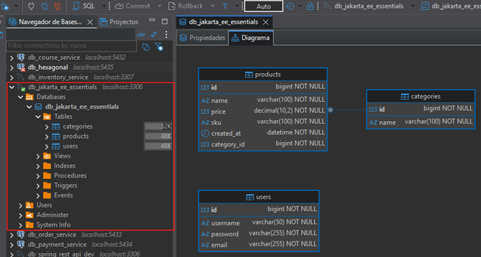

# 🏗️ Proyecto de Práctica CDI

> ⚠️ **Nota:** Este proyecto es una aplicación web **MVC tradicional** (Servlets + JSP),
> no una REST API. Usa sesiones, vistas JSP, conexión manual a base de datos (JDBC)
> y sigue el patrón MVC con filtros y listeners.
>
> Lo trabajamos en este formato porque el objetivo no es la arquitectura del proyecto
> en sí, sino **observar el contraste entre una aplicación sin CDI y con CDI**, para
> entender de forma práctica qué problema resuelve la inyección de dependencias.
> En el mundo real con Quarkus trabajaremos REST APIs stateless.

## 🔧 Proyecto Sin CDI

### 📄 Dependencias y plugins — `pom.xml`

````xml
<?xml version="1.0" encoding="UTF-8"?>
<project xmlns="http://maven.apache.org/POM/4.0.0"
         xmlns:xsi="http://www.w3.org/2001/XMLSchema-instance"
         xsi:schemaLocation="http://maven.apache.org/POM/4.0.0 http://maven.apache.org/xsd/maven-4.0.0.xsd">
    <modelVersion>4.0.0</modelVersion>

    <groupId>dev.magadiflo</groupId>
    <artifactId>01-web-app-without-cdi</artifactId>
    <version>1.0-SNAPSHOT</version>

    <packaging>war</packaging>

    <properties>
        <maven.compiler.source>25</maven.compiler.source>
        <maven.compiler.target>25</maven.compiler.target>
        <project.build.sourceEncoding>UTF-8</project.build.sourceEncoding>
        <project.reporting.outputEncoding>UTF-8</project.reporting.outputEncoding>
    </properties>
    <dependencies>
        <dependency>
            <groupId>jakarta.platform</groupId>
            <artifactId>jakarta.jakartaee-api</artifactId>
            <version>11.0.0</version>
            <scope>provided</scope>
        </dependency>
        <dependency>
            <groupId>com.fasterxml.jackson.core</groupId>
            <artifactId>jackson-databind</artifactId>
            <version>2.21.1</version>
        </dependency>
        <dependency>
            <groupId>jakarta.servlet.jsp.jstl</groupId>
            <artifactId>jakarta.servlet.jsp.jstl-api</artifactId>
            <version>3.0.2</version>
        </dependency>
        <dependency>
            <groupId>org.glassfish.web</groupId>
            <artifactId>jakarta.servlet.jsp.jstl</artifactId>
            <version>3.0.1</version>
        </dependency>
    </dependencies>

    <build>
        <plugins>
            <plugin>
                <groupId>org.apache.maven.plugins</groupId>
                <artifactId>maven-compiler-plugin</artifactId>
                <version>3.14.1</version>
            </plugin>
            <plugin>
                <groupId>org.apache.tomcat.maven</groupId>
                <artifactId>tomcat7-maven-plugin</artifactId>
                <version>2.2</version>

                <!--Ruta para el despliegue en Tomcat-->
                <configuration>
                    <url>http://localhost:8080/manager/text</url>
                    <username>admin</username>
                    <password>admin</password>
                </configuration>
            </plugin>
            <plugin>
                <artifactId>maven-war-plugin</artifactId>
                <version>3.4.0</version>
            </plugin>
        </plugins>
    </build>

</project>
````

#### 🔍 Dependencias destacadas

| Dependencia                            | Descripción                                                                                                  |
|----------------------------------------|--------------------------------------------------------------------------------------------------------------|
| `jakarta.jakartaee-api`                | API completa de Jakarta EE 11. Scope `provided` porque el servidor (Tomcat + librerías) la provee en runtime |
| `jackson-databind`                     | Serialización/deserialización JSON                                                                           |
| `jakarta.servlet.jsp.jstl-api`         | Especificación de JSTL — define el contrato de las etiquetas estándar para JSP                               |
| `jakarta.servlet.jsp.jstl` (Glassfish) | Implementación de JSTL — la lógica real detrás de las etiquetas como `<c:forEach>`                           |

> 📌 **¿Por qué dos dependencias para JSTL?** Sigue el mismo patrón de especificación/implementación que vemos en todo
> Jakarta EE: una dependencia define **el contrato** (la API) y otra provee **la implementación concreta**.
> Es el mismo principio que `jakarta.jakartaee-api` + Tomcat/WildFly.

#### 🔍 Plugins destacados

| Plugin                  | Descripción                                                     |
|-------------------------|-----------------------------------------------------------------|
| `maven-compiler-plugin` | Compilación con Java 25                                         |
| `tomcat7-maven-plugin`  | Despliega el `.war` automáticamente en Tomcat vía Maven         |
| `maven-war-plugin`      | Empaqueta el proyecto como `.war` para ser desplegado en Tomcat |

### 📦 Modelos

El proyecto maneja 5 modelos que representan las entidades principales de la aplicación:

```
User          → Usuario del sistema (login)
Category      → Categoría de producto
Product       → Producto de la tienda
CartItem      → Ítem dentro del carrito (producto + cantidad)
ShoppingCart  → Carrito de compras (colección de CartItems)
```

#### `User`

Representa al usuario de la aplicación. Contiene los datos básicos de autenticación.

```java
public class User {
    private Long id;
    private String username;
    private String password;
    private String email;

    /* Setters and Getters */
}
````

#### `Category`

Categoría a la que pertenece un producto. Modelo simple de solo dos atributos.

```java
public class Category {
    private Long id;
    private String name;

    /* Setters and Getters */
}
````

#### `Product`

Representa un producto de la tienda. Contiene una referencia a su `Category` (relación de composición) y sobreescribe
`equals`/`hashCode` basándose en el `id`, lo que permite comparar productos correctamente en colecciones como el
carrito.

```java
public class Product {
    private Long id;
    private String name;
    private Category category;
    private BigDecimal price;
    private String sku;
    private LocalDateTime createdAt;

    public Product() {
    }

    // Constructor de conveniencia — crea el producto y su categoría en un solo paso
    public Product(Long id, String name, String tipo, BigDecimal price) {
        this.id = id;
        this.name = name;
        this.price = price;

        Category category = new Category();
        category.setName(tipo);
        this.category = category;
    }

    /* Setters and Getters */

    @Override
    public boolean equals(Object o) { // basado en id
        if (o == null || getClass() != o.getClass()) return false;
        Product product = (Product) o;
        return Objects.equals(getId(), product.getId());
    }

    @Override
    public int hashCode() { // basado en id
        return Objects.hashCode(getId());
    }
}
````

#### `CartItem`

Representa un ítem dentro del carrito: un producto con una cantidad determinada. Es el modelo más rico en lógica de
negocio:

- Valida en el constructor que la cantidad sea positiva, el producto no sea nulo y el precio sea válido.
- Calcula su propio subtotal: `unitPrice × quantity`.
- Permite aumentar y disminuir la cantidad con validaciones.
- `equals`/`hashCode` basados en el `Product` — dos `CartItem` son iguales si contienen el mismo producto,
  independientemente de la cantidad.

```java
public class CartItem {
    private int quantity;
    private final BigDecimal unitPrice; // se fija al momento de crear el item
    private final Product product;      // inmutable — no puede cambiar el producto

    public CartItem(int quantity, Product product) {
        if (quantity <= 0) {
            throw new IllegalArgumentException("La cantidad debe ser mayor que cero");
        }
        if (product == null) {
            throw new IllegalArgumentException("El producto no puede ser nulo");
        }
        if (product.getPrice() == null || product.getPrice().compareTo(BigDecimal.ZERO) < 0) {
            throw new IllegalArgumentException("El precio del producto es inválido");
        }

        this.quantity = quantity;
        this.product = product;
        this.unitPrice = product.getPrice();
    }

    public BigDecimal getSubtotal() {
        return this.unitPrice
                .multiply(BigDecimal.valueOf(quantity))
                .setScale(2, RoundingMode.HALF_UP); // redondeo estándar comercial
    }

    public int getQuantity() {
        return quantity;
    }

    public void increaseQuantity(int quantity) {
        if (quantity <= 0) {
            throw new IllegalArgumentException("La cantidad debe ser positiva");
        }
        this.quantity += quantity;
    }

    public void decreaseQuantity(int quantity) {
        if (quantity <= 0) {
            throw new IllegalArgumentException("La cantidad debe ser positiva");
        }
        if (this.quantity - quantity < 1) {
            throw new IllegalArgumentException("La cantidad mínima es 1. El item debe eliminarse del carrito");
        }
        this.quantity -= quantity;
    }

    public BigDecimal getUnitPrice() {
        return unitPrice;
    }


    public Product getProduct() {
        return product;
    }

    @Override
    public boolean equals(Object o) {
        if (o == null || getClass() != o.getClass()) return false;
        CartItem cartItem = (CartItem) o;
        return Objects.equals(getProduct(), cartItem.getProduct());
    }

    @Override
    public int hashCode() {
        return Objects.hashCode(getProduct());
    }
}
````

> 📌 `unitPrice` es `final` porque el precio se congela en el momento en que el ítem se agrega al carrito. Si el precio
> del producto cambia después, el carrito no se ve afectado — comportamiento esperado en cualquier e-commerce.

#### `ShoppingCart`

Gestiona la colección de `CartItem`. Toda la lógica de manipulación del carrito vive aquí:

````java

public class ShoppingCart {

    private List<CartItem> items = new ArrayList<>();

    public List<CartItem> getItems() {
        return items;
    }

    // Calcula el total sumando los subtotales de todos los items
    public BigDecimal getTotal() {
        return this.items.stream()
                .map(CartItem::getSubtotal)
                .reduce(BigDecimal.ZERO, BigDecimal::add);
    }

    // Agrega un item — si el producto ya existe, incrementa su cantidad en 1
    public void addItemToCart(CartItem item) {
        this.items.stream()
                .filter(cartItem -> cartItem.equals(item))
                .findFirst()
                .ifPresentOrElse(
                        cartItem -> cartItem.increaseQuantity(1),
                        () -> this.items.add(item)
                );
    }

    // Elimina múltiples items por lista de IDs de producto
    public void removeItemsByProductId(List<Long> productIds) {
        List<CartItem> itemsToRemove = this.items.stream()
                .filter(cartItem -> productIds.contains(cartItem.getProduct().getId()))
                .toList();
        this.items.removeAll(itemsToRemove);
    }

    // Elimina un item por ID de producto
    public void removeItemByProductId(Long productId) {
        this.items.removeIf(cartItem -> productId.equals(cartItem.getProduct().getId()));
    }

    // Aumenta la cantidad de un item específico
    public void increaseQuantityOfItem(Long productId, Integer quantity) {
        this.items.stream()
                .filter(cartItem -> productId.equals(cartItem.getProduct().getId()))
                .findFirst()
                .ifPresent(cartItem -> cartItem.increaseQuantity(quantity));
    }

    // Disminuye la cantidad de un item específico
    public void decreaseQuantityOfItem(Long productId, Integer quantity) {
        this.items.stream()
                .filter(cartItem -> productId.equals(cartItem.getProduct().getId()))
                .findFirst()
                .ifPresent(cartItem -> cartItem.decreaseQuantity(quantity));
    }
}
````

> 📌 `addItemToCart()` implementa una regla de negocio importante: si intentas agregar un producto que ya está en el
> carrito, no duplica el ítem sino que incrementa su cantidad. Esto es posible gracias al `equals` de `CartItem`
> basado en el producto.

## 🗄️ DAOs

La capa de acceso a datos sigue el patrón **DAO (Data Access Object)**, centralizando toda la lógica de base de datos y
separándola del resto de la aplicación.

### `GenericDAO<T>` — Interfaz base

Define el contrato CRUD común para todas las entidades:

````java
public interface GenericDAO<T> {
    List<T> getAll() throws SQLException;

    T findById(Long id) throws SQLException;

    void save(T t) throws SQLException; // INSERT o UPDATE según corresponda

    void deleteById(Long id) throws SQLException;
}
````

> 📌 Todos los métodos declaran `throws SQLException` porque JDBC es una API que
> trabaja con excepciones chequeadas. Cada operación con la base de datos puede
> fallar y el llamador debe decidir cómo manejarlo.

### `CategoryDAOImpl`

Implementa `GenericDAO<Category>`. Recibe la `Connection` por constructor — es
el llamador quien gestiona y provee la conexión:

````java

public class CategoryDAOImpl implements GenericDAO<Category> {

    private final Connection connection;

    public CategoryDAOImpl(Connection connection) {
        this.connection = connection;
    }

    @Override
    public List<Category> getAll() throws SQLException {
        List<Category> categories = new ArrayList<>();

        try (Statement statement = this.connection.createStatement();
             ResultSet resultSet = statement.executeQuery("SELECT * FROM categories")) {
            while (resultSet.next()) {
                categories.add(this.buildCategory(resultSet));
            }
        }

        return categories;
    }

    @Override
    public Category findById(Long id) throws SQLException {
        Category category = null;
        try (PreparedStatement preparedStatement = this.connection.prepareStatement("SELECT * FROM categories AS c WHERE c.id = ?")) {
            preparedStatement.setLong(1, id);
            try (ResultSet resultSet = preparedStatement.executeQuery()) {
                if (resultSet.next()) {
                    category = this.buildCategory(resultSet);
                }
            }
        }
        return category;
    }

    @Override
    public void save(Category category) throws SQLException {
        // INSERT o UPDATE según corresponda
    }

    @Override
    public void deleteById(Long id) throws SQLException {
        try (PreparedStatement preparedStatement = this.connection.prepareStatement("DELETE FROM categories WHERE id = ?")) {
            preparedStatement.setLong(1, id);
            preparedStatement.executeUpdate();
        }
    }

    // Mapeo ResultSet → Category centralizado en un método privado
    private Category buildCategory(ResultSet resultSet) throws SQLException {
        Category category = new Category();
        category.setId(resultSet.getLong("id"));
        category.setName(resultSet.getString("name"));
        return category;
    }
}
````

### `UserDAO` y `UserDAOImpl`

`UserDAO` extiende `GenericDAO<User>` agregando un método específico de dominio:

```java
public interface UserDAO extends GenericDAO<User> {
    User findByUsername(String username) throws SQLException;
}
````

`UserDAOImpl` solo implementa `findByUsername()` porque es el único método
requerido por la aplicación — los demás quedan vacíos intencionalmente:

````java
public class UserDAOImpl implements UserDAO {

    private final Connection connection;

    public UserDAOImpl(Connection connection) {
        this.connection = connection;
    }

    @Override
    public List<User> getAll() throws SQLException {
        return null;
    }

    @Override
    public User findById(Long id) throws SQLException {
        return null;
    }

    @Override
    public void save(User category) throws SQLException {
    }

    @Override
    public void deleteById(Long id) throws SQLException {

    }

    @Override
    public User findByUsername(String username) throws SQLException {
        User user = null;
        try (PreparedStatement preparedStatement = this.connection.prepareStatement("SELECT * FROM users AS u WHERE u.username = ?")) {
            preparedStatement.setString(1, username);
            try (ResultSet resultSet = preparedStatement.executeQuery()) {
                if (resultSet.next()) {
                    user = new User();
                    user.setId(resultSet.getLong("id"));
                    user.setUsername(resultSet.getString("username"));
                    user.setPassword(resultSet.getString("password"));
                    user.setEmail(resultSet.getString("email"));
                }
            }
        }
        return user;
    }
}
````

### `ProductDAOImpl`

El DAO más completo. Usa un `JOIN` para traer la categoría junto con el producto
en una sola query, evitando múltiples viajes a la base de datos:

````java

public class ProductDAOImpl implements GenericDAO<Product> {

    // Query base reutilizada en getAll() y findById()
    private static final String SQL_ALL_PRODUCTS = """
            SELECT p.*, c.name AS category_name
            FROM products AS p
                INNER JOIN categories AS c ON(p.category_id = c.id)
            """;
    private final Connection connection;

    public ProductDAOImpl(Connection connection) {
        this.connection = connection;
    }

    @Override
    public List<Product> getAll() throws SQLException {
        List<Product> products = new ArrayList<>();
        try (Statement statement = this.connection.createStatement();
             ResultSet resultSet = statement.executeQuery(SQL_ALL_PRODUCTS + " ORDER BY p.id ASC")) {
            while (resultSet.next()) {
                products.add(this.buildProduct(resultSet));
            }
        }
        return products;
    }

    @Override
    public Product findById(Long id) throws SQLException {
        Product product = null;
        try (PreparedStatement preparedStatement = this.connection.prepareStatement(SQL_ALL_PRODUCTS + " WHERE p.id = ?")) {
            preparedStatement.setLong(1, id);
            try (ResultSet resultSet = preparedStatement.executeQuery()) {
                if (resultSet.next()) {
                    product = this.buildProduct(resultSet);
                }
            }
        }
        return product;
    }

    @Override
    public void save(Product product) throws SQLException {
        // INSERT si id es null, UPDATE si ya tiene id
        String sql = Objects.isNull(product.getId())
                ? "INSERT INTO products(name, price, sku, category_id, created_at) VALUES(?,?,?,?,?)"
                : """
                UPDATE products
                SET name = ?,
                    price = ?,
                    sku = ?,
                    category_id = ?
                WHERE id = ?
                """;
        try (PreparedStatement preparedStatement = this.connection.prepareStatement(sql)) {
            preparedStatement.setString(1, product.getName());
            preparedStatement.setBigDecimal(2, product.getPrice());
            preparedStatement.setString(3, product.getSku());
            preparedStatement.setLong(4, product.getCategory().getId());

            if (Objects.isNull(product.getId())) {
                preparedStatement.setTimestamp(5, Timestamp.valueOf(product.getCreatedAt()));
            } else {
                preparedStatement.setLong(5, product.getId());
            }

            preparedStatement.executeUpdate();
        }
    }

    @Override
    public void deleteById(Long id) throws SQLException {
        String sql = "DELETE FROM products WHERE id = ?";
        try (PreparedStatement preparedStatement = this.connection.prepareStatement(sql)) {
            preparedStatement.setLong(1, id);
            preparedStatement.executeUpdate();
        }
    }

    // Mapeo ResultSet → Product + Category en un solo paso
    private Product buildProduct(ResultSet rs) throws SQLException {
        Product product = new Product();
        product.setId(rs.getLong("id"));
        product.setName(rs.getString("name"));
        product.setPrice(rs.getBigDecimal("price"));
        product.setSku(rs.getString("sku"));
        product.setCreatedAt(rs.getObject("created_at", LocalDateTime.class));

        Category category = new Category();
        category.setId(rs.getLong(("category_id")));
        category.setName(rs.getString("category_name"));
        product.setCategory(category);
        return product;
    }
}
````

> 📌 **Patrón INSERT/UPDATE en `save()`:** En lugar de tener dos métodos separados
> (`insert()` y `update()`), se unifica en `save()` detectando si el objeto tiene
> `id` o no.
>
> Si `id` es `null` → es nuevo → `INSERT`.  
> Si tiene `id` → ya existe → `UPDATE`.
>
> Este patrón lo verás también en JPA con `entityManager.persist()` vs `entityManager.merge()`.

## 🐬 Instalando el Driver MySQL en Tomcat

### ¿Por qué este paso?

En **Spring Boot**, el driver MySQL se incluye como dependencia en el `pom.xml` y queda empaquetado dentro del
`.jar` ejecutable de la aplicación — todo va junto.

En cambio, con **Tomcat standalone**, es decir, con Apache Tomcat instalado y ejecutándose de forma independiente
(en nuestra máquina local o en un servidor, y no embebido dentro de una aplicación), el servidor gestiona las conexiones
a base de datos a nivel global mediante un **DataSource compartido** (`context.xml`). Esto significa que el driver debe
estar disponible para Tomcat **antes** de que cualquier aplicación arranque, por eso debe instalarse directamente en su
directorio `/lib` y no dentro del `.war` de la aplicación.

```
Spring Boot:  [app.jar] contiene todo → driver adentro ✅
Tomcat:       [tomcat/lib] + [app.war] separados → driver en /lib ✅
```

### 📋 Pasos

**1. Localizar el driver** — Maven lo descarga automáticamente al compilar cualquier proyecto que lo use. En mi caso he
usado el driver de mysql en varios proyectos de Spring Boot, así que ya lo debemos tener descargado.
Lo encontramos en el repositorio local de Maven:

```
C:\Users\magadiflo\.m2\repository\com\mysql\mysql-connector-j\9.6.0\mysql-connector-j-9.6.0.jar
```

**2. Copiarlo al directorio `/lib` de Apache Tomcat:**

```
C:\apache-tomcat-11.0.18\lib\
```

**3. Verificar que quedó instalado correctamente:**

```bash
C:\apache-tomcat-11.0.18\lib
$ ls -l | grep mysql
-rw-r--r-- 1 magadiflo 197121 2602989 Mar  9 13:15 mysql-connector-j-9.6.0.jar
```

> 💡 **Nota técnica:**  
> Copiar el `.jar` del driver en el directorio `/lib` de Tomcat es suficiente para dejarlo instalado y disponible
> globalmente. No es necesario realizar ninguna configuración adicional, ya que Tomcat carga automáticamente todas las
> librerías de este directorio al iniciar.
>
> 🔄 Eso sí, debes `reiniciar Tomcat` después de copiar el archivo para que el driver sea reconocido.

> ⚠️ **Importante:**  
> Cada vez que actualices la versión del driver MySQL, debes reemplazar el `.jar` en `/lib`
> manualmente y reiniciar Tomcat para que tome el nuevo driver.

## 🚨 Excepción personalizada: `DatabaseException`

Excepción personalizada de tipo `RuntimeException` (no chequeada) que usaremos para envolver errores de base de datos y
activar el `rollback` en el filtro:

````java
public class DatabaseException extends RuntimeException {
    public DatabaseException(String message) {
        super(message);
    }

    public DatabaseException(String message, Throwable cause) {
        super(message, cause);
    }
}
````

> 📌 Extiende `RuntimeException` y no `Exception` para no obligar a quien la lanza a declararla con `throws`. Así el
> código queda más limpio sin perder la capacidad de capturarla cuando sea necesario.

## 🔌 Conexión a Base de Datos

> 📌 Existen dos formas de establecer conexión a la base de datos en una aplicación Jakarta EE con Tomcat. Documentamos
> ambas para tener el panorama completo, pero **en este proyecto usaremos la `Forma 2 (DataSource)`** por ser la
> aproximación recomendada en entornos reales.

|                           | `DriverManager`                 | `DataSource`                     |
|---------------------------|---------------------------------|----------------------------------|
| **Gestión de conexiones** | Crea una nueva por cada llamada | Pool de conexiones reutilizables |
| **Rendimiento**           | Bajo en producción              | Alto                             |
| **Configuración**         | En el código Java               | En `context.xml` de Tomcat       |
| **Uso recomendado**       | Pruebas / aprendizaje           | Entornos reales                  |

## 🔌 Forma 1 — `DriverManager` (conexión directa)

### `DriverManagerConnectionFactory`

Clase utilitaria que centraliza la creación de conexiones JDBC. Vive en el paquete `dev.magadiflo.app.db` y sigue el
patrón **Factory** — su único propósito es fabricar conexiones.

````java
public class DriverManagerConnectionFactory {

    private static final Logger log = Logger.getLogger(DriverManagerConnectionFactory.class.getName());

    private static final String URL = "jdbc:mysql://localhost:3306/db_jakarta_ee_essentials?serverTimezone=America/Lima";
    private static final String USER = "root";
    private static final String PASSWORD = "magadiflo";

    private DriverManagerConnectionFactory() {
        // Constructor privado — evita instanciación, esta clase no debe ser instanciada
    }

    public static Connection getConnection() throws SQLException {
        log.info("Estableciendo conexión a la base de datos");
        return DriverManager.getConnection(URL, USER, PASSWORD);
    }
}
````

#### 🔍 Puntos clave

- **Constructor privado** — impide que alguien haga `new DriverManagerConnectionFactory()`. Al ser una clase puramente
  utilitaria con métodos estáticos, no tiene sentido instanciarla
- **`DriverManager.getConnection()`** — abre una nueva conexión física a la base de datos cada vez que se llama. Es la
  forma más simple de conectarse pero también la menos eficiente, ya que no reutiliza conexiones (para eso existe el
  `DataSource`, lo veremos más adelante)
- **Credenciales hardcodeadas** — válido solo para aprendizaje. En un entorno productivo jamás se hardcodean
  credenciales en el código. Lo correcto es usar **variables de entorno** o un gestor de secretos.

> 🔗 **Conexión con Quarkus:** En Quarkus nunca escribes esto manualmente. Configuras
> la conexión en `application.properties` y Quarkus crea y gestiona el `DataSource`
> automáticamente:
> ```properties
> quarkus.datasource.db-kind=mysql
> quarkus.datasource.username=${DB_USER}
> quarkus.datasource.password=${DB_PASSWORD}
> quarkus.datasource.jdbc.url=jdbc:mysql://localhost:3306/mi_db
> ```

## 🔌 Forma 2 — `DataSource` (recomendada) ⭐

### ¿Qué es un DataSource y por qué es mejor?

A diferencia de `DriverManager` que abre una **nueva conexión física** cada vez, un `DataSource` gestiona un **pool de
conexiones** — un conjunto de conexiones pre-establecidas y reutilizables. Cuando un servlet necesita una conexión, el
pool le presta una disponible y cuando termina, la devuelve al pool en lugar de cerrarla.

```
DriverManager:  Petición 1 → abre conexión → cierra conexión  (costoso)
                Petición 2 → abre conexión → cierra conexión  (costoso)

DataSource:     Petición 1 → toma del pool → devuelve al pool (eficiente)
                Petición 2 → toma del pool → devuelve al pool (eficiente)
```

### ⚙️ Configurando el pool de conexiones — `context.xml`

Tomcat gestiona el `DataSource` a través de **JNDI (Java Naming and Directory Interface)**, que es un mecanismo para
localizar recursos del servidor mediante un nombre único — como un directorio telefónico donde buscas recursos por
nombre en lugar de por dirección física.

> Referencias desde donde se obtuvieron las configuraciones:
> - https://tomcat.apache.org/tomcat-11.0-doc/index.html
> - https://tomcat.apache.org/tomcat-11.0-doc/jndi-datasource-examples-howto.html
> - https://tomcat.apache.org/tomcat-11.0-doc/jndi-datasource-examples-howto.html#MySQL_DBCP_2_Example

Creamos el archivo en `src/main/webapp/META-INF/context.xml`:

````xml

<Context>
    <Resource name="jdbc/MySQLResource"
              auth="Container"
              type="javax.sql.DataSource"
              maxTotal="100"
              maxIdle="30"
              maxWaitMillis="10000"
              username="root"
              password="magadiflo"
              driverClassName="com.mysql.cj.jdbc.Driver"
              url="jdbc:mysql://localhost:3306/db_jakarta_ee_essentials?serverTimezone=America/Lima"/>
</Context>
````

#### 🔍 Atributos del `<Resource>`

| Atributo          | Valor                      | Descripción                                                                                                 |
|-------------------|----------------------------|-------------------------------------------------------------------------------------------------------------|
| `name`            | `jdbc/MySQLResource`       | Nombre JNDI del recurso — con este nombre lo buscaremos desde el código Java                                |
| `auth`            | `Container`                | Quién gestiona la autenticación. `Container` significa que es Tomcat quien maneja las credenciales          |
| `type`            | `javax.sql.DataSource`     | Tipo del recurso que se registra en JNDI                                                                    |
| `maxTotal`        | `100`                      | Número máximo de conexiones en el pool (activas + inactivas)                                                |
| `maxIdle`         | `30`                       | Número máximo de conexiones inactivas que el pool mantiene abiertas esperando ser usadas                    |
| `maxWaitMillis`   | `10000`                    | Tiempo máximo en ms que una petición espera por una conexión disponible antes de lanzar error (10 segundos) |
| `username`        | `root`                     | Usuario de la base de datos                                                                                 |
| `password`        | `magadiflo`                | Contraseña de la base de datos                                                                              |
| `driverClassName` | `com.mysql.cj.jdbc.Driver` | Clase del driver JDBC de MySQL                                                                              |
| `url`             | `jdbc:mysql://...`         | URL de conexión a la base de datos                                                                          |

> 📌 **`maxTotal` vs `maxIdle`:** `maxTotal` es el techo absoluto de conexiones. `maxIdle` es cuántas conexiones "en
> reposo" mantiene el pool para responder rápido ante nuevas peticiones. Si `maxIdle=30` y hay 30 conexiones inactivas,
> el pool cierra las sobrantes para no desperdiciar recursos.

### 📋 Registrando el recurso — `web.xml`

El `web.xml` declara que nuestra aplicación necesita acceder al recurso JNDI definido en `context.xml`. Es esencialmente
un **permiso de acceso** — sin esta declaración, la aplicación no puede usar el `DataSource` aunque esté configurado
en Tomcat.

Creamos el archivo en `src/main/webapp/WEB-INF/web.xml`:

````xml
<?xml version="1.0" encoding="UTF-8"?>
<web-app xmlns="https://jakarta.ee/xml/ns/jakartaee"
         xmlns:xsi="http://www.w3.org/2001/XMLSchema-instance"
         xsi:schemaLocation="https://jakarta.ee/xml/ns/jakartaee
                      https://jakarta.ee/xml/ns/jakartaee/web-app_6_1.xsd"
         version="6.1">
    <description>MySQL Resource for web app without CDI</description>
    <resource-ref>
        <description>DB Connection</description>
        <res-ref-name>jdbc/MySQLResource</res-ref-name>
        <res-type>javax.sql.DataSource</res-type>
        <res-auth>Container</res-auth>
    </resource-ref>
</web-app>
````

#### 🔍 Elementos del `<resource-ref>`

| Elemento       | Descripción                                                                              |
|----------------|------------------------------------------------------------------------------------------|
| `res-ref-name` | Nombre JNDI del recurso — **debe coincidir exactamente** con el `name` del `context.xml` |
| `res-type`     | Tipo del recurso referenciado                                                            |
| `res-auth`     | Quién gestiona la autenticación, debe coincidir con el `auth` del `context.xml`          |

### `DataSourceConnectionFactory`

Clase utilitaria que obtiene conexiones desde el pool del `DataSource` registrado en JNDI. El lookup sigue una ruta
estándar de dos pasos en JNDI:

````java
public class DataSourceConnectionFactory {

    private static final Logger log = Logger.getLogger(DataSourceConnectionFactory.class.getName());

    private DataSourceConnectionFactory() {
        // Evita instanciación
    }

    public static Connection getConnection() throws SQLException, NamingException {
        log.info("Estableciendo conexión a la base de datos con context.xml");

        // Paso 1 — accedemos al contexto raíz de JNDI
        Context initContext = new InitialContext();

        // Paso 2 — navegamos al subcontexto de recursos de la aplicación
        Context envContext = (Context) initContext.lookup("java:/comp/env");

        // Paso 3 — buscamos el DataSource por su nombre JNDI (definido en context.xml)
        DataSource ds = (DataSource) envContext.lookup("jdbc/MySQLResource");

        // Paso 4 — pedimos una conexión al pool
        return ds.getConnection();
    }
}
````

#### 🔍 La ruta JNDI explicada

```
java:/comp/env/jdbc/MySQLResource
│             │    │
│             │    └── nombre definido en context.xml
│             └──────── subcontexto estándar de recursos de la app
└────────────────────── contexto raíz de JNDI en Java EE/Jakarta EE
```

> 🔗 **Conexión con Quarkus:** En Quarkus todo esto desaparece. No hay `context.xml`,
> no hay `web.xml`, no hay lookup JNDI. Solo configuras en `application.properties`:
> ```properties
> quarkus.datasource.db-kind=mysql
> quarkus.datasource.username=${DB_USER}
> quarkus.datasource.password=${DB_PASSWORD}
> quarkus.datasource.jdbc.url=jdbc:mysql://localhost:3306/mi_db
> quarkus.datasource.jdbc.max-size=100
> ```
> Quarkus crea y gestiona el pool automáticamente usando **Agroal** (su pool de
> conexiones nativo), y lo inyectas directamente con `@Inject DataSource ds`. ✅

## 🔗 Creando filtro: `DatabaseConnectionFilter`

El filtro que **envuelve cada petición HTTP en una transacción de base de datos**. Es la pieza que une todo: obtiene la
conexión, la pasa al servlet, y según el resultado hace `commit` o `rollback`.

````java

@WebFilter("/*") //El patrón definido indica que se aplicará a cualquier ruta
public class DatabaseConnectionFilter implements Filter {

    private static final Logger log = Logger.getLogger(DatabaseConnectionFilter.class.getName());

    @Override
    public void doFilter(ServletRequest request, ServletResponse response, FilterChain chain)
            throws IOException, ServletException {
        try (Connection connection = DataSourceConnectionFactory.getConnection()) {

            // Desactivamos autoCommit para manejar la transacción manualmente
            if (connection.getAutoCommit()) {
                log.info("Desactivando autoCommit");
                connection.setAutoCommit(false);
            }

            try {
                // Compartimos la conexión con el servlet vía atributo del request
                log.info("Agregando 'connection' al request");
                request.setAttribute("connection", connection);

                chain.doFilter(request, response); // Continuamos con la cadena de filtros hasta llegar al Servlet

                log.info("Realizando 'commit' en la base de datos");
                connection.commit(); // tod OK → confirmamos cambios
            } catch (SQLException | DatabaseException ex) {
                log.warning("Realizando 'rollback' en la base de datos");
                connection.rollback(); // algo falló → revertimos cambios

                HttpServletResponse httpServletResponse = (HttpServletResponse) response;
                httpServletResponse.sendError(HttpServletResponse.SC_INTERNAL_SERVER_ERROR, ex.getMessage());
                ex.printStackTrace();
            }
        } catch (SQLException | NamingException ex) {
            ex.printStackTrace(); // fallo al obtener la conexión
        }
    }
}
````

#### 🔍 Puntos clave del filtro

- **`try-with-resources` en la conexión** — garantiza que la conexión se cierre automáticamente al terminar la petición,
  sin importar si hubo error o no. Cada petición HTTP obtiene su propia conexión y la libera al finalizar.
- **`setAutoCommit(false)`** — desactiva el commit automático para tomar control manual de la transacción. Sin esto,
  cada sentencia SQL se confirmaría de forma independiente sin posibilidad de revertirlas juntas.
- **`request.setAttribute("connection", connection)`** — el mecanismo para compartir la conexión con el servlet. El
  servlet la recupera luego con `(Connection) request.getAttribute("connection")`.
- **`chain.doFilter()`** — ejecuta el servlet. Todo lo que ocurre antes es pre-procesamiento, todo lo que ocurre después
  es post-procesamiento.
- **Doble `try-catch`** — el exterior captura fallos al **obtener** la conexión, el interior captura fallos durante la
  **ejecución** del servlet.

### 🔄 Flujo completo por petición

```
HTTP Request
     │
     ▼
[DatabaseConnectionFilter]
     │
     ├── Abre conexión (DataSource)
     ├── setAutoCommit(false)
     ├── request.setAttribute("connection", conn)
     │
     ▼
[Servlet]
     │
     ├── (Connection) request.getAttribute("connection")
     ├── Ejecuta operaciones SQL
     │
     ▼
[DatabaseConnectionFilter] — continúa después de chain.doFilter()
     │
     ├── ✅ Sin excepción → connection.commit()
     └── ❌ Con excepción → connection.rollback() + HTTP 500
```

> 🔗 **Conexión con Quarkus:** Este filtro completo desaparece en Quarkus. El manejo
> de la conexión, la transacción, el commit y el rollback se reemplaza con una sola
> anotación `@Transactional` en el método o clase del servicio. Quarkus intercepta
> la llamada automáticamente, abre la conexión del pool, ejecuta el método y hace
> commit si todo va bien o rollback si ocurre una excepción — exactamente el mismo
> flujo que implementamos manualmente aquí, pero con cero boilerplate. ✅

## 🗃️ Scripts SQL

A diferencia de Spring Boot donde `schema.sql` y `data.sql` se ejecutan automáticamente al arrancar la aplicación, en
este proyecto los ejecutamos **manualmente** desde **DBeaver** directamente sobre la base de datos.

### `schema.sql` — Estructura de tablas

`Script DDL` que crea las tres tablas del proyecto. Usa `IF NOT EXISTS` para que sea seguro ejecutarlo múltiples veces
sin errores:

````mysql
CREATE TABLE IF NOT EXISTS categories
(
    id   BIGINT AUTO_INCREMENT,
    name VARCHAR(100) NOT NULL,
    CONSTRAINT pk_categories_id PRIMARY KEY (id),
    CONSTRAINT uk_categories_name UNIQUE (name)
);

CREATE TABLE IF NOT EXISTS products
(
    id          BIGINT AUTO_INCREMENT,
    name        VARCHAR(100)   NOT NULL,
    price       DECIMAL(10, 2) NOT NULL,
    sku         VARCHAR(100)   NOT NULL,
    created_at  DATETIME       NOT NULL,
    category_id BIGINT         NOT NULL,
    CONSTRAINT pk_products_id PRIMARY KEY (id),
    CONSTRAINT fk_products_categories_category_id FOREIGN KEY (category_id) REFERENCES categories (id),
    CONSTRAINT uk_products_sku UNIQUE (sku)
);

CREATE TABLE IF NOT EXISTS users
(
    id       BIGINT AUTO_INCREMENT,
    username VARCHAR(50)  NOT NULL,
    password VARCHAR(255) NOT NULL,
    email    VARCHAR(255) NOT NULL,
    CONSTRAINT pk_users_id PRIMARY KEY (id),
    CONSTRAINT uk_users_username UNIQUE (username),
    CONSTRAINT uk_users_email UNIQUE (email)
);
````

#### 🔍 Puntos clave del schema

- **`DECIMAL(10, 2)`** en `price` — tipo correcto para valores monetarios. Nunca usar `FLOAT` o `DOUBLE` para dinero por
  problemas de precisión en punto flotante.
- **`FOREIGN KEY`** en `products.category_id` — garantiza integridad referencial a nivel de base de datos. No puedes
  insertar un producto con una categoría inexistente.
- **`UNIQUE`** en `sku`, `username` y `email` — restricciones de unicidad definidas en la base de datos como segunda
  línea de defensa, además de las validaciones en el código.

### `data.sql` — Datos iniciales

Script que combina dos tipos de sentencias SQL: `TRUNCATE` (DDL) para limpiar las tablas antes de insertar,
e `INSERT` (DML) para cargar los datos de prueba. El control de foreign keys con `SET FOREIGN_KEY_CHECKS = 0` es
necesario porque `TRUNCATE` no puede ejecutarse sobre tablas que tienen **restricciones de clave foránea activas** —
sin importar el orden en que se haga. Al desactivarlas temporalmente, podemos truncar cualquier tabla libremente
y luego reactivarlas con `SET FOREIGN_KEY_CHECKS = 1` antes de los `INSERT`.

````mysql
-- Limpieza segura respetando foreign keys
SET FOREIGN_KEY_CHECKS = 0; -- Desactiva temporalmente las restricciones
TRUNCATE TABLE categories;
TRUNCATE TABLE products;
TRUNCATE TABLE users;
SET FOREIGN_KEY_CHECKS = 1; -- Reactiva las restricciones

INSERT INTO categories(name)
VALUES ('Laptops'),
       ('Computadoras de Escritorio'),
       ('Periféricos'),
       ('Componentes'),
       ('Accesorios');

INSERT INTO products (name, price, sku, created_at, category_id)
VALUES ('Laptop Lenovo IdeaPad 3', 2499.90, 'SKU-LAP-001', NOW(), 1),
       ('Laptop HP Pavilion 15', 3299.90, 'SKU-LAP-002', NOW(), 1),
       ('Laptop ASUS VivoBook 14', 2799.90, 'SKU-LAP-003', NOW(), 1),

       ('PC Gamer Ryzen 5 5600G', 3599.90, 'SKU-PC-001', NOW(), 2),
       ('PC Gamer Intel i5 RTX 4060', 5899.90, 'SKU-PC-002', NOW(), 2),
       ('PC Oficina Intel i3 12th Gen', 2199.90, 'SKU-PC-003', NOW(), 2),

       ('Mouse Logitech G203', 129.90, 'SKU-PER-001', NOW(), 3),
       ('Teclado Mecánico Redragon Kumara', 199.90, 'SKU-PER-002', NOW(), 3),
       ('Monitor LG 24" Full HD', 649.90, 'SKU-PER-003', NOW(), 3),

       ('Memoria RAM Kingston 16GB DDR4', 289.90, 'SKU-COM-001', NOW(), 4),
       ('SSD Kingston NV2 1TB', 349.90, 'SKU-COM-002', NOW(), 4),
       ('Tarjeta de Video RTX 4060 8GB', 1899.90, 'SKU-COM-003', NOW(), 4),

       ('Mouse Pad Gamer XL', 59.90, 'SKU-ACC-001', NOW(), 5),
       ('Soporte para Laptop Aluminio', 79.90, 'SKU-ACC-002', NOW(), 5),
       ('Hub USB-C 6 en 1', 149.90, 'SKU-ACC-003', NOW(), 5);

INSERT INTO users (username, password, email)
VALUES ('martin', '123456', 'martin@example.com'),
       ('carlos', '123456', 'carlos@example.com'),
       ('ana', '123456', 'ana@example.com'),
       ('luisa', '123456', 'luisa@example.com'),
       ('diego', '123456', 'diego@example.com');
````

> ⚠️ **Contraseñas en texto plano** — válido solo para aprendizaje. En producción las contraseñas siempre deben
> almacenarse como un **hash** usando algoritmos como `bcrypt` o `Argon2`. Nunca almacenar contraseñas en texto plano.

Luego de ejecutar los scripts en DBeaver, las tablas quedan creadas correctamente:



## ⚙️ Servicios

La capa de servicios actúa como intermediario entre los servlets y los DAOs. Su responsabilidad es encapsular la
lógica de negocio y traducir las excepciones chequeadas de JDBC (`SQLException`) en excepciones no chequeadas
(`DatabaseException`) para que los servlets no tengan que lidiar con ellas directamente.

```
Servlet → Service → DAO → Base de datos
```

### `ProductService` / `ProductServiceImpl`

Gestiona todo lo relacionado a productos y categorías:

````java
public interface ProductService {
    List<Product> getAllProducts();

    Optional<Product> getProduct(Long productId);

    void saveProduct(Product product);

    void deleteProduct(Long productId);

    List<Category> getAllCategories();

    Optional<Category> getCategory(Long categoryId);
}
````

````java

public class ProductServiceImpl implements ProductService {

    private final GenericDAO<Product> productDao;
    private final GenericDAO<Category> categoryDao;

    // Recibe la conexión por constructor y crea sus propios DAOs
    public ProductServiceImpl(Connection connection) {
        this.productDao = new ProductDAOImpl(connection);
        this.categoryDao = new CategoryDAOImpl(connection);
    }

    @Override
    public List<Product> getAllProducts() {
        try {
            return this.productDao.getAll();
        } catch (SQLException e) {
            throw new DatabaseException(e.getMessage(), e.getCause());
        }
    }

    @Override
    public Optional<Product> getProduct(Long productId) {
        try {
            return Optional.ofNullable(this.productDao.findById(productId));
        } catch (SQLException e) {
            throw new DatabaseException(e.getMessage(), e.getCause());
        }
    }

    @Override
    public void saveProduct(Product product) {
        try {
            this.productDao.save(product);
        } catch (SQLException e) {
            throw new DatabaseException(e.getMessage(), e.getCause());
        }
    }

    @Override
    public void deleteProduct(Long productId) {
        try {
            this.productDao.deleteById(productId);
        } catch (SQLException e) {
            throw new DatabaseException(e.getMessage(), e.getCause());
        }
    }

    @Override
    public List<Category> getAllCategories() {
        try {
            return this.categoryDao.getAll();
        } catch (SQLException e) {
            throw new DatabaseException(e.getMessage(), e.getCause());
        }
    }

    @Override
    public Optional<Category> getCategory(Long categoryId) {
        try {
            return Optional.ofNullable(this.categoryDao.findById(categoryId));
        } catch (SQLException e) {
            throw new DatabaseException(e.getMessage(), e.getCause());
        }
    }
}
````

#### 🔍 Puntos clave

- **Recibe `Connection` por constructor** — la misma conexión que el filtro depositó en el request. Así todos los DAOs
  comparten la misma conexión y por tanto la misma transacción. Si alguna operación falla, el rollback afecta a todas.
- **`Optional.ofNullable()`** — los DAOs retornan `null` cuando no encuentran un registro. El servicio lo envuelve en
  `Optional` para que el servlet maneje el caso "no encontrado" de forma más expresiva y sin riesgo de
  `NullPointerException`.
- **`SQLException` → `DatabaseException`** — convierte excepciones chequeadas en no chequeadas. El filtro captura
  `DatabaseException` para hacer rollback, mientras que el servlet queda limpio sin `try-catch` por cada operación.

### `UserService` / `UserServiceImpl`

Gestiona la autenticación del usuario:

````java
public interface UserService {
    Optional<User> login(String username, String password);
}
````

````java
public class UserServiceImpl implements UserService {

    private final UserDAO userDAO;

    public UserServiceImpl(Connection connection) {
        this.userDAO = new UserDAOImpl(connection);
    }

    @Override
    public Optional<User> login(String username, String password) {
        try {
            return Optional.ofNullable(this.userDAO.findByUsername(username))
                    .filter(user -> user.getPassword().equals(password));
        } catch (SQLException e) {
            throw new DatabaseException(e.getMessage(), e.getCause());
        }
    }
}
````

#### 🔍 Puntos clave

- **Búsqueda + validación en cadena** — primero busca el usuario por `username` (`Optional.ofNullable`) y luego
  verifica la contraseña con `.filter()`. Si el usuario no existe o la contraseña no coincide, retorna
  `Optional.empty()`.
- **Sin lógica de sesión** — este servicio solo valida credenciales. El manejo de la sesión HTTP es responsabilidad del
  servlet, no del servicio.

### `LoginService` / `LoginServiceSessionImpl`

Servicio auxiliar que verifica si existe una sesión activa para el usuario actual:

````java
public interface LoginService {
    Optional<String> getUsername(HttpServletRequest request);
}
````

````java
public class LoginServiceSessionImpl implements LoginService {
    @Override
    public Optional<String> getUsername(HttpServletRequest request) {
        HttpSession session = request.getSession();
        return Optional.ofNullable((String) session.getAttribute("username"));
    }
}
````

#### 🔍 Puntos clave

- **`request.getSession()`** — obtiene la sesión HTTP actual del usuario. Si no existe, Tomcat la crea automáticamente.
- **`session.getAttribute("username")`** — busca el atributo `username` en la sesión. Retorna `null` si el usuario no ha
  iniciado sesión, por eso se envuelve en `Optional.ofNullable()`.
- **Propósito** — permite a los servlets y filtros verificar rápidamente si hay una sesión activa sin repetir la misma
  lógica en cada lugar.

> ⚠️ **Recuerda:** El uso de `HttpSession` es propio de aplicaciones web MVC tradicionales. En APIs REST con Quarkus no
> existe este concepto — la autenticación se maneja con **JWT** donde cada petición es completamente independiente y
> stateless. ✅

## 🔐 Filtro: `AuthenticationFilter`

Filtro de seguridad que protege rutas específicas verificando si el usuario tiene una sesión activa antes de permitir
el acceso. No realiza el proceso de login — eso es responsabilidad del servlet correspondiente.
Este filtro únicamente **verifica si el usuario ya está autenticado**.

````java

@WebFilter({"/carts/*", "/products/form/*", "/products/delete/*"})
public class AuthenticationFilter implements Filter {

    private final LoginService loginServiceSession = new LoginServiceSessionImpl();

    @Override
    public void doFilter(ServletRequest request, ServletResponse response, FilterChain chain)
            throws IOException, ServletException {
        HttpServletRequest httpRequest = (HttpServletRequest) request;

        if (this.isAuthenticated(httpRequest)) {
            chain.doFilter(request, response); // ✅ autenticado → continúa la cadena
            return;
        }

        // ❌ no autenticado → bloquea la petición con 401
        ((HttpServletResponse) response).sendError(HttpServletResponse.SC_UNAUTHORIZED, "Unauthorized: Debe estar autenticado.");
    }

    private boolean isAuthenticated(HttpServletRequest request) {
        return this.loginServiceSession.getUsername(request).isPresent();
    }
}
````

### 🔍 Puntos clave

- `@WebFilter({"/carts/*", "/products/form/*", "/products/delete/*"})` — a diferencia del `DatabaseConnectionFilter`
  que aplica a `"/*"` (todas las rutas), este filtro protege únicamente rutas sensibles. El `*` es un wildcard que
  cubre cualquier subruta — por ejemplo `/products/form/new` y `/products/form/edit/1` quedan protegidas.
- `isAuthenticated()` — delega la verificación al `LoginServiceSessionImpl` que comprueba si existe el atributo
  `username` en la sesión HTTP. Si `Optional.isPresent()` retorna `true` → hay sesión activa → usuario autenticado.
- `return` tras `chain.doFilter()` — el `return` es importante. Asegura que si el usuario está autenticado, el filtro
  no continúe ejecutando el código del bloque siguiente (el `sendError`).
- `HTTP 401 Unauthorized` — código de respuesta estándar cuando el cliente no está autenticado. Es diferente al
  `403 Forbidden` que se usa cuando el usuario sí está autenticado pero no tiene permisos suficientes.

### 🔄 Flujo del filtro

```
HTTP Request → ruta protegida
        │
        ▼
[AuthenticationFilter]
        │
        ├── ¿Tiene sesión activa?
        │         │
        │    SÍ ──┴──► chain.doFilter() → [DatabaseConnectionFilter] → Servlet
        │
        └── NO ──────► HTTP 401 Unauthorized (petición bloqueada)
```

> ⚠️ **Nota sobre el orden de los filtros:** El flujo mostrado asume que `AuthenticationFilter` se ejecuta antes que
`DatabaseConnectionFilter`, lo cual es el comportamiento lógico esperado — primero verificar autenticación y luego abrir
> conexión a la BD. Sin embargo, con `@WebFilter` el orden de ejecución **no está garantizado** por la especificación y
> depende del contenedor.
>
> Para garantizar el orden correcto se deben registrar los filtros en `web.xml` en el orden deseado:
> ```xml
> <!-- 1° se ejecuta AuthenticationFilter -->
> <filter-mapping>
>     <filter-name>AuthenticationFilter</filter-name>
>     <url-pattern>/carts/*</url-pattern>
> </filter-mapping>
>
> <!-- 2° se ejecuta DatabaseConnectionFilter -->
> <filter-mapping>
>     <filter-name>DatabaseConnectionFilter</filter-name>
>     <url-pattern>/*</url-pattern>
> </filter-mapping>
> ```
> 📝 **En este proyecto** usaremos únicamente `@WebFilter` sin configurar el orden explícitamente, para mantener el
> proyecto simple y enfocado en el aprendizaje de CDI.

> 🔗 **Conexión con Quarkus:** Este filtro manual desaparece en Quarkus. La protección de rutas se maneja
> declarativamente con anotaciones de seguridad como `@RolesAllowed("user")` o `@Authenticated` sobre el recurso
> JAX-RS, y Quarkus junto con `quarkus-oidc` o `quarkus-smallrye-jwt` se encarga de verificar el token JWT
> automáticamente.

## 🎮 Controladores (Servlets)

### `LoginServlet`

Maneja el flujo completo de autenticación: muestra el formulario de login, procesa las credenciales y gestiona la
sesión del usuario.

````java

@WebServlet({"/login", "/login.html"})
public class LoginServlet extends HttpServlet {

    @Override
    protected void doGet(HttpServletRequest req, HttpServletResponse resp)
            throws ServletException, IOException {

        LoginService loginService = new LoginServiceSessionImpl();
        Optional<String> usernameOptional = loginService.getUsername(req);
        if (usernameOptional.isPresent()) {

            // Usuario ya autenticado → muestra página de bienvenida
            String username = usernameOptional.get();

            resp.setContentType("text/html;charset=utf-8");
            try (PrintWriter out = resp.getWriter()) {
                // HTML de bienvenida con username
                out.println("""
                        <!DOCTYPE html>
                        <html lang="en">
                        <head>
                            <meta charset="UTF-8">
                            <meta name="viewport" content="width=device-width, initial-scale=1.0">
                        """);
                out.println("<title>Hola %s</title>".formatted(username));
                out.println("""
                        </head>
                        <body>
                        """);
                out.println("<h1>Hola %s, has iniciado sesión con éxito</h1>".formatted(username));
                out.println("<p><a href='" + req.getContextPath() + "/index.jsp'>volver</a></p>");
                out.println("<p><a href='" + req.getContextPath() + "/logout'>cerrar sesión</a></p>");
                out.println("""
                            </body>
                        </html>
                        """);
            }
        } else {
            // Usuario no autenticado → redirige al formulario de login
            req.setAttribute("title", req.getAttribute("title") + ": Login");
            this.getServletContext().getRequestDispatcher("/login.jsp").forward(req, resp);
        }
    }

    @Override
    protected void doPost(HttpServletRequest req, HttpServletResponse resp)
            throws ServletException, IOException {
        String username = req.getParameter("username");
        String password = req.getParameter("password");

        // Obtiene la conexión que el DatabaseConnectionFilter depositó en el request
        UserService service = new UserServiceImpl((Connection) req.getAttribute("connection"));
        Optional<User> loginOptional = service.login(username, password);

        if (loginOptional.isPresent()) {
            // Credenciales correctas → crea sesión y redirige
            HttpSession session = req.getSession(); // si no existe sesión → crea una nueva y dispara sessionCreated(...) en AppListener
            session.setAttribute("username", username);
            resp.sendRedirect(req.getContextPath() + "/login.html");
        } else {
            // Credenciales incorrectas → HTTP 401
            resp.sendError(HttpServletResponse.SC_UNAUTHORIZED, "Unauthorized: No se pudo autenticar correctamente");
        }
    }
}
````

#### 🔍 Puntos clave

- `@WebServlet({"/login", "/login.html"})` — el servlet responde a dos rutas: `/login` para el formulario POST y
  `/login.html` para la página de bienvenida tras autenticarse. Ambas rutas apuntan al mismo servlet.
- `doGet()` con doble comportamiento — si el usuario ya tiene sesión activa muestra la página de bienvenida,
  si no la tiene lo redirige al formulario `login.jsp`. Un solo método maneja ambos casos según el estado de la sesión
- `doPost()` — el proceso de autenticación:
    - Lee `username` y `password` del formulario via `req.getParameter()`.
    - Obtiene la conexión del request: `(Connection) req.getAttribute("connection")` — la misma que
      `DatabaseConnectionFilter` depositó ahí.
    - Valida credenciales con `UserService.login()`.
    - Si son correctas → guarda `username` en sesión y redirige a `/login.html`.
    - Si son incorrectas → HTTP 401.
- `req.getSession()` — si ya existe sesión activa la retorna, si no existe crea una nueva disparando
  `sessionCreated(HttpSessionEvent se)` en el `AppListener`, lo que inicializa automáticamente el `shopping-cart` en la
  nueva sesión.
- `session.setAttribute("username", username)` — este es el atributo que `LoginServiceSessionImpl` busca para
  determinar si hay sesión activa. Es el puente entre el login y el `AuthenticationFilter`.
- `resp.sendRedirect()` vs `forward()` — tras un POST exitoso se usa `sendRedirect()` (no `forward()`) para evitar el
  problema de reenvío de formulario al refrescar la página (patrón **PRG: Post-Redirect-Get**).

#### 🔄 Flujo completo de autenticación

```
GET /login
    │
    ├── ¿Tiene sesión? → SÍ → muestra página de bienvenida
    └── ¿Tiene sesión? → NO → forward a login.jsp (formulario)
                                    │
                                    ▼
                            Usuario llena formulario
                                    │
                                    ▼
                            POST /login
                                    │
                            UserService.login()
                                    │
                    ┌───────────────┴───────────────┐
                    │                               │
              ✅ Credenciales OK             ❌ Credenciales KO
                    │                               │
            req.getSession()                   HTTP 401
                    │
            ¿Existe sesión?
                    │
        ┌───────────┴───────────┐
        │                       │
    SÍ existe               NO existe
    retorna sesión          crea nueva sesión
    existente                    │
        │               sessionCreated(...) → shopping-cart = new ShoppingCart()
        │                    │
        └────────┬───────────┘
                 │
    session.setAttribute("username", username)
                 │
    redirect → GET /login.html
                 │
    muestra bienvenida
```

> 🔗 **Conexión con Quarkus:** En una REST API con Quarkus este flujo completo desaparece. No hay sesiones, no hay
> formularios, no hay redirecciones. El cliente envía credenciales vía `POST /auth/login`, recibe un **JWT** y lo
> incluye en cada petición posterior en el header `Authorization: Bearer <token>`. Stateless por diseño.

### `LogoutServlet`

Maneja el cierre de sesión del usuario. Invalida la sesión activa y redirige al formulario de login.

````java

@WebServlet("/logout")
public class LogoutServlet extends HttpServlet {
    @Override
    protected void doGet(HttpServletRequest req, HttpServletResponse resp)
            throws ServletException, IOException {
        LoginService loginService = new LoginServiceSessionImpl();
        Optional<String> usernameOptional = loginService.getUsername(req);
        if (usernameOptional.isPresent()) {
            // Existe sesión activa → la invalidamos
            HttpSession session = req.getSession();
            session.invalidate();
        }
        // Con o sin sesión → siempre redirige al login
        resp.sendRedirect(req.getContextPath() + "/login.html");
    }
}
````

#### 🔍 Puntos clave

- Solo `doGet()` — el logout se dispara desde un enlace `<a href="/logout">`, no desde un formulario, por eso es un
  `GET` y no un `POST`.
- **Verifica antes de invalidar** — comprueba si existe sesión activa antes de llamar a `invalidate()`.
  Evita errores si alguien accede a `/logout` sin tener sesión.
- `session.invalidate()` — destruye la sesión completamente, eliminando todos sus atributos (incluido `username`).
  Después de esto, `AuthenticationFilter` bloqueará cualquier intento de acceso a rutas protegidas.
- **Redirección incondicional** — independientemente de si había sesión o no, siempre redirige a `/login.html`.
  Comportamiento seguro y predecible.

> 🔗 **Conexión con Quarkus:** En una REST API con Quarkus no existe el concepto de logout con sesión.
> Como la autenticación es stateless con JWT, el "logout" del lado del servidor simplemente no existe —
> el cliente descarta el token. Si se necesita invalidar tokens, se implementa una lista negra de tokens
> revocados o se usan tokens de corta duración.

### `ViewCartServlet`

Muestra la vista del carrito de compras. Es el servlet más simple — solo establece el título de la página
y delega el renderizado al `JSP`.

````java

@WebServlet("/carts/view")
public class ViewCartServlet extends HttpServlet {
    @Override
    protected void doGet(HttpServletRequest req, HttpServletResponse resp)
            throws ServletException, IOException {
        req.setAttribute("title", req.getAttribute("title") + ": Carro de compras");

        this.getServletContext()
                .getRequestDispatcher("/cart.jsp")
                .forward(req, resp);
    }
}
````

### `AddToCartServlet`

Agrega un producto al carrito de compras. Recibe el `id` del producto por parámetro, lo busca en la base de datos y lo
añade al carrito en sesión.

````java

@WebServlet("/carts/add")
public class AddToCartServlet extends HttpServlet {
    @Override
    protected void doGet(HttpServletRequest req, HttpServletResponse resp)
            throws ServletException, IOException {
        long productId = Long.parseLong(req.getParameter("productId"));

        // Obtiene la conexión del request (depositada por DatabaseConnectionFilter)
        Connection connection = (Connection) req.getAttribute("connection");
        ProductService productService = new ProductServiceImpl(connection);
        Optional<Product> optionalProduct = productService.getProduct(productId);

        if (optionalProduct.isPresent()) {
            CartItem cartItem = new CartItem(1, optionalProduct.get());

            // Obtiene el carrito de la sesión y agrega el item
            HttpSession session = req.getSession();
            ShoppingCart shoppingCart = (ShoppingCart) session.getAttribute("shopping-cart");
            shoppingCart.addItemToCart(cartItem);
        }

        resp.sendRedirect(req.getContextPath() + "/carts/view");
    }
}
````

#### 🔍 Puntos clave

- `req.getAttribute("connection")` — recuperamos la `connection` que el  `DatabaseConnectionFilter` guarda.
- `ShoppingCart` en sesión — el carrito vive en la sesión HTTP del usuario, no en la base de datos. Persiste entre
  peticiones mientras la sesión esté activa.
- `CartItem(1, product)` — siempre se agrega con cantidad `1`. Si el producto ya existe en el carrito,
  `ShoppingCart.addItemToCart()` incrementa su cantidad en lugar de duplicarlo, como vimos en el modelo.

### `UpdateCartServlet`

Actualiza el carrito en dos operaciones: elimina productos marcados para borrar y actualiza las cantidades de los
restantes.

````java

@WebServlet("/carts/update")
public class UpdateCartServlet extends HttpServlet {
    @Override
    protected void doPost(HttpServletRequest req, HttpServletResponse resp)
            throws ServletException, IOException {
        HttpSession session = req.getSession();
        if (Objects.nonNull(session.getAttribute("shopping-cart"))) {
            ShoppingCart shoppingCart = (ShoppingCart) session.getAttribute("shopping-cart");
            this.updateProducts(req, shoppingCart);
            this.updateQuantities(req, shoppingCart);
        }

        resp.sendRedirect(req.getContextPath() + "/carts/view");
    }

    // Elimina los productos cuyos IDs vienen en el parámetro "id-of-products-to-delete"
    private void updateProducts(HttpServletRequest req, ShoppingCart shoppingCart) {
        String[] productIds = req.getParameterValues("id-of-products-to-delete");

        if (Objects.nonNull(productIds) && productIds.length > 0) {
            List<Long> productIdsList = Arrays.stream(productIds)
                    .map(Long::valueOf)
                    .toList();
            shoppingCart.removeItemsByProductId(productIdsList);
        }
    }

    // Actualiza cantidades buscando parámetros con prefijo "quantity_"
    // Formato del parámetro: "quantity_{productId}" → ej: "quantity_3"
    private void updateQuantities(HttpServletRequest req, ShoppingCart shoppingCart) {
        Enumeration<String> names = req.getParameterNames();
        while (names.hasMoreElements()) {
            String parameterName = names.nextElement();
            if (parameterName.startsWith("quantity_")) {
                long productId = Long.parseLong(parameterName.substring(9)); // extrae el ID después de "quantity_"
                String quantity = req.getParameter(parameterName);
                if (Objects.nonNull(quantity)) {
                    shoppingCart.increaseQuantityOfItem(productId, Integer.parseInt(quantity));
                }
            }
        }
    }
}
````

#### 🔍 Puntos clave

- `req.getParameterValues()` — a diferencia de `getParameter()` que retorna un solo valor, `getParameterValues()`
  retorna un array cuando el mismo parámetro aparece múltiples veces — útil cuando el formulario envía varios checkboxes
  con el mismo nombre.
- Convención `quantity_{productId}` — los campos de cantidad en el formulario JSP siguen el patrón `quantity_` + `id`
  del producto. El servlet itera todos los parámetros, filtra los que empiezan con `"quantity_"` y extrae el `id` con
  `substring(9)` (9 = longitud de `"quantity_"`).
- Orden de operaciones — primero se eliminan productos (`updateProducts`) y luego se actualizan cantidades
  (`updateQuantities`). El orden importa: si fuera al revés, estarías actualizando cantidades de productos que luego se
  van a eliminar.

### `ProductServlet`

Lista todos los productos disponibles y los pasa a la vista `list.jsp`. También verifica si hay sesión activa para
mostrar opciones según el estado del usuario.

````java

@WebServlet({"/products", "/products.html"})
public class ProductServlet extends HttpServlet {
    @Override
    protected void doGet(HttpServletRequest req, HttpServletResponse resp)
            throws ServletException, IOException {

        // Obtiene todos los productos desde la base de datos
        Connection connection = (Connection) req.getAttribute("connection");
        ProductService productService = new ProductServiceImpl(connection);
        List<Product> products = productService.getAllProducts();

        // Verifica si hay sesión activa
        LoginService loginService = new LoginServiceSessionImpl();
        Optional<String> optionalUsername = loginService.getUsername(req);

        // Pasa los datos a la vista
        req.setAttribute("products", products);
        req.setAttribute("username", optionalUsername);
        req.setAttribute("title", req.getAttribute("title") + ": Listado de productos");

        this.getServletContext()
                .getRequestDispatcher("/list.jsp")
                .forward(req, resp);
    }
}
````

#### 🔍 Puntos clave

- `req.getAttribute("title")` — lee el título base del request como atributo y le concatena el título de la página.
- `optionalUsername` — se pasa a la vista como `Optional` para que el JSP pueda mostrar u ocultar opciones según si hay
  sesión activa o no.

### `ProductFormServlet`

Maneja el formulario de creación y edición de productos. El `doGet()` muestra el formulario y el `doPost()` procesa y
guarda los datos.

````java

@WebServlet("/products/form")
public class ProductFormServlet extends HttpServlet {
    @Override
    protected void doGet(HttpServletRequest req, HttpServletResponse resp)
            throws ServletException, IOException {
        Connection connection = (Connection) req.getAttribute("connection");
        ProductService productService = new ProductServiceImpl(connection);

        // Si viene productId → edición, si no → creación
        Long productId = Objects.nonNull(req.getParameter("productId"))
                ? Long.parseLong(req.getParameter("productId"))
                : null;

        // Producto por defecto vacío para el formulario de creación
        Product product = new Product();
        product.setCategory(new Category());

        if (Objects.nonNull(productId)) {
            Optional<Product> optionalProduct = productService.getProduct(productId);
            if (optionalProduct.isPresent()) {
                product = optionalProduct.get();
            }
        }

        req.setAttribute("categories", productService.getAllCategories());
        req.setAttribute("product", product);
        req.setAttribute("title", req.getAttribute("title") + ": Listado de productos");

        this.getServletContext()
                .getRequestDispatcher("/form.jsp")
                .forward(req, resp);
    }

    @Override
    protected void doPost(HttpServletRequest req, HttpServletResponse resp)
            throws ServletException, IOException {
        Connection connection = (Connection) req.getAttribute("connection");
        ProductService productService = new ProductServiceImpl(connection);

        // Lee los parámetros del formulario
        String name = req.getParameter("name");
        String sku = req.getParameter("sku");
        LocalDateTime createdAt = LocalDateTime.now();
        BigDecimal price = new BigDecimal(req.getParameter("price"));

        // Si viene productId → UPDATE, si no → INSERT
        Long productId = Objects.nonNull(req.getParameter("productId"))
                ? Long.parseLong(req.getParameter("productId"))
                : null;
        Long categoryId = Objects.nonNull(req.getParameter("categoryId"))
                ? Long.parseLong(req.getParameter("categoryId"))
                : null;

        // Construye el objeto Product con los datos del formulario
        Category category = new Category();
        category.setId(categoryId);

        Product product = new Product();
        product.setId(productId);
        product.setName(name);
        product.setCategory(category);
        product.setPrice(price);
        product.setSku(sku);
        product.setCreatedAt(createdAt);

        productService.saveProduct(product);
        resp.sendRedirect(req.getContextPath() + "/products");
    }
}
````

#### 🔍 Puntos clave

- `doGet()` con doble comportamiento — si viene `productId` en la URL carga el producto existente para editar,
  si no viene muestra el formulario vacío para crear. Un solo método maneja creación y edición.
- `product.setCategory(new Category())` — inicializa la categoría vacía para evitar un `NullPointerException`
  cuando el JSP intente acceder a `product.getCategory()` en el formulario de creación.
- `doPost()` → INSERT o UPDATE — el mismo `productService.saveProduct()` decide internamente si hacer INSERT o
  UPDATE según si `product.getId()` es `null` o no, como vimos en `ProductDAOImpl`.
- **Patrón PRG** — tras el `doPost()` exitoso se usa `sendRedirect()` hacia `/products` para evitar el reenvío del
  formulario al refrescar la página.

### `ProductDeleteServlet`

Elimina un producto por su `productId`. Verifica que el producto exista antes de eliminarlo.

````java

@WebServlet("/products/delete")
public class ProductDeleteServlet extends HttpServlet {
    @Override
    protected void doGet(HttpServletRequest req, HttpServletResponse resp)
            throws ServletException, IOException {
        Connection connection = (Connection) req.getAttribute("connection");
        ProductService productService = new ProductServiceImpl(connection);

        long productId = Long.parseLong(req.getParameter("productId"));
        Optional<Product> optionalProduct = productService.getProduct(productId);
        if (optionalProduct.isPresent()) {
            productService.deleteProduct(productId);
            resp.sendRedirect(req.getContextPath() + "/products");
            return;
        }

        resp.sendError(HttpServletResponse.SC_NOT_FOUND, "Producto con id [%d] no encontrado".formatted(productId));
    }
}
````

#### 🔍 Puntos clave

- **Verificar antes de eliminar** — busca el producto antes de intentar eliminarlo. Si no existe retorna HTTP 404 con un
  mensaje descriptivo en lugar de ejecutar un `DELETE` que no afectaría ningún registro.
- **`return` tras `sendRedirect()`** — igual que en `AuthenticationFilter`, el `return` es fundamental para cortar la
  ejecución después de la redirección. Sin él, el código continuaría hasta el `sendError()` generando un conflicto de
  respuesta.
- **`doGet()` para eliminar** — en una API REST pura esto sería un `DELETE`. Aquí se usa `GET` porque la eliminación se
  dispara desde un enlace `<a href>` en el JSP, no desde un formulario.

## 👂 Listeners

Un `Listener` es una clase que "escucha" eventos del ciclo de vida de la aplicación web y reacciona ante ellos. No
maneja peticiones HTTP directamente como un Servlet — su rol es ejecutar lógica en momentos clave como cuando la
aplicación arranca, cuando llega un request o cuando se crea una sesión.

En nuestro proyecto usamos un único listener `AppListener` que implementa tres interfaces a la vez, cubriendo los tres
niveles del ciclo de vida:

```
ServletContextListener  → eventos de la aplicación  (arranque / apagado)
ServletRequestListener  → eventos de cada petición  (inicio / fin del request)
HttpSessionListener     → eventos de sesión         (creación / destrucción)
```

````java

@WebListener
public class AppListener implements ServletContextListener, ServletRequestListener, HttpSessionListener {

    private ServletContext servletContext;

    // ── Contexto de aplicación ──────────────────────────────────────────────
    @Override
    public void contextInitialized(ServletContextEvent sce) {
        // Se ejecuta UNA vez al arrancar Tomcat — ideal para inicialización global
        this.servletContext = sce.getServletContext();
        this.servletContext.log("Aplicacion inicializada!");
    }

    @Override
    public void contextDestroyed(ServletContextEvent sce) {
        // Se ejecuta UNA vez al apagar Tomcat — ideal para liberar recursos globales
        this.servletContext.log("Aplicacion destruida!");
    }

    // ── Request ─────────────────────────────────────────────────────────────
    @Override
    public void requestInitialized(ServletRequestEvent sre) {
        // Se ejecuta al INICIO de cada petición HTTP — antes de llegar al servlet
        this.servletContext.log("Iniciando request!");
        sre.getServletRequest().setAttribute("title", "Jakarta EE Essentials");
    }

    @Override
    public void requestDestroyed(ServletRequestEvent sre) {
        // Se ejecuta al FIN de cada petición HTTP — después de que el servlet responde
        this.servletContext.log("Destruyendo el request!");
    }

    // ── Sesión HTTP ─────────────────────────────────────────────────────────
    @Override
    public void sessionCreated(HttpSessionEvent se) {
        // Se ejecuta cuando Tomcat crea una nueva sesión HTTP para un usuario
        this.servletContext.log("Session HTTP inicializada!");
        se.getSession().setAttribute("shopping-cart", new ShoppingCart());
    }

    @Override
    public void sessionDestroyed(HttpSessionEvent se) {
        // Se ejecuta cuando la sesión expira o se invalida con session.invalidate()
        this.servletContext.log("Sesión HTTP destruida!");
    }
}
````

### 🔍 Puntos clave

- **`@WebListener`** — registra la clase como listener en el contenedor web. Sin esta anotación, Tomcat ignoraría la
  clase completamente.
- **`contextInitialized()`** — guardamos la referencia a `servletContext` como atributo de instancia para reutilizarla
  en los demás métodos del listener, especialmente para hacer `log()`.
- **`requestInitialized()`** — establece el atributo `title` con el valor base `"Jakarta EE Essentials"` en cada
  petición. Cada servlet luego le concatena su propio subtítulo con
  `req.getAttribute("title") + ": Listado de productos"`. Esto garantiza que `title` nunca sea `null` cuando el servlet
  lo lea.
- **`sessionCreated()`** — la pieza más importante para nuestro proyecto. Inicializa un `ShoppingCart` vacío en la
  sesión con la clave `"shopping-cart"` cada vez que un nuevo usuario abre la aplicación. Sin esto, `AddToCartServlet`
  lanzaría `NullPointerException` al intentar hacer `shoppingCart.addItemToCart(cartItem)` sobre un objeto `null`.

### ⏱️ Orden de ejecución

```
Tomcat arranca
      │
      ▼
contextInitialized()  ← una sola vez
      │
      ▼ (por cada usuario nuevo)
sessionCreated()      ← ShoppingCart vacío en sesión
      │
      ▼ (por cada petición HTTP)
requestInitialized()  ← title = "Jakarta EE Essentials"
      │
      ▼
[Filtros] → [Servlet] → [Respuesta]
      │
      ▼
requestDestroyed()    ← fin de la petición
      │
      ▼ (cuando el usuario cierra sesión o expira)
sessionDestroyed()    ← sesión eliminada
      │
      ▼ (al apagar Tomcat)
contextDestroyed()    ← una sola vez
```

> 🔗 **Conexión con Quarkus:** En Quarkus los listeners desaparecen. La inicialización global se maneja con
> `@Observes StartupEvent` en un bean `@ApplicationScoped`, y el `ShoppingCart` en sesión simplemente no existe en una
> REST API stateless — el estado del carrito se maneja en base de datos o en el cliente.

## 🖼️ Layouts

Los layouts son fragmentos JSP reutilizables que se incluyen en todas las vistas para mantener una estructura HTML
consistente — evitando repetir el mismo encabezado y pie de página en cada JSP.

```
header.jsp  →  <html>, <head>, <nav>  (apertura)
  [contenido específico de cada vista]
footer.jsp  →  </div>, </body>, </html>  (cierre)
```

### `header.jsp`

Contiene la estructura HTML de apertura, los imports de Bootstrap y la barra de navegación común a todas las vistas:

````html
<!DOCTYPE html>
<html lang="en">
<head>
    <meta charset="UTF-8">
    <title>${title}</title>
    <link href="https://cdn.jsdelivr.net/npm/bootstrap@5.0.2/dist/css/bootstrap.min.css" rel="stylesheet"
          integrity="sha384-EVSTQN3/azprG1Anm3QDgpJLIm9Nao0Yz1ztcQTwFspd3yD65VohhpuuCOmLASjC" crossorigin="anonymous">
    <script src="https://cdn.jsdelivr.net/npm/bootstrap@5.0.2/dist/js/bootstrap.bundle.min.js"
            integrity="sha384-MrcW6ZMFYlzcLA8Nl+NtUVF0sA7MsXsP1UyJoMp4YLEuNSfAP+JcXn/tWtIaxVXM"
            crossorigin="anonymous"></script>
</head>
<body>
<nav class="navbar navbar-expand-lg navbar-light bg-light">
    <div class="container-fluid">
        <a class="navbar-brand" href="#">Navbar</a>
        <button class="navbar-toggler" type="button" data-bs-toggle="collapse" data-bs-target="#navbarSupportedContent"
                aria-controls="navbarSupportedContent" aria-expanded="false" aria-label="Toggle navigation">
            <span class="navbar-toggler-icon"></span>
        </button>
        <div class="collapse navbar-collapse" id="navbarSupportedContent">
            <ul class="navbar-nav me-auto mb-2 mb-lg-0">
                <li class="nav-item">
                    <a class="nav-link active" aria-current="page" href="${pageContext.request.contextPath}/index.jsp">Home</a>
                </li>
                <li class="nav-item">
                    <a class="nav-link" href="${pageContext.request.contextPath}/products">Productos</a>
                </li>
                <li class="nav-item">
                    <a class="nav-link" href="${pageContext.request.contextPath}/carts/view">Ver carro
                        (${sessionScope['shopping-cart'].items.size()})
                    </a>
                </li>
                <li class="nav-item dropdown">
                    <a class="nav-link dropdown-toggle" href="#" id="navbarDropdown" role="button"
                       data-bs-toggle="dropdown" aria-expanded="false">
                        ${not empty sessionScope.username? sessionScope.username: "Cuenta"}
                    </a>
                    <ul class="dropdown-menu" aria-labelledby="navbarDropdown">
                        <li>
                            <a class="dropdown-item"
                               href="${pageContext.request.contextPath}/${not empty sessionScope.username? " logout":
                            "login"}">
                            ${not empty sessionScope.username? "Logout": "Login"}
                            </a>
                        </li>
                    </ul>
                </li>
            </ul>

        </div>
    </div>
</nav>
<div class="container">
````

#### 🔍 Puntos clave

- **`${title}`** — lee el atributo `title` del request que cada servlet establece con `req.setAttribute("title", ...)`.
- **`${sessionScope['shopping-cart'].items.size()}`** — el nombre `"shopping-cart"` contiene un guión, por lo que no
  puede usarse como `${shopping-cart}` en EL (se interpretaría como resta). La notación con corchetes
  `['shopping-cart']` es la forma correcta de acceder a atributos con caracteres especiales en EL.
- **`${not empty sessionScope.username}`** — verifica si existe el atributo `username` en sesión. `not empty` es más
  seguro que comparar con `null` en EL porque también cubre el caso de string vacío.
- **`${pageContext.request.contextPath}`** — equivalente a `req.getContextPath()` en Java. Genera el prefijo correcto de
  la aplicación para que los enlaces funcionen independientemente de dónde esté desplegada.

### `footer.jsp`

Cierra los tags HTML abiertos en `header.jsp`:

````html
</div>
</body>
</html>
````

> 📌 La separación `header.jsp` / `footer.jsp` es el patrón clásico de layouts en JSP. En frameworks modernos esto se
> reemplaza por motores de plantillas como `Thymeleaf` en Spring Boot o `Qute` en Quarkus, que ofrecen herencia de
> plantillas de forma más elegante y sin depender de includes manuales.

## 🖼️ Vistas JSP

Las vistas se ubican en `src/main/webapp` y son archivos JSP que reciben los
datos que los servlets depositan en el request o sesión y los renderizan en HTML.
Todas incluyen `header.jsp` y `footer.jsp` para mantener la estructura común.

### `index.jsp`

Página principal con el menú de navegación de la aplicación:

````html

<jsp:include page="layout/header.jsp"/>

<h3>${title}</h3>

<ul class="list-group">
    <li class="list-group-item active">Menu de opciones</li>
    <li class="list-group-item"><a href="${pageContext.request.contextPath}/products">mostrar productos html</a></li>
    <li class="list-group-item"><a href="${pageContext.request.contextPath}/login.html">login</a></li>
    <li class="list-group-item"><a href="${pageContext.request.contextPath}/logout">logout</a></li>
    <li class="list-group-item"><a href="${pageContext.request.contextPath}/carts/view">ver carro</a></li>
</ul>

<jsp:include page="layout/footer.jsp"/>
````

### `list.jsp`

Lista todos los productos. Muestra opciones adicionales (precio, agregar, editar,
eliminar) solo si el usuario tiene sesión activa:

````html
<%@page contentType="text/html" pageEncoding="UTF-8"%>
<%@taglib uri="http://java.sun.com/jsp/jstl/core" prefix="c"%>
<jsp:include page="layout/header.jsp"/>
<h3>${title}</h3>
<c:if test="${username.present}">
    <div class="alert alert-info">Hola ${username.get()}, bienvenido!</div>
    <a class="btn btn-primary my-2" href="${pageContext.request.contextPath}/products/form">crear [+]</a>
</c:if>
<table class="table table-hover table-striped">
    <tr>
        <th>id</th>
        <th>nombre</th>
        <th>tipo</th>
        <c:if test="${username.present}">
            <th>precio</th>
            <th>agregar</th>
            <th>editar</th>
            <th>eliminar</th>
        </c:if>
    </tr>
    <c:forEach items="${products}" var="p">
        <tr>
            <td>${p.id}</td>
            <td>${p.name}</td>
            <td>${p.category.name}</td>
            <c:if test="${username.present}">
                <td>${p.price}</td>
                <td><a class="btn btn-sm btn-primary"
                       href="${pageContext.request.contextPath}/carts/add?productId=${p.id}">agregar al carro</a></td>
                <td><a class="btn btn-sm btn-success"
                       href="${pageContext.request.contextPath}/products/form?productId=${p.id}">editar</a></td>
                <td><a class="btn btn-sm btn-danger" onclick="return confirm('esta seguro que desea eliminar?');"
                       href="${pageContext.request.contextPath}/products/delete?productId=${p.id}">eliminar</a></td>
            </c:if>
        </tr>
    </c:forEach>
</table>
<jsp:include page="layout/footer.jsp"/>
````

#### 🔍 Puntos clave

- **`${username.present}`** — `username` es un `Optional<String>` que el
  `ProductServlet` depositó en el request. EL `.present` es la forma de EL de
  acceder a `Optional.isPresent()`.
- **`${username.get()}`** — obtiene el valor del `Optional` para mostrar el
  nombre del usuario.
- **`?productId=${p.id}`** — el parámetro `productId` coincide exactamente con
  `req.getParameter("productId")` en `ProductFormServlet` y `ProductDeleteServlet`.

### `form.jsp`

Formulario de creación y edición de productos. El mismo formulario sirve para
ambas operaciones detectando si `product.id` tiene valor o no:

````html
<%@page contentType="text/html" pageEncoding="UTF-8" import="java.time.format.*"%>
<%@taglib uri="http://java.sun.com/jsp/jstl/core" prefix="c"%>
<jsp:include page="layout/header.jsp"/>

<h3>${title}</h3>

<form action="${pageContext.request.contextPath}/products/form" method="post">
    <div class="row mb-2">
        <label for="name" class="col-form-label col-sm-2">Nombre</label>
        <div class="col-sm-4">
            <input type="text" name="name" id="name" value="${product.name}" class="form-control">
        </div>
    </div>

    <div class="row mb-2">
        <label for="price" class="col-form-label col-sm-2">Precio</label>
        <div class="col-sm-4">
            <input type="number" name="price" id="price" value="${product.price > 0 ? product.price: ""}"
            class="form-control">
        </div>
    </div>

    <div class="row mb-2">
        <label for="sku" class="col-form-label col-sm-2">Sku</label>
        <div class="col-sm-4">
            <input type="text" name="sku" id="sku" value="${product.sku}" class="form-control">
        </div>
    </div>

    <div class="row mb-2">
        <label for="createdAt" class="col-form-label col-sm-2">Fecha Registro</label>
        <div class="col-sm-4">
            <input class="form-control" type="date" name="createdAt" id="createdAt"
                   value="${product.createdAt != null? product.createdAt.format(DateTimeFormatter.ofPattern(" yyyy-MM-dd")):
            ""}">
        </div>
    </div>

    <div class="row mb-2">
        <label for="categoryId" class="col-form-label col-sm-2">Categoria</label>
        <div class="col-sm-4">
            <select name="categoryId" id="categoryId" class="form-select">
                <option value="">--- seleccionar ---</option>
                <c:forEach items="${categories}" var="c">
                    <option value="${c.id}" ${c.id.equals(product.category.id) ?
                    "selected": ""}>${c.name}</option>
                </c:forEach>
            </select>
        </div>
    </div>

    <div class="row mb-2">
        <div>
            <input class="btn btn-primary" type="submit" value="${product.id != null && product.id > 0 ? " Editar":
            "Crear"}">
        </div>
    </div>
    <input type="hidden" name="productId" value="${product.id}">
</form>

<jsp:include page="layout/footer.jsp"/>
````

#### 🔍 Puntos clave

- **`name="productId"` oculto** — campo clave que el `ProductFormServlet.doPost()`
  lee con `req.getParameter("productId")` para decidir si hacer INSERT o UPDATE.
  Si es `null` → INSERT, si tiene valor → UPDATE.
- **`name="categoryId"`** — coincide con `req.getParameter("categoryId")` en
  `ProductFormServlet.doPost()`.
- **`${c.id.equals(product.category.id)}`** — marca como `selected` la categoría
  que tiene el producto actualmente, útil en el modo edición.

### `cart.jsp`

Muestra el contenido del carrito y permite actualizar cantidades y eliminar productos:

```html
<%@page contentType="text/html" pageEncoding="UTF-8"%>
<%@taglib uri="http://java.sun.com/jsp/jstl/core" prefix="c"%>
<jsp:include page="layout/header.jsp"/>

<h3>${title}</h3>

<c:choose>
    <c:when test="${sessionScope['shopping-cart'] == null || sessionScope['shopping-cart'].items.isEmpty()}">
        <div class="alert alert-warning">Lo sentimos no hay productos en el carro de compras!</div>
    </c:when>
    <c:otherwise>
        <form name="formcarro" action="${pageContext.request.contextPath}/carts/update" method="post">
            <table class="table table-hover table-striped">
                <tr>
                    <th>id</th>
                    <th>nombre</th>
                    <th>precio</th>
                    <th>cantidad</th>
                    <th>total</th>
                    <th>borrar</th>
                </tr>
                <c:forEach items="${sessionScope['shopping-cart'].items}" var="item">
                    <tr>
                        <td>${item.product.id}</td>
                        <td>${item.product.name}</td>
                        <td>${item.unitPrice}</td>
                        <td><input type="text" size="4" name="quantity_${item.product.id}" value="${item.quantity}"/>
                        </td>
                        <td>${item.subtotal}</td>
                        <td><input type="checkbox" value="${item.product.id}" name="id-of-products-to-delete"/></td>
                    </tr>
                </c:forEach>
                <tr>
                    <td colspan="5" style="text-align: right">Total:</td>
                    <td>${sessionScope['shopping-cart'].total}</td>
                </tr>
            </table>
            <a class="btn btn-primary" href="javascript:document.formcarro.submit();">Actualizar</a>
        </form>
    </c:otherwise>
</c:choose>
<div class="my-2">
    <a class="btn btn-secondary" href="${pageContext.request.contextPath}/index.jsp">volver</a>
    <a class="btn btn-success" href="${pageContext.request.contextPath}/products">seguir comprando</a>
</div>

<jsp:include page="layout/footer.jsp"/>
````

#### 🔍 Puntos clave

- **`name="quantity_${item.product.id}"`** — coincide exactamente con el prefijo
  `"quantity_"` que `UpdateCartServlet.updateQuantities()` busca con
  `parameterName.startsWith("quantity_")`.
- **`name="id-of-products-to-delete"`** — coincide con
  `req.getParameterValues("id-of-products-to-delete")` en
  `UpdateCartServlet.updateProducts()`.
- **`${item.subtotal}`** — muestra el subtotal por ítem calculado por
  `CartItem.getSubtotal()` (unitPrice × quantity).
- **`${sessionScope['shopping-cart'].total}`** — muestra el total del carrito
  calculado por `ShoppingCart.getTotal()`.
- **`javascript:document.formcarro.submit()`** — envía el formulario mediante
  JavaScript al hacer clic en "Actualizar", sin necesidad de un `<button type="submit">`.

### `login.jsp`

Formulario de inicio de sesión:

````html
<%@page contentType="text/html" pageEncoding="UTF-8"%>

<jsp:include page="layout/header.jsp"/>

<h3>${title}</h3>

<form action="${pageContext.request.contextPath}/login" method="post">
    <div class="row my-2">
        <label for="username" class="form-label">Username</label>
        <div>
            <input type="text" name="username" id="username" class="form-control">
        </div>
    </div>
    <div class="row my-2">
        <label for="password" class="form-label">Password</label>
        <div>
            <input type="password" name="password" id="password" class="form-control">
        </div>
    </div>
    <div class="row my-2">
        <input type="submit" value="Login" class="btn btn-primary">
    </div>
</form>

<jsp:include page="layout/footer.jsp"/>
````

