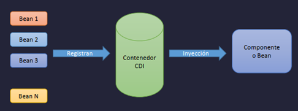
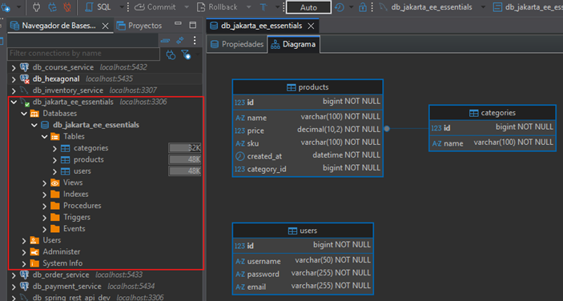

# 💉 Jakarta EE 11: CDI — Contexts and Dependency Injection

## ¿Qué es CDI?

`CDI (Contexts and Dependency Injection)` es la `especificación estándar` de `Jakarta EE` para la
`inyección de dependencias` y el `manejo de contextos`. Forma parte del estándar desde Java EE 6 y es,
junto con `JAX-RS`, la especificación más importante para el desarrollo moderno con Quarkus.

Al igual que `JPA`, `JAX-RS` o `Bean Validation`, `CDI` es una `especificación` — define el contrato.
`Weld` es su implementación de referencia (desarrollada por RedHat/JBoss, los mismos creadores de Quarkus).

## 🧩 ¿Qué es la Inyección de Dependencias?

Es un `patrón de diseño` que consiste en suministrarle a un objeto las referencias de otros objetos que necesita,
en lugar de que él mismo los cree. En Jakarta EE esto se rige por la especificación `JSR-330` y se expresa mediante
la anotación `@Inject`.

```java
// ❌ Sin inyección — el objeto crea su propia dependencia (alto acoplamiento)
public class OrderService {
    private PaymentService paymentService = new PaymentServiceImpl(); // acoplado
}

// ✅ Con inyección — el contenedor CDI suministra la dependencia (bajo acoplamiento)
public class OrderService {
    @Inject
    private PaymentService paymentService; // el contenedor CDI lo resuelve
}
```

## ⚙️ ¿Cómo funciona CDI?

CDI opera en dos pasos fundamentales:

```
┌─────────────────────────────────────────────────────┐
│                  CONTENEDOR CDI                     │
│                                                     │
│   1. REGISTRO          2. INYECCIÓN                 │
│                                                     │
│   PaymentService  ──►  OrderService                 │
│   OrderService    ──►  OrderController              │
│   UserService     ──►  UserController               │
│                                                     │
└─────────────────────────────────────────────────────┘
```

**Paso 1 — Registrar el bean:** El objeto debe ser reconocido por el contenedor CDI para que pueda ser gestionado y
ofrecido a otros componentes.

**Paso 2 — Inyectar el bean:** Una vez registrado, cualquier otro componente puede solicitarlo mediante `@Inject` y el
contenedor se encarga de suministrarlo.



> 📌 **Importante:** Tanto el objeto que **provee** la dependencia como el que la **recibe** deben estar registrados en
> el contenedor CDI. No puedes inyectar en un objeto que CDI no conoce.

## ✨ Características y beneficios de CDI

| Característica        | Descripción                                                          |
|-----------------------|----------------------------------------------------------------------|
| **Bajo acoplamiento** | Los componentes no se crean entre sí, el contenedor los conecta      |
| **Alta cohesión**     | Cada clase tiene una única responsabilidad bien definida             |
| **Modularidad**       | Fácil de reemplazar implementaciones sin tocar el código que las usa |
| **Menos código**      | Se elimina código repetitivo y configuraciones XML                   |
| **Más anotaciones**   | La configuración es declarativa, legible y directa en el código      |

> 🔗 **Conexión con Quarkus:** CDI es la columna vertebral de Quarkus. Cada vez que
> usas `@Inject`, `@ApplicationScoped`, `@RequestScoped` o `@Produces` en Quarkus,
> estás usando CDI puro. Quarkus no reinventó este mecanismo, lo adoptó completamente
> y lo optimizó para compilación nativa mediante su propio contenedor CDI llamado **ArC**.

## 📋 Registrar e Inyectar Beans

### 1. Registrar un bean

En CDI, `no necesitas hacer nada especial para registrar un bean`. Cualquier clase concreta es automáticamente
candidata a ser gestionada por el `contenedor CDI`:

```java
public interface Repositorio {
}

public class RepositorioImpl implements Repositorio {
    // CDI ya lo reconoce como bean — sin anotaciones adicionales
}
```

### 2. Inyectar un bean en otro bean

Una vez que el bean está registrado, cualquier otro componente CDI puede recibirlo mediante `@Inject`:

```java
public class ServiceImpl implements Service {

    @Inject
    private Repositorio repositorio; // CDI resuelve e inyecta RepositorioImpl
}
```

> 📌 CDI resuelve la inyección por **tipo** (`Repositorio`). Si existe una sola implementación, la inyecta
> automáticamente. Si hay varias, necesitas usar `@Named` o `@Qualifier` para desambiguar (lo veremos más adelante).

## 🗂️ Manejo de Contextos

El `contexto` de un bean define `cuánto tiempo vive` y `cuántas instancias` existen de él. Se define mediante
anotaciones directamente en la clase.

Si no defines ningún contexto explícitamente, el bean queda como `@Dependent` (contexto por defecto):

```java
// Sin anotación → contexto @Dependent por defecto
public class RepositorioImpl implements Repositorio {
}

// Con contexto explícito
@ApplicationScoped
public class ServiceImpl implements Service {

    @Inject
    private Repositorio repositorio;
}
```

## 🔭 Contextos CDI

### `@Dependent` — Contexto por defecto

Es el contexto más básico. El bean **no tiene vida propia**: adopta automáticamente el contexto del bean en el que
es inyectado. Cada vez que se inyecta, `se crea una nueva instancia ligada al ciclo de vida del bean receptor`.

```java
// Sin anotación → @Dependent implícito
public class RepositorioImpl implements Repositorio {
}

@RequestScoped
public class ServiceImpl implements Service {
    @Inject
    private Repositorio repositorio;
    // repositorio es @Dependent → vivirá tanto como ServiceImpl (@RequestScoped)
}
```

### `@RequestScoped` — Ámbito de petición

Se crea `una instancia por cada petición HTTP` y se destruye al finalizar la misma. Es el scope más común para
servicios y repositorios en una `API REST`.

```java

@RequestScoped
public class CarritoService {
    private List items = new ArrayList<>();

    public void agregar(Item item) {
        items.add(item);
    }
}
// Cada petición HTTP obtiene su propio CarritoService — aislado y seguro
```

### `@SessionScoped` — Ámbito de sesión

Se crea `una instancia por sesión de usuario` (cookie de sesión HTTP) y se destruye cuando la sesión expira o el
usuario cierra sesión. Requiere que el bean sea `Serializable`.

```java

@SessionScoped
public class UsuarioSesion implements Serializable {
    private String username;
    private List<String> roles;
    // La misma instancia se mantiene durante toda la sesión del usuario
}
```

> ⚠️ Este scope aplica a aplicaciones web tradicionales con estado de sesión. `En APIs REST stateless raramente se usa`.

### `@ConversationScoped` — Ámbito de conversación

Scope intermedio entre `@RequestScoped` y `@SessionScoped`. Permite definir manualmente `cuándo inicia y cuándo termina`
el ciclo de vida del bean, abarcando múltiples peticiones HTTP dentro de una misma sesión.

```java

@ConversationScoped
public class ProcesoCompra implements Serializable {

    @Inject
    private Conversation conversation;

    public void iniciar() {
        conversation.begin(); // inicia la conversación manualmente
    }

    public void finalizar() {
        conversation.end(); // termina la conversación manualmente
    }
}
```

> ⚠️ Diseñado para flujos de múltiples pasos (wizards, procesos de compra). `En APIs REST modernas no se usa` —
> mencionarlo como contexto histórico es suficiente.

### `@ApplicationScoped` — Ámbito de aplicación ⭐

Existe `una única instancia` para toda la aplicación, compartida por todos los clientes y todas las peticiones. Es el
equivalente a un `Singleton`.

```java

@ApplicationScoped
public class ConfiguracionApp {
    private final String appName = "Mi App";
    private final String version = "1.0.0";

    public String getAppName() {
        return appName;
    }

    public String getVersion() {
        return version;
    }
}
```

> ⚠️ **Importante con la concurrencia:** Al ser una sola instancia compartida por todos los clientes simultáneamente,
> los atributos mutables deben ser `thread-safe`:

```java

@ApplicationScoped
public class ContadorVisitas {
    // ❌ MAL — no es thread-safe
    private int contador = 0;

    // ✅ BIEN — thread-safe
    private AtomicInteger contador = new AtomicInteger(0);
}
```

## 📊 Resumen comparativo de contextos

| Scope                 | Duración de vida     | Instancias           | Uso típico                   |
|-----------------------|----------------------|----------------------|------------------------------|
| `@Dependent`          | La del bean receptor | Una por inyección    | Helpers, utilitarios         |
| `@RequestScoped`      | Una petición HTTP    | Una por petición     | Servicios, repositorios REST |
| `@SessionScoped`      | Sesión del usuario   | Una por sesión       | Apps web con login           |
| `@ConversationScoped` | Manual (begin/end)   | Una por conversación | Flujos de múltiples pasos    |
| `@ApplicationScoped`  | Toda la aplicación   | Una sola (Singleton) | Configuración, caché global  |

> 🔗 **Conexión con Quarkus:** Quarkus usa exactamente estos mismos scopes. El más
> importante es `@ApplicationScoped`, que es el scope por defecto recomendado en
> Quarkus para servicios y repositorios. `@RequestScoped` también se usa pero con
> menos frecuencia gracias al modelo reactivo. `@SessionScoped` y
> `@ConversationScoped` prácticamente no se usan en APIs REST con Quarkus.

## 🏷️ Anotación `@Named`

CDI permite asignar un `nombre explícito` a un bean mediante `@Named`. Esto es útil principalmente en dos escenarios:
cuando hay `múltiples implementaciones` de una misma interfaz y necesitas distinguirlas, o cuando quieres acceder
al bean desde vistas JSP mediante Expression Language (EL).

```java
public interface Repositorio {
}

@Named("jdbcRepositorio")
public class RepositorioImpl implements Repositorio {
}
```

Para inyectarlo, combinas `@Inject` con `@Named` indicando el nombre del bean:

```java

@ApplicationScoped
public class ServiceImpl implements Service {

    @Inject
    @Named("jdbcRepositorio")
    private Repositorio repositorio;
}
```

> 📌 **Cuándo usar `@Named` para desambiguar:** Si tienes dos implementaciones de `Repositorio` — por ejemplo
> `JdbcRepositorioImpl` y `JpaRepositorioImpl` — CDI no sabría cuál inyectar y lanzaría un error de ambigüedad.
> `@Named` (o mejor aún, un `@Qualifier` propio) resuelve ese conflicto:

```java

@Named("jdbcRepositorio")
public class JdbcRepositorioImpl implements Repositorio {
}

@Named("jpaRepositorio")
public class JpaRepositorioImpl implements Repositorio {
}
```

## 🎯 `@Qualifier` — La alternativa más robusta a `@Named`

Mientras `@Named` desambigua por un `nombre en texto` (un String propenso a typos), `@Qualifier` te permite crear tus
`propias anotaciones personalizadas` para identificar implementaciones. Es la forma recomendada en CDI cuando tienes
múltiples implementaciones de una misma interfaz.

> 💡 **¿Qué es un typo?** Es simplemente un error tipográfico al escribir. Con `@Named` puedes escribir
> `"jdbRepositorio"` (falta la 'c') en lugar de `"jdbcRepositorio"` y el código compila sin problemas — el error solo
> aparece cuando la app arranca. Con `@Qualifier` usas anotaciones reales, por lo que el IDE te avisa al instante
> si te equivocas, antes de compilar.

### 🛠️ ¿Cómo usar `@Qualifier`?

### Paso 1 — Defines tu propia anotación qualifier

```java

@Qualifier
@Retention(RetentionPolicy.RUNTIME)
@Target({ElementType.FIELD, ElementType.TYPE, ElementType.METHOD})
public @interface Jdbc {
}

@Qualifier
@Retention(RetentionPolicy.RUNTIME)
@Target({ElementType.FIELD, ElementType.TYPE, ElementType.METHOD})
public @interface Jpa {
}
```

> 📌 **¿Qué significan esas meta-anotaciones?**
>
> **`@Qualifier`** — le indica a CDI que esta anotación será usada como un identificador para distinguir entre
> múltiples implementaciones de una misma interfaz. Sin esta meta-anotación, CDI ignoraría tu anotación personalizada
> como qualifier.
>
> **`@Retention(RetentionPolicy.RUNTIME)`** — define hasta cuándo "sobrevive" la anotación. `RUNTIME` significa que la
> anotación sigue disponible en tiempo de ejecución, lo que permite que CDI (y frameworks como Quarkus) la lean
> mediante reflexión para resolver las inyecciones. Sin esto, CDI no podría ver tu qualifier.
> Los otros valores posibles son `SOURCE` (solo en código fuente, se descarta al compilar) y `CLASS` (se guarda en el
> `.class` pero no en runtime).
>
> **`@Target`** — define **en qué lugares** puedes usar tu anotación. Los valores usados aquí son:
> - `ElementType.FIELD` → en atributos de instancia (`@Inject @Jdbc private Repositorio r`)
> - `ElementType.TYPE` → en clases o interfaces (`@Jdbc public class JdbcImpl...`)
> - `ElementType.METHOD` → en métodos (útil para `@Produces`)

### Paso 2 — Anotas cada implementación con su qualifier

```java

@Jdbc
public class JdbcRepositorioImpl implements Repositorio {
}

@Jpa
public class JpaRepositorioImpl implements Repositorio {
}
```

### Paso 3 — Inyectas indicando qué implementación quieres

```java

@ApplicationScoped
public class ServiceImpl implements Service {

    @Inject
    @Jdbc  // CDI inyecta JdbcRepositorioImpl
    private Repositorio repositorio;
}
```

## 📊 `@Named` vs `@Qualifier`

|                     | `@Named`                             | `@Qualifier`                        |
|---------------------|--------------------------------------|-------------------------------------|
| **Identificación**  | Por String `"jdbcRepositorio"`       | Por anotación propia `@Jdbc`        |
| **Typos**           | ⚠️ Posibles — falla en runtime       | ✅ Imposibles — falla en compilación |
| **Refactoring**     | ⚠️ Manual — hay que buscar el String | ✅ Automático con el IDE             |
| **Legibilidad**     | Regular                              | Alta                                |
| **Uso recomendado** | Acceso desde JSP/EL                  | Desambiguar implementaciones        |

> 🔗 **Conexión con Quarkus:** En Quarkus `@Qualifier` funciona exactamente igual.
> De hecho, Quarkus lo usa internamente — por ejemplo `@RestClient` es un qualifier
> que identifica beans generados para clientes REST. Cuando tengas múltiples
> implementaciones de una interfaz en Quarkus, `@Qualifier` es la forma correcta
> de resolverlo.

## 🏭 Anotación `@Produces`

Cuando un objeto no puede ser registrado directamente como bean CDI (por ejemplo, una clase de una librería externa que
no puedes anotar), `@Produces` te permite **registrarlo a través de un método fábrica**. El objeto que retorna ese
método queda registrado en el contenedor CDI.

```java

@Produces
public Conexion produceConexion() {
    return new Conexion(); // CDI registra este objeto como bean
}
```

El método productor también puede combinarse con un scope y un nombre:

```java

@Produces
@RequestScoped
@Named("conn")
public Conexion produceConexion() {
    return new Conexion();
    // Una instancia por petición HTTP, accesible por el nombre "conn"
}
```

> 🔗 **Conexión con Quarkus:** `@Produces` es muy usado en Quarkus para registrar
> beans de librerías externas que no puedes anotar directamente, como clientes HTTP,
> configuraciones personalizadas o conexiones especiales. Es una pieza clave del
> ecosistema CDI.

## 🔗 Integración con EL (Expression Language)

Cuando `@Named` se usa `sin valor`, el nombre del bean se deriva automáticamente del nombre de la clase en
`camelCase` con `la primera letra en minúscula`:

```java

@SessionScoped
@Named  // nombre automático → "carro"
public class Carro implements Serializable {
    private List items;
    private BigDecimal total;
}
```

Esto permite acceder al bean directamente desde vistas JSP mediante EL:

```html

<c:forEach items="${carro.items}" var="item">
    …
</c:forEach>
Total: ${carro.total}
```

> ⚠️ **Nota:** La integración con EL y JSP es el caso de uso **original** de `@Named`,
> pensado para aplicaciones web tradicionales. En el contexto de **APIs REST y Quarkus**
> no lo usarás para esto — allí `@Named` se emplea principalmente para desambiguar
> entre múltiples implementaciones de una misma interfaz, como vimos arriba.

---

# 🏗️ Proyecto de Práctica CDI

> ⚠️ **Nota:** Este proyecto es una aplicación web **MVC tradicional** (Servlets + JSP),
> no una REST API. Usa sesiones, vistas JSP, conexión manual a base de datos (JDBC)
> y sigue el patrón MVC con filtros y listeners.
>
> Lo trabajamos en este formato porque el objetivo no es la arquitectura del proyecto
> en sí, sino **observar el contraste entre una aplicación sin CDI y con CDI**, para
> entender de forma práctica qué problema resuelve la inyección de dependencias.
> En el mundo real con Quarkus trabajaremos REST APIs stateless.

## 🔧 Proyecto Sin CDI

### 📄 Dependencias y plugins — `pom.xml`

````xml
<?xml version="1.0" encoding="UTF-8"?>
<project xmlns="http://maven.apache.org/POM/4.0.0"
         xmlns:xsi="http://www.w3.org/2001/XMLSchema-instance"
         xsi:schemaLocation="http://maven.apache.org/POM/4.0.0 http://maven.apache.org/xsd/maven-4.0.0.xsd">
    <modelVersion>4.0.0</modelVersion>

    <groupId>dev.magadiflo</groupId>
    <artifactId>01-web-app-without-cdi</artifactId>
    <version>1.0-SNAPSHOT</version>

    <packaging>war</packaging>

    <properties>
        <maven.compiler.source>25</maven.compiler.source>
        <maven.compiler.target>25</maven.compiler.target>
        <project.build.sourceEncoding>UTF-8</project.build.sourceEncoding>
        <project.reporting.outputEncoding>UTF-8</project.reporting.outputEncoding>
    </properties>
    <dependencies>
        <dependency>
            <groupId>jakarta.platform</groupId>
            <artifactId>jakarta.jakartaee-api</artifactId>
            <version>11.0.0</version>
            <scope>provided</scope>
        </dependency>
        <dependency>
            <groupId>com.fasterxml.jackson.core</groupId>
            <artifactId>jackson-databind</artifactId>
            <version>2.21.1</version>
        </dependency>
        <dependency>
            <groupId>jakarta.servlet.jsp.jstl</groupId>
            <artifactId>jakarta.servlet.jsp.jstl-api</artifactId>
            <version>3.0.2</version>
        </dependency>
        <dependency>
            <groupId>org.glassfish.web</groupId>
            <artifactId>jakarta.servlet.jsp.jstl</artifactId>
            <version>3.0.1</version>
        </dependency>
    </dependencies>

    <build>
        <plugins>
            <plugin>
                <groupId>org.apache.maven.plugins</groupId>
                <artifactId>maven-compiler-plugin</artifactId>
                <version>3.14.1</version>
            </plugin>
            <plugin>
                <groupId>org.apache.tomcat.maven</groupId>
                <artifactId>tomcat7-maven-plugin</artifactId>
                <version>2.2</version>

                <!--Ruta para el despliegue en Tomcat-->
                <configuration>
                    <url>http://localhost:8080/manager/text</url>
                    <username>admin</username>
                    <password>admin</password>
                </configuration>
            </plugin>
            <plugin>
                <artifactId>maven-war-plugin</artifactId>
                <version>3.4.0</version>
            </plugin>
        </plugins>
    </build>

</project>
````

#### 🔍 Dependencias destacadas

| Dependencia                            | Descripción                                                                                                  |
|----------------------------------------|--------------------------------------------------------------------------------------------------------------|
| `jakarta.jakartaee-api`                | API completa de Jakarta EE 11. Scope `provided` porque el servidor (Tomcat + librerías) la provee en runtime |
| `jackson-databind`                     | Serialización/deserialización JSON                                                                           |
| `jakarta.servlet.jsp.jstl-api`         | Especificación de JSTL — define el contrato de las etiquetas estándar para JSP                               |
| `jakarta.servlet.jsp.jstl` (Glassfish) | Implementación de JSTL — la lógica real detrás de las etiquetas como `<c:forEach>`                           |

> 📌 **¿Por qué dos dependencias para JSTL?** Sigue el mismo patrón de especificación/implementación que vemos en todo
> Jakarta EE: una dependencia define **el contrato** (la API) y otra provee **la implementación concreta**.
> Es el mismo principio que `jakarta.jakartaee-api` + Tomcat/WildFly.

#### 🔍 Plugins destacados

| Plugin                  | Descripción                                                     |
|-------------------------|-----------------------------------------------------------------|
| `maven-compiler-plugin` | Compilación con Java 25                                         |
| `tomcat7-maven-plugin`  | Despliega el `.war` automáticamente en Tomcat vía Maven         |
| `maven-war-plugin`      | Empaqueta el proyecto como `.war` para ser desplegado en Tomcat |

### 📦 Modelos

El proyecto maneja 5 modelos que representan las entidades principales de la aplicación:

```
User          → Usuario del sistema (login)
Category      → Categoría de producto
Product       → Producto de la tienda
CartItem      → Ítem dentro del carrito (producto + cantidad)
ShoppingCart  → Carrito de compras (colección de CartItems)
```

#### `User`

Representa al usuario de la aplicación. Contiene los datos básicos de autenticación.

```java
public class User {
    private Long id;
    private String username;
    private String password;
    private String email;

    /* Setters and Getters */
}
````

#### `Category`

Categoría a la que pertenece un producto. Modelo simple de solo dos atributos.

```java
public class Category {
    private Long id;
    private String name;

    /* Setters and Getters */
}
````

#### `Product`

Representa un producto de la tienda. Contiene una referencia a su `Category` (relación de composición) y sobreescribe
`equals`/`hashCode` basándose en el `id`, lo que permite comparar productos correctamente en colecciones como el
carrito.

```java
public class Product {
    private Long id;
    private String name;
    private Category category;
    private BigDecimal price;
    private String sku;
    private LocalDateTime createdAt;

    public Product() {
    }

    // Constructor de conveniencia — crea el producto y su categoría en un solo paso
    public Product(Long id, String name, String tipo, BigDecimal price) {
        this.id = id;
        this.name = name;
        this.price = price;

        Category category = new Category();
        category.setName(tipo);
        this.category = category;
    }

    /* Setters and Getters */

    @Override
    public boolean equals(Object o) { // basado en id
        if (o == null || getClass() != o.getClass()) return false;
        Product product = (Product) o;
        return Objects.equals(getId(), product.getId());
    }

    @Override
    public int hashCode() { // basado en id
        return Objects.hashCode(getId());
    }
}
````

#### `CartItem`

Representa un ítem dentro del carrito: un producto con una cantidad determinada. Es el modelo más rico en lógica de
negocio:

- Valida en el constructor que la cantidad sea positiva, el producto no sea nulo y el precio sea válido.
- Calcula su propio subtotal: `unitPrice × quantity`.
- Permite aumentar y disminuir la cantidad con validaciones.
- `equals`/`hashCode` basados en el `Product` — dos `CartItem` son iguales si contienen el mismo producto,
  independientemente de la cantidad.

```java
public class CartItem {
    private int quantity;
    private final BigDecimal unitPrice; // se fija al momento de crear el item
    private final Product product;      // inmutable — no puede cambiar el producto

    public CartItem(int quantity, Product product) {
        if (quantity <= 0) {
            throw new IllegalArgumentException("La cantidad debe ser mayor que cero");
        }
        if (product == null) {
            throw new IllegalArgumentException("El producto no puede ser nulo");
        }
        if (product.getPrice() == null || product.getPrice().compareTo(BigDecimal.ZERO) < 0) {
            throw new IllegalArgumentException("El precio del producto es inválido");
        }

        this.quantity = quantity;
        this.product = product;
        this.unitPrice = product.getPrice();
    }

    public BigDecimal getSubtotal() {
        return this.unitPrice
                .multiply(BigDecimal.valueOf(quantity))
                .setScale(2, RoundingMode.HALF_UP); // redondeo estándar comercial
    }

    public int getQuantity() {
        return quantity;
    }

    public void increaseQuantity(int quantity) {
        if (quantity <= 0) {
            throw new IllegalArgumentException("La cantidad debe ser positiva");
        }
        this.quantity += quantity;
    }

    public void decreaseQuantity(int quantity) {
        if (quantity <= 0) {
            throw new IllegalArgumentException("La cantidad debe ser positiva");
        }
        if (this.quantity - quantity < 1) {
            throw new IllegalArgumentException("La cantidad mínima es 1. El item debe eliminarse del carrito");
        }
        this.quantity -= quantity;
    }

    public BigDecimal getUnitPrice() {
        return unitPrice;
    }


    public Product getProduct() {
        return product;
    }

    @Override
    public boolean equals(Object o) {
        if (o == null || getClass() != o.getClass()) return false;
        CartItem cartItem = (CartItem) o;
        return Objects.equals(getProduct(), cartItem.getProduct());
    }

    @Override
    public int hashCode() {
        return Objects.hashCode(getProduct());
    }
}
````

> 📌 `unitPrice` es `final` porque el precio se congela en el momento en que el ítem se agrega al carrito. Si el precio
> del producto cambia después, el carrito no se ve afectado — comportamiento esperado en cualquier e-commerce.

#### `ShoppingCart`

Gestiona la colección de `CartItem`. Toda la lógica de manipulación del carrito vive aquí:

````java

public class ShoppingCart {

    private List<CartItem> items = new ArrayList<>();

    public List<CartItem> getItems() {
        return items;
    }

    // Calcula el total sumando los subtotales de todos los items
    public BigDecimal getTotal() {
        return this.items.stream()
                .map(CartItem::getSubtotal)
                .reduce(BigDecimal.ZERO, BigDecimal::add);
    }

    // Agrega un item — si el producto ya existe, incrementa su cantidad en 1
    public void addItemToCart(CartItem item) {
        this.items.stream()
                .filter(cartItem -> cartItem.equals(item))
                .findFirst()
                .ifPresentOrElse(
                        cartItem -> cartItem.increaseQuantity(1),
                        () -> this.items.add(item)
                );
    }

    // Elimina múltiples items por lista de IDs de producto
    public void removeItemsByProductId(List<Long> productIds) {
        List<CartItem> itemsToRemove = this.items.stream()
                .filter(cartItem -> productIds.contains(cartItem.getProduct().getId()))
                .toList();
        this.items.removeAll(itemsToRemove);
    }

    // Elimina un item por ID de producto
    public void removeItemByProductId(Long productId) {
        this.items.removeIf(cartItem -> productId.equals(cartItem.getProduct().getId()));
    }

    // Aumenta la cantidad de un item específico
    public void increaseQuantityOfItem(Long productId, Integer quantity) {
        this.items.stream()
                .filter(cartItem -> productId.equals(cartItem.getProduct().getId()))
                .findFirst()
                .ifPresent(cartItem -> cartItem.increaseQuantity(quantity));
    }

    // Disminuye la cantidad de un item específico
    public void decreaseQuantityOfItem(Long productId, Integer quantity) {
        this.items.stream()
                .filter(cartItem -> productId.equals(cartItem.getProduct().getId()))
                .findFirst()
                .ifPresent(cartItem -> cartItem.decreaseQuantity(quantity));
    }
}
````

> 📌 `addItemToCart()` implementa una regla de negocio importante: si intentas agregar un producto que ya está en el
> carrito, no duplica el ítem sino que incrementa su cantidad. Esto es posible gracias al `equals` de `CartItem`
> basado en el producto.

## 🗄️ DAOs

La capa de acceso a datos sigue el patrón **DAO (Data Access Object)**, centralizando toda la lógica de base de datos y
separándola del resto de la aplicación.

### `GenericDAO<T>` — Interfaz base

Define el contrato CRUD común para todas las entidades:

````java
public interface GenericDAO<T> {
    List<T> getAll() throws SQLException;

    T findById(Long id) throws SQLException;

    void save(T t) throws SQLException; // INSERT o UPDATE según corresponda

    void deleteById(Long id) throws SQLException;
}
````

> 📌 Todos los métodos declaran `throws SQLException` porque JDBC es una API que
> trabaja con excepciones chequeadas. Cada operación con la base de datos puede
> fallar y el llamador debe decidir cómo manejarlo.

### `CategoryDAOImpl`

Implementa `GenericDAO<Category>`. Recibe la `Connection` por constructor — es
el llamador quien gestiona y provee la conexión:

````java

public class CategoryDAOImpl implements GenericDAO<Category> {

    private final Connection connection;

    public CategoryDAOImpl(Connection connection) {
        this.connection = connection;
    }

    @Override
    public List<Category> getAll() throws SQLException {
        List<Category> categories = new ArrayList<>();

        try (Statement statement = this.connection.createStatement();
             ResultSet resultSet = statement.executeQuery("SELECT * FROM categories")) {
            while (resultSet.next()) {
                categories.add(this.buildCategory(resultSet));
            }
        }

        return categories;
    }

    @Override
    public Category findById(Long id) throws SQLException {
        Category category = null;
        try (PreparedStatement preparedStatement = this.connection.prepareStatement("SELECT * FROM categories AS c WHERE c.id = ?")) {
            preparedStatement.setLong(1, id);
            try (ResultSet resultSet = preparedStatement.executeQuery()) {
                if (resultSet.next()) {
                    category = this.buildCategory(resultSet);
                }
            }
        }
        return category;
    }

    @Override
    public void save(Category category) throws SQLException {
        // INSERT o UPDATE según corresponda
    }

    @Override
    public void deleteById(Long id) throws SQLException {
        try (PreparedStatement preparedStatement = this.connection.prepareStatement("DELETE FROM categories WHERE id = ?")) {
            preparedStatement.setLong(1, id);
            preparedStatement.executeUpdate();
        }
    }

    // Mapeo ResultSet → Category centralizado en un método privado
    private Category buildCategory(ResultSet resultSet) throws SQLException {
        Category category = new Category();
        category.setId(resultSet.getLong("id"));
        category.setName(resultSet.getString("name"));
        return category;
    }
}
````

### `UserDAO` y `UserDAOImpl`

`UserDAO` extiende `GenericDAO<User>` agregando un método específico de dominio:

```java
public interface UserDAO extends GenericDAO<User> {
    User findByUsername(String username) throws SQLException;
}
````

`UserDAOImpl` solo implementa `findByUsername()` porque es el único método
requerido por la aplicación — los demás quedan vacíos intencionalmente:

````java
public class UserDAOImpl implements UserDAO {

    private final Connection connection;

    public UserDAOImpl(Connection connection) {
        this.connection = connection;
    }

    @Override
    public List<User> getAll() throws SQLException {
        return null;
    }

    @Override
    public User findById(Long id) throws SQLException {
        return null;
    }

    @Override
    public void save(User category) throws SQLException {
    }

    @Override
    public void deleteById(Long id) throws SQLException {

    }

    @Override
    public User findByUsername(String username) throws SQLException {
        User user = null;
        try (PreparedStatement preparedStatement = this.connection.prepareStatement("SELECT * FROM users AS u WHERE u.username = ?")) {
            preparedStatement.setString(1, username);
            try (ResultSet resultSet = preparedStatement.executeQuery()) {
                if (resultSet.next()) {
                    user = new User();
                    user.setId(resultSet.getLong("id"));
                    user.setUsername(resultSet.getString("username"));
                    user.setPassword(resultSet.getString("password"));
                    user.setEmail(resultSet.getString("email"));
                }
            }
        }
        return user;
    }
}
````

### `ProductDAOImpl`

El DAO más completo. Usa un `JOIN` para traer la categoría junto con el producto
en una sola query, evitando múltiples viajes a la base de datos:

````java

public class ProductDAOImpl implements GenericDAO<Product> {

    // Query base reutilizada en getAll() y findById()
    private static final String SQL_ALL_PRODUCTS = """
            SELECT p.*, c.name AS category_name
            FROM products AS p
                INNER JOIN categories AS c ON(p.category_id = c.id)
            """;
    private final Connection connection;

    public ProductDAOImpl(Connection connection) {
        this.connection = connection;
    }

    @Override
    public List<Product> getAll() throws SQLException {
        List<Product> products = new ArrayList<>();
        try (Statement statement = this.connection.createStatement();
             ResultSet resultSet = statement.executeQuery(SQL_ALL_PRODUCTS + " ORDER BY p.id ASC")) {
            while (resultSet.next()) {
                products.add(this.buildProduct(resultSet));
            }
        }
        return products;
    }

    @Override
    public Product findById(Long id) throws SQLException {
        Product product = null;
        try (PreparedStatement preparedStatement = this.connection.prepareStatement(SQL_ALL_PRODUCTS + " WHERE p.id = ?")) {
            preparedStatement.setLong(1, id);
            try (ResultSet resultSet = preparedStatement.executeQuery()) {
                if (resultSet.next()) {
                    product = this.buildProduct(resultSet);
                }
            }
        }
        return product;
    }

    @Override
    public void save(Product product) throws SQLException {
        // INSERT si id es null, UPDATE si ya tiene id
        String sql = Objects.isNull(product.getId())
                ? "INSERT INTO products(name, price, sku, category_id, created_at) VALUES(?,?,?,?,?)"
                : """
                UPDATE products
                SET name = ?,
                    price = ?,
                    sku = ?,
                    category_id = ?
                WHERE id = ?
                """;
        try (PreparedStatement preparedStatement = this.connection.prepareStatement(sql)) {
            preparedStatement.setString(1, product.getName());
            preparedStatement.setBigDecimal(2, product.getPrice());
            preparedStatement.setString(3, product.getSku());
            preparedStatement.setLong(4, product.getCategory().getId());

            if (Objects.isNull(product.getId())) {
                preparedStatement.setTimestamp(5, Timestamp.valueOf(product.getCreatedAt()));
            } else {
                preparedStatement.setLong(5, product.getId());
            }

            preparedStatement.executeUpdate();
        }
    }

    @Override
    public void deleteById(Long id) throws SQLException {
        String sql = "DELETE FROM products WHERE id = ?";
        try (PreparedStatement preparedStatement = this.connection.prepareStatement(sql)) {
            preparedStatement.setLong(1, id);
            preparedStatement.executeUpdate();
        }
    }

    // Mapeo ResultSet → Product + Category en un solo paso
    private Product buildProduct(ResultSet rs) throws SQLException {
        Product product = new Product();
        product.setId(rs.getLong("id"));
        product.setName(rs.getString("name"));
        product.setPrice(rs.getBigDecimal("price"));
        product.setSku(rs.getString("sku"));
        product.setCreatedAt(rs.getObject("created_at", LocalDateTime.class));

        Category category = new Category();
        category.setId(rs.getLong(("category_id")));
        category.setName(rs.getString("category_name"));
        product.setCategory(category);
        return product;
    }
}
````

> 📌 **Patrón INSERT/UPDATE en `save()`:** En lugar de tener dos métodos separados
> (`insert()` y `update()`), se unifica en `save()` detectando si el objeto tiene
> `id` o no.
>
> Si `id` es `null` → es nuevo → `INSERT`.  
> Si tiene `id` → ya existe → `UPDATE`.
>
> Este patrón lo verás también en JPA con `entityManager.persist()` vs `entityManager.merge()`.

## 🐬 Instalando el Driver MySQL en Tomcat

### ¿Por qué este paso?

En **Spring Boot**, el driver MySQL se incluye como dependencia en el `pom.xml` y queda empaquetado dentro del
`.jar` ejecutable de la aplicación — todo va junto.

En cambio, con **Tomcat standalone**, es decir, con Apache Tomcat instalado y ejecutándose de forma independiente
(en nuestra máquina local o en un servidor, y no embebido dentro de una aplicación), el servidor gestiona las conexiones
a base de datos a nivel global mediante un **DataSource compartido** (`context.xml`). Esto significa que el driver debe
estar disponible para Tomcat **antes** de que cualquier aplicación arranque, por eso debe instalarse directamente en su
directorio `/lib` y no dentro del `.war` de la aplicación.

```
Spring Boot:  [app.jar] contiene todo → driver adentro ✅
Tomcat:       [tomcat/lib] + [app.war] separados → driver en /lib ✅
```

### 📋 Pasos

**1. Localizar el driver** — Maven lo descarga automáticamente al compilar cualquier proyecto que lo use. En mi caso he
usado el driver de mysql en varios proyectos de Spring Boot, así que ya lo debemos tener descargado.
Lo encontramos en el repositorio local de Maven:

```
C:\Users\magadiflo\.m2\repository\com\mysql\mysql-connector-j\9.6.0\mysql-connector-j-9.6.0.jar
```

**2. Copiarlo al directorio `/lib` de Apache Tomcat:**

```
C:\apache-tomcat-11.0.18\lib\
```

**3. Verificar que quedó instalado correctamente:**

```bash
C:\apache-tomcat-11.0.18\lib
$ ls -l | grep mysql
-rw-r--r-- 1 magadiflo 197121 2602989 Mar  9 13:15 mysql-connector-j-9.6.0.jar
```

> 💡 **Nota técnica:**  
> Copiar el `.jar` del driver en el directorio `/lib` de Tomcat es suficiente para dejarlo instalado y disponible
> globalmente. No es necesario realizar ninguna configuración adicional, ya que Tomcat carga automáticamente todas las
> librerías de este directorio al iniciar.
>
> 🔄 Eso sí, debes `reiniciar Tomcat` después de copiar el archivo para que el driver sea reconocido.

> ⚠️ **Importante:**  
> Cada vez que actualices la versión del driver MySQL, debes reemplazar el `.jar` en `/lib`
> manualmente y reiniciar Tomcat para que tome el nuevo driver.

## 🚨 Excepción personalizada: `DatabaseException`

Excepción personalizada de tipo `RuntimeException` (no chequeada) que usaremos para envolver errores de base de datos y
activar el `rollback` en el filtro:

````java
public class DatabaseException extends RuntimeException {
    public DatabaseException(String message) {
        super(message);
    }

    public DatabaseException(String message, Throwable cause) {
        super(message, cause);
    }
}
````

> 📌 Extiende `RuntimeException` y no `Exception` para no obligar a quien la lanza a declararla con `throws`. Así el
> código queda más limpio sin perder la capacidad de capturarla cuando sea necesario.

## 🔌 Conexión a Base de Datos

> 📌 Existen dos formas de establecer conexión a la base de datos en una aplicación Jakarta EE con Tomcat. Documentamos
> ambas para tener el panorama completo, pero **en este proyecto usaremos la `Forma 2 (DataSource)`** por ser la
> aproximación recomendada en entornos reales.

|                           | `DriverManager`                 | `DataSource`                     |
|---------------------------|---------------------------------|----------------------------------|
| **Gestión de conexiones** | Crea una nueva por cada llamada | Pool de conexiones reutilizables |
| **Rendimiento**           | Bajo en producción              | Alto                             |
| **Configuración**         | En el código Java               | En `context.xml` de Tomcat       |
| **Uso recomendado**       | Pruebas / aprendizaje           | Entornos reales                  |

## 🔌 Forma 1 — `DriverManager` (conexión directa)

### `DriverManagerConnectionFactory`

Clase utilitaria que centraliza la creación de conexiones JDBC. Vive en el paquete `dev.magadiflo.app.db` y sigue el
patrón **Factory** — su único propósito es fabricar conexiones.

````java
public class DriverManagerConnectionFactory {

    private static final Logger log = Logger.getLogger(DriverManagerConnectionFactory.class.getName());

    private static final String URL = "jdbc:mysql://localhost:3306/db_jakarta_ee_essentials?serverTimezone=America/Lima";
    private static final String USER = "root";
    private static final String PASSWORD = "magadiflo";

    private DriverManagerConnectionFactory() {
        // Constructor privado — evita instanciación, esta clase no debe ser instanciada
    }

    public static Connection getConnection() throws SQLException {
        log.info("Estableciendo conexión a la base de datos");
        return DriverManager.getConnection(URL, USER, PASSWORD);
    }
}
````

#### 🔍 Puntos clave

- **Constructor privado** — impide que alguien haga `new DriverManagerConnectionFactory()`. Al ser una clase puramente
  utilitaria con métodos estáticos, no tiene sentido instanciarla
- **`DriverManager.getConnection()`** — abre una nueva conexión física a la base de datos cada vez que se llama. Es la
  forma más simple de conectarse pero también la menos eficiente, ya que no reutiliza conexiones (para eso existe el
  `DataSource`, lo veremos más adelante)
- **Credenciales hardcodeadas** — válido solo para aprendizaje. En un entorno productivo jamás se hardcodean
  credenciales en el código. Lo correcto es usar **variables de entorno** o un gestor de secretos.

> 🔗 **Conexión con Quarkus:** En Quarkus nunca escribes esto manualmente. Configuras
> la conexión en `application.properties` y Quarkus crea y gestiona el `DataSource`
> automáticamente:
> ```properties
> quarkus.datasource.db-kind=mysql
> quarkus.datasource.username=${DB_USER}
> quarkus.datasource.password=${DB_PASSWORD}
> quarkus.datasource.jdbc.url=jdbc:mysql://localhost:3306/mi_db
> ```

## 🔗 Creando filtro: `DatabaseConnectionFilter`

El filtro que **envuelve cada petición HTTP en una transacción de base de datos**. Es la pieza que une todo: obtiene la
conexión, la pasa al servlet, y según el resultado hace `commit` o `rollback`.

````java

@WebFilter("/*") //El patrón definido indica que se aplicará a cualquier ruta
public class DatabaseConnectionFilter implements Filter {

    private static final Logger log = Logger.getLogger(DatabaseConnectionFilter.class.getName());

    @Override
    public void doFilter(ServletRequest request, ServletResponse response, FilterChain chain)
            throws IOException, ServletException {
        try (Connection connection = DataSourceConnectionFactory.getConnection()) {

            // Desactivamos autoCommit para manejar la transacción manualmente
            if (connection.getAutoCommit()) {
                log.info("Desactivando autoCommit");
                connection.setAutoCommit(false);
            }

            try {
                // Compartimos la conexión con el servlet vía atributo del request
                log.info("Agregando 'connection' al request");
                request.setAttribute("connection", connection);

                chain.doFilter(request, response); // Continuamos con la cadena de filtros hasta llegar al Servlet

                log.info("Realizando 'commit' en la base de datos");
                connection.commit(); // tod OK → confirmamos cambios
            } catch (SQLException | DatabaseException ex) {
                log.warning("Realizando 'rollback' en la base de datos");
                connection.rollback(); // algo falló → revertimos cambios

                HttpServletResponse httpServletResponse = (HttpServletResponse) response;
                httpServletResponse.sendError(HttpServletResponse.SC_INTERNAL_SERVER_ERROR, ex.getMessage());
                ex.printStackTrace();
            }
        } catch (SQLException ex) {
            ex.printStackTrace(); // fallo al obtener la conexión
        }
    }
}
````

#### 🔍 Puntos clave del filtro

- **`try-with-resources` en la conexión** — garantiza que la conexión se cierre automáticamente al terminar la petición,
  sin importar si hubo error o no. Cada petición HTTP obtiene su propia conexión y la libera al finalizar.
- **`setAutoCommit(false)`** — desactiva el commit automático para tomar control manual de la transacción. Sin esto,
  cada sentencia SQL se confirmaría de forma independiente sin posibilidad de revertirlas juntas.
- **`request.setAttribute("connection", connection)`** — el mecanismo para compartir la conexión con el servlet. El
  servlet la recupera luego con `(Connection) request.getAttribute("connection")`.
- **`chain.doFilter()`** — ejecuta el servlet. Todo lo que ocurre antes es pre-procesamiento, todo lo que ocurre después
  es post-procesamiento.
- **Doble `try-catch`** — el exterior captura fallos al **obtener** la conexión, el interior captura fallos durante la
  **ejecución** del servlet.

### 🔄 Flujo completo por petición

```
HTTP Request
     │
     ▼
[DriverManagerConnectionFilter]
     │
     ├── Abre conexión (DriverManager)
     ├── setAutoCommit(false)
     ├── request.setAttribute("connection", conn)
     │
     ▼
[Servlet]
     │
     ├── (Connection) request.getAttribute("connection")
     ├── Ejecuta operaciones SQL
     │
     ▼
[DriverManagerConnectionFilter] — continúa después de chain.doFilter()
     │
     ├── ✅ Sin excepción → connection.commit()
     └── ❌ Con excepción → connection.rollback() + HTTP 500
```

> 🔗 **Conexión con Quarkus:** Este patrón manual de abrir conexión → commit/rollback → cerrar conexión es exactamente
> lo que `@Transactional` hace por ti en Quarkus. Una sola anotación reemplaza todo este filtro. El concepto es
> idéntico, la implementación infinitamente más simple. ✅

## 🗃️ Scripts SQL

A diferencia de Spring Boot donde `schema.sql` y `data.sql` se ejecutan automáticamente al arrancar la aplicación, en
este proyecto los ejecutamos **manualmente** desde **DBeaver** directamente sobre la base de datos.

### `schema.sql` — Estructura de tablas

`Script DDL` que crea las tres tablas del proyecto. Usa `IF NOT EXISTS` para que sea seguro ejecutarlo múltiples veces
sin errores:

````mysql
CREATE TABLE IF NOT EXISTS categories
(
    id   BIGINT AUTO_INCREMENT,
    name VARCHAR(100) NOT NULL,
    CONSTRAINT pk_categories_id PRIMARY KEY (id),
    CONSTRAINT uk_categories_name UNIQUE (name)
);

CREATE TABLE IF NOT EXISTS products
(
    id          BIGINT AUTO_INCREMENT,
    name        VARCHAR(100)   NOT NULL,
    price       DECIMAL(10, 2) NOT NULL,
    sku         VARCHAR(100)   NOT NULL,
    created_at  DATETIME       NOT NULL,
    category_id BIGINT         NOT NULL,
    CONSTRAINT pk_products_id PRIMARY KEY (id),
    CONSTRAINT fk_products_categories_category_id FOREIGN KEY (category_id) REFERENCES categories (id),
    CONSTRAINT uk_products_sku UNIQUE (sku)
);

CREATE TABLE IF NOT EXISTS users
(
    id       BIGINT AUTO_INCREMENT,
    username VARCHAR(50)  NOT NULL,
    password VARCHAR(255) NOT NULL,
    email    VARCHAR(255) NOT NULL,
    CONSTRAINT pk_users_id PRIMARY KEY (id),
    CONSTRAINT uk_users_username UNIQUE (username),
    CONSTRAINT uk_users_email UNIQUE (email)
);
````

#### 🔍 Puntos clave del schema

- **`DECIMAL(10, 2)`** en `price` — tipo correcto para valores monetarios. Nunca usar `FLOAT` o `DOUBLE` para dinero por
  problemas de precisión en punto flotante.
- **`FOREIGN KEY`** en `products.category_id` — garantiza integridad referencial a nivel de base de datos. No puedes
  insertar un producto con una categoría inexistente.
- **`UNIQUE`** en `sku`, `username` y `email` — restricciones de unicidad definidas en la base de datos como segunda
  línea de defensa, además de las validaciones en el código.

### `data.sql` — Datos iniciales

Script que combina dos tipos de sentencias SQL: `TRUNCATE` (DDL) para limpiar las tablas antes de insertar,
e `INSERT` (DML) para cargar los datos de prueba. El control de foreign keys con `SET FOREIGN_KEY_CHECKS = 0` es
necesario porque `TRUNCATE` no puede ejecutarse sobre tablas que tienen **restricciones de clave foránea activas** —
sin importar el orden en que se haga. Al desactivarlas temporalmente, podemos truncar cualquier tabla libremente
y luego reactivarlas con `SET FOREIGN_KEY_CHECKS = 1` antes de los `INSERT`.

````mysql
-- Limpieza segura respetando foreign keys
SET FOREIGN_KEY_CHECKS = 0; -- Desactiva temporalmente las restricciones
TRUNCATE TABLE categories;
TRUNCATE TABLE products;
TRUNCATE TABLE users;
SET FOREIGN_KEY_CHECKS = 1; -- Reactiva las restricciones

INSERT INTO categories(name)
VALUES ('Laptops'),
       ('Computadoras de Escritorio'),
       ('Periféricos'),
       ('Componentes'),
       ('Accesorios');

INSERT INTO products (name, price, sku, created_at, category_id)
VALUES ('Laptop Lenovo IdeaPad 3', 2499.90, 'SKU-LAP-001', NOW(), 1),
       ('Laptop HP Pavilion 15', 3299.90, 'SKU-LAP-002', NOW(), 1),
       ('Laptop ASUS VivoBook 14', 2799.90, 'SKU-LAP-003', NOW(), 1),

       ('PC Gamer Ryzen 5 5600G', 3599.90, 'SKU-PC-001', NOW(), 2),
       ('PC Gamer Intel i5 RTX 4060', 5899.90, 'SKU-PC-002', NOW(), 2),
       ('PC Oficina Intel i3 12th Gen', 2199.90, 'SKU-PC-003', NOW(), 2),

       ('Mouse Logitech G203', 129.90, 'SKU-PER-001', NOW(), 3),
       ('Teclado Mecánico Redragon Kumara', 199.90, 'SKU-PER-002', NOW(), 3),
       ('Monitor LG 24" Full HD', 649.90, 'SKU-PER-003', NOW(), 3),

       ('Memoria RAM Kingston 16GB DDR4', 289.90, 'SKU-COM-001', NOW(), 4),
       ('SSD Kingston NV2 1TB', 349.90, 'SKU-COM-002', NOW(), 4),
       ('Tarjeta de Video RTX 4060 8GB', 1899.90, 'SKU-COM-003', NOW(), 4),

       ('Mouse Pad Gamer XL', 59.90, 'SKU-ACC-001', NOW(), 5),
       ('Soporte para Laptop Aluminio', 79.90, 'SKU-ACC-002', NOW(), 5),
       ('Hub USB-C 6 en 1', 149.90, 'SKU-ACC-003', NOW(), 5);

INSERT INTO users (username, password, email)
VALUES ('martin', '123456', 'martin@example.com'),
       ('carlos', '123456', 'carlos@example.com'),
       ('ana', '123456', 'ana@example.com'),
       ('luisa', '123456', 'luisa@example.com'),
       ('diego', '123456', 'diego@example.com');
````

> ⚠️ **Contraseñas en texto plano** — válido solo para aprendizaje. En producción las contraseñas siempre deben
> almacenarse como un **hash** usando algoritmos como `bcrypt` o `Argon2`. Nunca almacenar contraseñas en texto plano.

Luego de ejecutar los scripts en DBeaver, las tablas quedan creadas correctamente:



