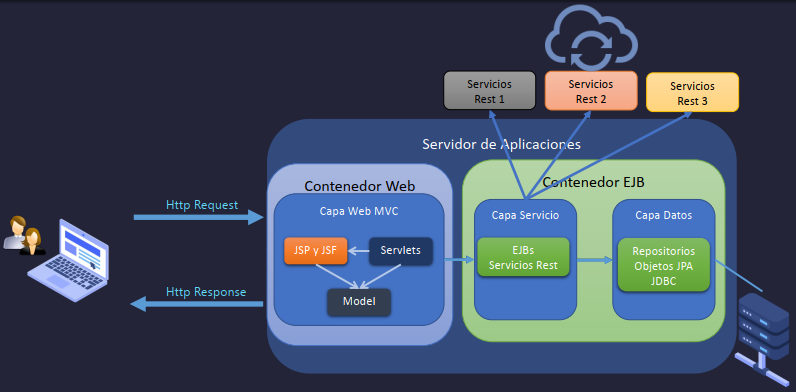
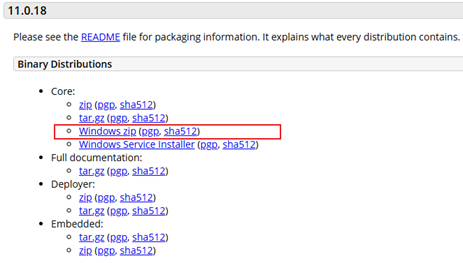
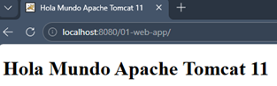
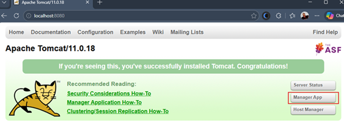
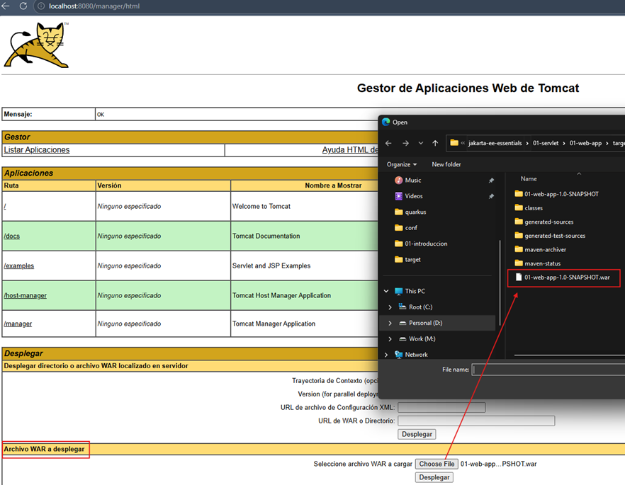
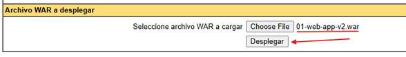
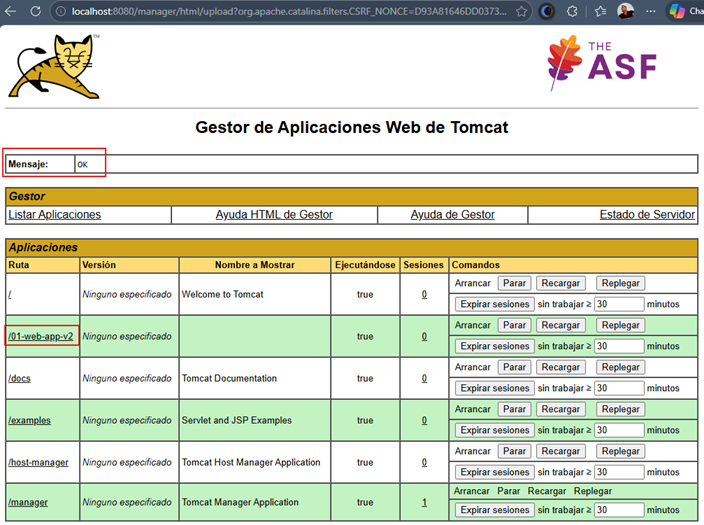
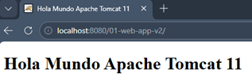

# 🌐 Jakarta EE - Fundamentos esenciales

Este repositorio reúne los **fundamentos esenciales de Jakarta EE** que todo desarrollador Java debería conocer.  
El objetivo es construir una base sólida sobre los estándares de Jakarta antes de dar el salto a frameworks modernos
como Quarkus.

---

## 📌 ¿Qué es Jakarta EE?

`Jakarta EE (Enterprise Edition)` es el conjunto de especificaciones abiertas y estandarizadas para el desarrollo de
aplicaciones empresariales en Java. Es el sucesor de `Java EE` y define APIs que permiten construir aplicaciones
`portables`, `escalables` y `mantenibles`, desplegadas sobre un servidor de aplicaciones.



### 🏗️ Contenedores dentro de un servidor de aplicaciones

Un servidor de aplicaciones `Jakarta EE` se organiza en `contenedores`, que gestionan distintos aspectos de la
aplicación:

- 🌐 `Contenedor Web`
    - Maneja **Servlets** (controladores que procesan peticiones HTTP).
    - Gestiona **JSP (JavaServer Pages)** como vistas dinámicas.
    - Es la puerta de entrada de las solicitudes web.

- ⚙️ `Contenedor EJB (Enterprise JavaBeans)`
    - Históricamente alojaba la **lógica de negocio** y la **persistencia**.
    - Permitía servicios distribuidos y transacciones complejas.
    - Hoy en día, gran parte de sus responsabilidades han sido reemplazadas por **CDI** y **JPA**, más simples y
      modernos.

### 🔗 Interacción entre contenedores

- El **contenedor web** interactúa con el **contenedor EJB** para acceder a la capa de servicio y persistencia.
- La capa de servicio puede ser **local** (dentro de la misma aplicación) o **remota/distribuida**, consumiendo
  servicios REST en otros servidores.

### ✅ Nota práctica

> Aunque EJB fue muy importante en el pasado, en el ecosistema moderno (incluido Quarkus) su rol ha
> sido reemplazado por **CDI, JPA y JTA**. Por eso, entender la arquitectura histórica es útil como contexto, pero no
> necesitas profundizar en EJB para tu roadmap.

---

## ⚖️ Tomcat vs. WildFly

En el ecosistema Java existen distintos tipos de servidores. Entender sus diferencias es clave para elegir el más
adecuado según el contexto.

### 🐱 Apache Tomcat

- Es un `servidor de servlets`(*Servlet Container*).
- Implementa las especificaciones básicas de `Jakarta Servlet`, `Jakarta Pages`, `Jakarta Expression Language`,
  `Jakarta WebSocket`, `Jakarta Annotations` y `Jakarta Authentication`.
- Ligero y ampliamente adoptado para aplicaciones web y APIs REST.
- No cubre todas las especificaciones de Jakarta EE (no soporta EJB, JMS, etc.).
- Compatible con **JAX-RS, CDI, JPA, Bean Validation y JTA** mediante dependencias externas,
  que son las especificaciones clave para trabajar con Quarkus.

### 🦅 WildFly

- Es un **servidor de aplicaciones completo** (*Application Server*).
- Implementa **toda la especificación Jakarta EE**: EJB, JMS, JAX-RS, CDI, JPA, entre otros.
- Más pesado y complejo que Tomcat; orientado a aplicaciones empresariales tradicionales.
- Resulta útil cuando se necesitan tecnologías como EJB, menos comunes en frameworks modernos.

### 📌 Conclusión práctica

Para un repaso de Jakarta EE enfocado en Quarkus, **Tomcat es suficiente**: cubre todas las especificaciones
relevantes, es ligero y elimina la complejidad innecesaria.

**WildFly** es la opción si en el futuro quisieras profundizar en EJB u otras especificaciones del stack completo,
pero queda fuera del objetivo actual.

## 🚀 Instalando y configurando Apache Tomcat 11

[Guía oficial de versiones](https://tomcat.apache.org/whichversion.html)

### 1️⃣ Descarga

- Descargamos la versión [Tomcat 11 Software Downloads](https://tomcat.apache.org/download-11.cgi).
- En nuestro caso, usaremos el binario para Windows:  
  [Windows zip (pgp, sha512)](https://dlcdn.apache.org/tomcat/tomcat-11/v11.0.18/bin/apache-tomcat-11.0.18-windows-x64.zip)

  

### 2️⃣ Instalación

- Extraemos el directorio en cualquier ubicación.
- En este ejemplo: `C:\apache-tomcat-11.0.18`

### 3️⃣ Configuración de usuarios

- Abrimos el archivo: `C:\apache-tomcat-11.0.18\conf\tomcat-users.xml`
- Agregamos un usuario con roles para poder desplegar aplicaciones desde `IntelliJ` usando el plugin `Tomcat Maven`:
    ```xml
    <user username="admin" password="admin" roles="admin,manager-gui,manager-script"/>
    ```

---

## ⚙️ Configuración inicial del proyecto Jakarta EE en IntelliJ IDEA

Creamos un proyecto **Maven** en IntelliJ IDEA y configuramos el archivo `pom.xml` con las dependencias y plugins
necesarios.

### 🎯 Propiedades

````xml

<properties>
    <maven.compiler.source>25</maven.compiler.source>
    <maven.compiler.target>25</maven.compiler.target>
    <project.build.sourceEncoding>UTF-8</project.build.sourceEncoding>
</properties>
````

### 📦 Dependencias

````xml

<dependencies>
    <dependency>
        <groupId>jakarta.platform</groupId>
        <artifactId>jakarta.jakartaee-api</artifactId>
        <version>11.0.0</version>
        <scope>provided</scope>
    </dependency>
</dependencies>
````

- `jakarta.jakartaee-api` → Incluye todas las APIs estándar de Jakarta EE (`Servlets`, `JAX-RS`, `CDI`, `JPA`, etc.).
- `scope="provided"` → Indica que estas librerías serán proporcionadas por el servidor de aplicaciones
  (`Tomcat`, `WildFly`, etc.), no se empaquetan dentro del WAR.
- Esto asegura que tu aplicación sea portable y ligera.

### 🔧 Plugins de Maven

#### 🖥️ maven-compiler-plugin

````xml

<plugin>
    <groupId>org.apache.maven.plugins</groupId>
    <artifactId>maven-compiler-plugin</artifactId>
    <version>3.14.1</version>
</plugin>
````

- Compila el código fuente Java.
- Usa las propiedades definidas (`maven.compiler.source` y `maven.compiler.target`) para establecer la versión de Java.

#### 🐱 tomcat7-maven-plugin

````xml

<plugin>
    <groupId>org.apache.tomcat.maven</groupId>
    <artifactId>tomcat7-maven-plugin</artifactId>
    <version>2.2</version>
    <!--Ruta para el despliegue en Tomcat-->
    <configuration>
        <url>http://localhost:8080/manager/text</url>
        <username>admin</username>
        <password>admin</password>
    </configuration>
</plugin>
````

- Permite desplegar automáticamente la aplicación en Tomcat desde Maven.
- Usa las credenciales configuradas en `tomcat-users.xml`.
- El `<url>` apunta al Tomcat Manager para publicar el WAR.
- Aunque se llama `tomcat7`, funciona también con versiones modernas de Tomcat (incluido `Tomcat 11`).

#### 📦 maven-war-plugin

````xml

<plugin>
    <artifactId>maven-war-plugin</artifactId>
    <version>3.4.0</version>
</plugin>
````

- Empaqueta la aplicación en formato `WAR (Web Application Archive)`.
- Este archivo es el que se despliega en Tomcat.

### 📌 Conclusión práctica

- La dependencia Jakarta EE API te da acceso a las especificaciones estándar.
- Los plugins aseguran que tu proyecto compile correctamente, se empaquete en WAR y se despliegue automáticamente en
  Tomcat.
- Con esta configuración, ya tienes un proyecto Jakarta EE listo para empezar a trabajar con Servlets, JAX-RS y demás
  módulos esenciales.

## 📂 Creando la estructura del proyecto

Como parte de la convención de `Jakarta EE`, creamos un directorio llamado **`webapp`** dentro de `src/main`.  
Este directorio debe llamarse exactamente así, ya que es donde se colocan los recursos web de la aplicación.

Dentro de `src/main/webapp` agregamos un archivo `index.html` con contenido básico:

```html
<!DOCTYPE html>
<html lang="es">
<head>
    <meta charset="UTF-8">
    <title>Hola Mundo Apache Tomcat 11</title>
</head>
<body>
<h1>Hola Mundo Apache Tomcat 11</h1>
</body>
</html>
```

### ⚙️ Configurando el arranque de la aplicación en IntelliJ IDEA

1. Ir a `Edit Configurations...`
2. Seleccionar `Add new...` → `Maven`
3. Configurar:
    - Name: `01-web-app` (nombre de nuestra aplicación)
    - Run (Command line): `tomcat7:redeploy`
4. Guardar con `Apply` → `OK`

#### 📌 Nota práctica

> - El directorio `webapp` es obligatorio porque Maven lo reconoce como el lugar donde se almacenan los recursos web
    (HTML, JSP, archivos estáticos).
> - El comando `tomcat7:redeploy` permite compilar, empaquetar y desplegar automáticamente el proyecto en Tomcat sin
    necesidad de copiar manualmente el WAR.
> - Aunque el plugin se llama `tomcat7`, funciona también con versiones modernas como `Tomcat 11`.

## 🚀 Levantando el servidor Tomcat

Nos ubicamos en el directorio `/bin` de Tomcat y ejecutamos uno de los siguientes comandos:

1. `catalina.bat run` → Ejecuta Tomcat en la misma ventana, mostrando los **logs en tiempo real**.
2. `startup.bat` → Abre Tomcat en una ventana nueva y devuelve el control a tu terminal.

En este caso usamos la primera opción para tener todo en la misma ventana.

```bash
C:\apache-tomcat-11.0.18\bin
$ catalina.bat run
Using CATALINA_BASE:   "C:\apache-tomcat-11.0.18"
Using CATALINA_HOME:   "C:\apache-tomcat-11.0.18"
...
01-Mar-2026 23:44:48.680 INFO [main] org.apache.catalina.startup.VersionLoggerListener.log Server version name:   Apache Tomcat/11.0.18
01-Mar-2026 23:44:48.683 INFO [main] org.apache.catalina.startup.VersionLoggerListener.log Server built:          Jan 23 2026 10:22:57 UTC
01-Mar-2026 23:44:48.684 INFO [main] org.apache.catalina.startup.VersionLoggerListener.log Server version number: 11.0.18.0
01-Mar-2026 23:44:48.685 INFO [main] org.apache.catalina.startup.VersionLoggerListener.log OS Name:               Windows 11
01-Mar-2026 23:44:48.685 INFO [main] org.apache.catalina.startup.VersionLoggerListener.log OS Version:            10.0
01-Mar-2026 23:44:48.685 INFO [main] org.apache.catalina.startup.VersionLoggerListener.log Architecture:          amd64
01-Mar-2026 23:44:48.685 INFO [main] org.apache.catalina.startup.VersionLoggerListener.log Java Home:             C:\Program Files\Java\jdk-25.0.2
01-Mar-2026 23:44:48.686 INFO [main] org.apache.catalina.startup.VersionLoggerListener.log JVM Version:           25.0.2+10-LTS-69
...
01-Mar-2026 23:44:50.102 INFO [main] org.apache.coyote.AbstractProtocol.start Starting ProtocolHandler ["http-nio-8080"]
01-Mar-2026 23:44:50.125 INFO [main] org.apache.catalina.startup.Catalina.start Server startup in [1086] milliseconds
```

✅ Con esto confirmamos que `Tomcat 11` está corriendo correctamente en el puerto `8080`.

## 📦 Construcción y despliegue automático del WAR

Gracias a la configuración previa en IntelliJ con el plugin Tomcat Maven, podemos ejecutar:

- `Run 01-web-app`
- o `Debug 01-web-app`

Esto construye el archivo `.war` y lo despliega automáticamente en `Tomcat`.

Ejemplo de log:

````bash
...
[INFO] Deploying war to http://localhost:8080/01-web-app  
Uploading: http://localhost:8080/manager/text/deploy?path=%2F01-web-app&update=true
Uploaded: http://localhost:8080/manager/text/deploy?path=%2F01-web-app&update=true (2 KB at 1714.8 KB/sec)

[INFO] tomcatManager status code:200, ReasonPhrase:
[INFO] OK - Deployed application at context path [/01-web-app]
[INFO] ------------------------------------------------------------------------
[INFO] BUILD SUCCESS
[INFO] ------------------------------------------------------------------------
[INFO] Total time:  8.832 s
[INFO] Finished at: 2026-03-01T23:52:19-05:00
[INFO] ------------------------------------------------------------------------ 
````

📌 Al finalizar, nuestra aplicación queda disponible en:

````
👉 http://localhost:8080/01-web-app
````

Así que mediante nuestro navegador vamos a esa dirección y vemos que todo está funcionando correctamente.



Incluso podemos ir al servidor y ver que nuestro proyecto está desplegado en el directorio `/webapps`.

````bash
C:\apache-tomcat-11.0.18\webapps
$ ls -l
total 36
drwxr-xr-x 1 magadiflo 197121    0 Mar  1 23:52 01-web-app/
-rw-r--r-- 1 magadiflo 197121 1756 Mar  1 23:52 01-web-app.war
drwxr-xr-x 1 magadiflo 197121    0 Jan 23 10:22 docs/
drwxr-xr-x 1 magadiflo 197121    0 Jan 23 10:22 examples/
drwxr-xr-x 1 magadiflo 197121    0 Jan 23 10:22 host-manager/
drwxr-xr-x 1 magadiflo 197121    0 Jan 23 10:22 manager/
drwxr-xr-x 1 magadiflo 197121    0 Jan 23 10:22 ROOT/ 
````

## 🖐️ Despliegue manual del WAR

También podemos desplegar manualmente el `.war`:

1. Ir a `http://localhost:8080/` → opción `Manager App`.



2. Autenticarse con las credenciales configuradas en `tomcat-users.xml`.
3. En la sección `Archivo WAR a desplegar`, seleccionar el `.war` generado en:

````bash
01-servlet/01-web-app/target/01-web-app-1.0-SNAPSHOT.war
````



4. Opcionalmente, renombrar el archivo a algo más corto (ejemplo: `01-web-app-v2.war`).



5. Presionar Desplegar.
6. ✅ Verás el mensaje OK y tu aplicación aparecerá en la lista de aplicaciones desplegadas.



👉 Ejemplo: `http://localhost:8080/01-web-app-v2`



### 📌 Nota práctica

- El despliegue automático es más rápido y cómodo durante el desarrollo.
- El despliegue manual es útil para pruebas puntuales o cuando no se usa el plugin Maven.
- Ambos métodos generan el `.war` en el directorio `target/` y lo colocan en `webapps/` de Tomcat.

